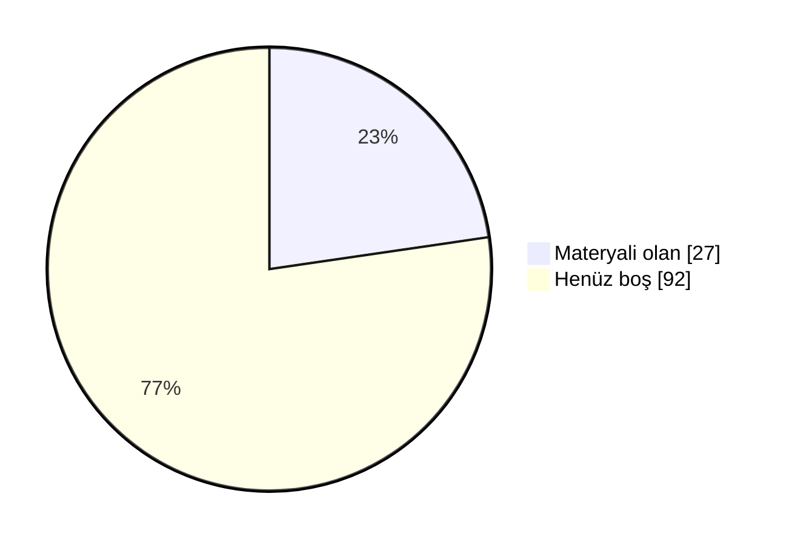

# 📖 Marmara Bilgisayar Mühendisliği Arşiv

Marmara Üniversitesi Teknoloji Fakültesi Bilgisayar Mühendisliği öğrencileri için düzenli, sürdürülebilir ve değer üreten bir akademik arşiv. Ders notları, ödev çözümleri, slaytlar, çıkmış sorular ve çalışma rehberleri tek bir yerde toplandı.

 ## 🗣️ Geri Bildirimde Bulunun

📬 Öğrenciler ve hocalar, derslerle ilgili hakaret içermeyen geri bildirimlerinizi aşağıdaki linkler aracılığıyla anonim olarak paylaşabilirsiniz.

- [✍️ **Hocalar için yorum linki**](https://docs.google.com/forms/d/e/1FAIpQLSf6Txu1KWmryvpjWyisuoEw9ikBP24hA-aOIvzKoEhhvxScFQ/viewform)
- [✍️ **Dersler için yorum linki**](https://docs.google.com/forms/d/e/1FAIpQLSdZ8qteiUcKRU6hkYA33RnwXt5C2PIgAxK6ZMsE9PIr9xa7-g/viewform)
- [⭐ **Dersler için oylama linki**](https://docs.google.com/forms/d/e/1FAIpQLSeT-6WtaEJERW5OcUyvBFAX6bhmzT8Op8utM8AXhNaCtruTRA/viewform)

## 🤝 Katkıda Bulunun

Elinde ders notu, slayt, çıkmış soru ya da ödev çözümü varsa arşive eklemek çok kolay:

- 📁 **GitHub kullanmıyorsan:** [Google Drive klasörümüze](https://drive.google.com/drive/folders/1KRobMRVHpJxUKcCZdCEippSZ5SmgpkZq?usp=sharing) yükle. Önce BENİOKU dosyasını oku, sonra **Bilgisayar-Teknoloji** klasöründe kendi adınla bir klasör aç.
- 🌐 **GitHub hesabın varsa:** Repoyu fork'la, dosyayı ilgili ders klasörüne yükle ve pull request gönder. Kurulum gerekmez, her şey tarayıcıdan yapılır.
- 📖 **Adım adım rehber:** [CONTRIBUTING.md](CONTRIBUTING.md)

Pull request ile katkıda bulunanların adı sayfanın en altındaki **Katkıda Bulunanlar** listesine otomatik eklenir.

### 📺 Video Rehberler
- 🎬 **Repoya nasıl katkı yapılır?** (~10 dk): *yakında*
- 🎬 **Repo nasıl kullanılır?** Klasör yapısı, ders README'leri ve aradığını bulma: *yakında*

<b>🗂 İçindekiler</b>

## 🗂 İçindekiler

- 🔗 [Katkıda Bulunun](#-katkıda-bulunun)
- 🔗 [Kavramlar](#-kavramlar)
- 🔗 [Arşiv Doluluk Durumu](#-arşiv-doluluk-durumu)
- 🔗 [Dersler](#-dersler)
- 🔗 [Seçmeli Dersler](#-seçmeli-dersler)
- 🔗 [Hocalar](#-hocalar)

<b>🛠 Repo Kullanımı</b>

## 🛠 Repo Kullanımı

### ⚙️ Açıklamalar:
- 📋 Bölümde bilinen ve güvenilir bir kaynak olmak.
- 📋 Akademik network oluşturmak ve iş birliklerini kolaylaştırmak.
- 📋 Dışarıdan bakan biri için temiz, düzenli ve profesyonel bir imaj sunmak.
- 📋 İçerikler: ders slaytları, kişisel ders notları ve özetler, ödev çözümleri, atölye çalışmaları, çıkmış sorular ve analizleri, proje dosyaları ve örnekleri.

### 📝 Talimatlar:
- 👉 Repo içindeki README.md'leri ders bazlı takip edin.
- 👉 Ödevleri çalıştırmak için ilgili klasörlerdeki .py veya .cpp dosyalarını kullanabilirsiniz.
- 👉 Ders özetleri, kısa ve okunabilir şekilde markdown olarak hazırlanmıştır.
- 👉 Özet ve ödevleri birleştirip kendi öğrenme sürecinize uyarlayabilirsiniz.

<b>🔍 Kavramlar</b>

## 🔍 Kavramlar

📌 Bölümle ilgili sık karşılaşılan terimlerin kısa açıklamaları. Not: tarih/şart gibi somut rakamlar dönemden
döneme değişebilir, kesin ve güncel bilgi için bölüm/fakülte öğrenci işlerine danışın.

- 💡 **Bütünleme Sınavı**
  - 📘 **S: Bütünleme sınavı nedir?** **C:** Final sınavının ardından yapılan, dersten başarısız olanların
    (ve şartlı geçenlerin isterlerse) girebildiği ek bir sınavdır. Bütünlemeye giren bir öğrencinin notu,
    final notunun yerini alır — geri dönüş yoktur.
- 💡 **Çan Eğrisi**
  - 📘 **S: Çan eğrisi nedir?** **C:** Bir sınıfın sınav sonuçlarının ortalama ve standart sapmasına göre
    harf notlarının belirlendiği bağıl bir değerlendirme yöntemidir. Her hoca kullanmak zorunda değildir;
    bazı dersler mutlak (bareme dayalı) notlandırılır.
- 💡 **DC Notu / Şartlı Geçme**
  - 📘 **S: DC nedir?** **C:** Şartlı geçme notudur — dersi geçmiş sayılırsınız ama not ortalamanız
    (GANO) yeterince yüksek değilse dersi tekrar almanız istenebilir. Bütünlemeye isteğe bağlı girilebilir.
- 💡 **GANO / AGNO**
  - 📘 **S: GANO nedir?** **C:** Genel Ağırlıklı Not Ortalaması — o ana kadar alınan tüm derslerin kredi
    ağırlıklı not ortalamasıdır. Mezuniyet, ÇAP/yandal başvurusu gibi şartlarda kullanılır.
- 💡 **YANO**
  - 📘 **S: YANO nedir?** **C:** Yarıyıl Ağırlıklı Not Ortalaması — yalnızca ilgili dönemde alınan derslerin
    kredi ağırlıklı not ortalamasıdır. Her dönem sıfırdan hesaplanır; GANO ise tüm dönemleri kapsar.
- 💡 **Mazeret Sınavı**
  - 📘 **S: Mazeret sınavı nedir?** **C:** Sağlık raporu, resmi belgeli bir mazeret vb. nedenle vize/finale
    giremeyen öğrenciler için düzenlenen, geçerli belgeyle başvurulan ek sınavdır.
- 💡 **ÇAP / Yandal**
  - 📘 **S: ÇAP nedir?** **C:** Çift Anadal Programı — uygun GANO'ya sahip öğrencilerin, okurken ikinci bir
    bölümden de lisans diploması almasını sağlayan program.
  - 📘 **S: Yandal nedir?** **C:** Diploma vermeyen, ikinci bir alanda sertifika niteliğinde daha hafif bir
    program.
- 💡 **Staj 1 / Staj 2**
  - 📘 **S: Staj 1/II nedir?** **C:** Müfredatta 3. ve 4. yıllarda yer alan, işletmede kısa süreli uygulamalı
    çalışmayı zorunlu kılan derslerdir. Bkz. [`3-1/Staj 1`](./3-1/Staj%201) ve [`4-1/Staj 2`](./4-1/Staj%202).
- 💡 **İş Yeri Eğitimi**
  - 📘 **S: İş Yeri Eğitimi nedir?** **C:** Staj'dan daha kapsamlı, bir dönem boyunca işletmede tam zamanlı
    çalışmayı içeren müfredat dersi (bkz. [müfredat](./M%C3%BCfredat/) — 7. yarıyılda 28 AKTS ile oldukça
    yüklü bir ders). Bkz. [`4-1/İş Yeri Eğitimi`](./4-1/%C4%B0%C5%9F%20Yeri%20E%C4%9Fitimi).
- 💡 **Bitirme Projesi**
  - 📘 **S: Bitirme Projesi nedir?** **C:** Son dönemde bir danışman hoca eşliğinde yürütülen, mezuniyet
    şartı olan bitirme çalışmasıdır. Bkz. [`4-2/Bitirme Projesi`](./4-2/Bitirme%20Projesi).
- 💡 **Mesleki Seçmeli / Üniversite Seçmeli**
  - 📘 **S: Aralarındaki fark ne?** **C:** Mesleki Seçmeli dersler bölüm içi teknik derslerdir (örn. Veri
    Madenciliği, Bilgisayar Güvenliği). Üniversite Seçmeli dersler ise bölüm dışı, daha genel/sosyal
    içeriklidir (örn. Girişimcilik, Osmanlı Tarihi). Bkz. [Seçmeli Dersler](#-seçmeli-dersler).

<!-- DOLULUK_BASLANGIC -->

<b>📊 Arşiv Doluluk Durumu</b>

## 📊 Arşiv Doluluk Durumu

Arşivdeki **119** dersin **27** tanesinde en az bir materyal var (genel doluluk **%23**).

| Dönem | Doluluk | Materyali olan ders |
|---|---|---|
| [1. Yıl Güz](./1-1/) | 🟩🟩🟩🟩🟩🟩🟩🟩⬜⬜ %80 | 8 / 10 |
| [1. Yıl Bahar](./1-2/) | 🟩🟩🟩🟩🟩🟩🟩🟩🟩⬜ %89 | 8 / 9 |
| [2. Yıl Güz](./2-1/) | 🟩🟩🟩🟩🟩⬜⬜⬜⬜⬜ %50 | 4 / 8 |
| [2. Yıl Bahar](./2-2/) | 🟩🟩🟩🟩🟩🟩🟩⬜⬜⬜ %71 | 5 / 7 |
| [3. Yıl Güz](./3-1/) | ⬜⬜⬜⬜⬜⬜⬜⬜⬜⬜ %0 | 0 / 6 |
| [3. Yıl Bahar](./3-2/) | ⬜⬜⬜⬜⬜⬜⬜⬜⬜⬜ %0 | 0 / 6 |
| [4. Yıl Güz](./4-1/) | 🟩🟩⬜⬜⬜⬜⬜⬜⬜⬜ %20 | 1 / 5 |
| [4. Yıl Bahar](./4-2/) | 🟩🟩⬜⬜⬜⬜⬜⬜⬜⬜ %20 | 1 / 5 |
| [Mesleki Seçmeli](./Mesleki%20Seçmeli/) | ⬜⬜⬜⬜⬜⬜⬜⬜⬜⬜ %0 | 0 / 40 |
| [Fakülte Teknik Seçmeli](./Fakülte%20Teknik%20Seçmeli/) | ⬜⬜⬜⬜⬜⬜⬜⬜⬜⬜ %0 | 0 / 8 |
| [Üniversite Seçmeli](./Üniversite%20Seçmeli/) | ⬜⬜⬜⬜⬜⬜⬜⬜⬜⬜ %0 | 0 / 15 |

### 🙋 Bu dersler katkını bekliyor
Elinde bu derslerden materyal varsa yukarıdaki **🤝 Katkıda Bulunun** bölümüne göz at.

- **1. Yıl Güz:** İş Sağlığı ve Güvenliği 1, Modern Biyolojiye Giriş
- **1. Yıl Bahar:** Mühendislik Ekonomisi
- **2. Yıl Güz:** Ayrık Matematik, Diferansiyel Denklemler, Olasılık ve İstatistik, Teknik İngilizce 1
- **2. Yıl Bahar:** Mühendisler için İstatistik, Teknik İngilizce 2
- **3. Yıl Güz:** Algoritma Analizi ve Tasarımı, İşletim Sistemleri, Mikrodenetleyiciler, Sinyaller ve Sistemlere Giriş, Staj 1, Veritabanı Yönetim Sistemleri
- **3. Yıl Bahar:** Biçimsel Diller ve Otomata Teorisi, Bilgisayar Organizasyonu ve Mimarisi, Bilimsel Araştırma ve Sunum Teknikleri 2, Sistem Programlama, Yazılım Mühendisliği, Web Programlama
- **4. Yıl Güz:** Bitirme Projesi 1, İş Hukuku ve Etiği, İş Yeri Eğitimi, Staj 2
- **4. Yıl Bahar:** Bitirme Projesi, Bitirme Projesi 2, Sistem ve Sunucu Yönetimi, Teknik İngilizce
- **Mesleki Seçmeli:** Açık Kaynak Kodlu Yazılımlar, Algoritma Analizi, Biçimsel Diller ve Otomata Teorisi, Bilgisayar Ağ Protokolleri, Bilgisayar Grafik, Bilgisayar Güvenliği, Blockchain Programlamaya Giriş, Bulut Bilişim, Dağıtık Sistemler, Derin Öğrenme ve Yapay Sinir Ağlarına Giriş, Eğitim Sistemleri Tasarımı, E-Ticarete Giriş, Gömülü Sistemler, Görüntü İşlemenin Temelleri, Güncel Yapay Zeka Yaklaşımları, İnsan-Bilgisayar Etkileşimi ve Görsellik, Kablosuz Ağlar, Kablosuz ve Mobil Ağlar, Kriptoloji, Linux Kabuk Programlama, Makine Öğrenimine Giriş, Mikrodenetleyiciler, Mobil Programlama, Mühendislik Matematiği ve Uygulamaları, Mühendislik Uygulamaları için Python, Nesnelerin İnterneti, Optimizasyon Teknikleri ve Uygulamaları, Oyun Yazılımı Geliştirme, Paralel Hesaplama, Rastgele Değişkenler, Sayısal İşaret İşleme, Simulasyon ve Modelleme, Sosyal Ağlarda Uygulamalı Metin Analizi, Veri Bilimine Giriş, Veri Madenciliği, Yapay Sinir Ağları, Yapay Zekâya Giriş, Yazılım Projelerinin Yönetimi, Web Programlama, Web Servisleri
- **Fakülte Teknik Seçmeli:** Araştırma Planlama ve Yönetimi, Bilgi Sistemleri Yönetimi, Çok Disiplinli Takım Çalışması Deneyimi, Disiplinler Arası Proje Tasarımı, Mühendisler için Proje Yönetimi, Mühendislik ve Teknoloji Yönetimi, Veri Bilimi ve Veri Analitiğine Giriş, Yazılım Proje Yönetimi
- **Üniversite Seçmeli:** Bilim Tarihi, Çevre ve Enerji, Fizibilite Hazırlama ve Uygulamaları, Girişimcilik, Girişimcilik ve İnovasyon, İş Psikolojisi, Kalite Yönetimi, Liderlik, Moda, Osmanlı Tarihi, Rapor Hazırlama ve Sunum Teknikleri, Sistem Mühendisliği, Sosyal Organizasyon, Teknik İletişim, Teknik Satış ve Pazarlama

<!-- DOLULUK_BITIS -->

<b>📖 Dersler</b>

## 📖 Dersler
📄 Bu bölümde, tüm dersler hakkında detaylı bilgiler ve kaynaklar bulunmaktadır. Öğrenciler bu bölümü kullanarak ders materyallerine ve içeriklerine ulaşabilirler.

### 🗓 1. Yıl - Güz

#### 📘 İş Sağlığı ve Güvenliği 1 
  - 🏷️ **Ders Tipi:** Zorunlu
  - 🏷️ **Müfredat:** 2026 Sonrası
  - ⭐ **Yıldız Sayıları:**
      - ℹ️ Henüz yıldız veren yok. Siz de [linkten](https://docs.google.com/forms/d/e/1FAIpQLSeT-6WtaEJERW5OcUyvBFAX6bhmzT8Op8utM8AXhNaCtruTRA/viewform?usp=pp_url&entry.1850083761=%C4%B0%C5%9F%20Sa%C4%9Fl%C4%B1%C4%9F%C4%B1%20ve%20G%C3%BCvenli%C4%9Fi%201) anonim şekilde oylamaya katılabilirsiniz.
  - 💬 **Öğrenci Görüşleri:**
      - ℹ️ Henüz yorum yok. Siz de [linkten](https://docs.google.com/forms/d/e/1FAIpQLSdZ8qteiUcKRU6hkYA33RnwXt5C2PIgAxK6ZMsE9PIr9xa7-g/viewform?usp=pp_url&entry.874814544=%C4%B0%C5%9F%20Sa%C4%9Fl%C4%B1%C4%9F%C4%B1%20ve%20G%C3%BCvenli%C4%9Fi%201) anonim şekilde görüşlerinizi belirtebilirsiniz.
  - 👨‍🏫 👩‍🏫 **Dersi Yürüten Akademisyenler:**
    - **2026-2027**: [YB](#‍-prof-dr-yahya-bozkurt)
  - 📂 [Ders Klasörü](./1-1/%C4%B0%C5%9F%20Sa%C4%9Fl%C4%B1%C4%9F%C4%B1%20ve%20G%C3%BCvenli%C4%9Fi%201)

#### 📘 Modern Biyolojiye Giriş 
  - 🏷️ **Ders Tipi:** Zorunlu
  - 🏷️ **Müfredat:** 2026 Sonrası
  - ⭐ **Yıldız Sayıları:**
      - ℹ️ Henüz yıldız veren yok. Siz de [linkten](https://docs.google.com/forms/d/e/1FAIpQLSeT-6WtaEJERW5OcUyvBFAX6bhmzT8Op8utM8AXhNaCtruTRA/viewform?usp=pp_url&entry.1850083761=Modern%20Biyolojiye%20Giri%C5%9F) anonim şekilde oylamaya katılabilirsiniz.
  - 💬 **Öğrenci Görüşleri:**
      - ℹ️ Henüz yorum yok. Siz de [linkten](https://docs.google.com/forms/d/e/1FAIpQLSdZ8qteiUcKRU6hkYA33RnwXt5C2PIgAxK6ZMsE9PIr9xa7-g/viewform?usp=pp_url&entry.874814544=Modern%20Biyolojiye%20Giri%C5%9F) anonim şekilde görüşlerinizi belirtebilirsiniz.
  - 👨‍🏫 👩‍🏫 **Dersi Yürüten Akademisyenler:**
    - **2026-2027**: [ACÇK](#‍-dr-öğretim-üyesi-ayşe-ceren-çalıkoğlu-koyuncu)
  - 📂 [Ders Klasörü](./1-1/Modern%20Biyolojiye%20Giri%C5%9F)

#### 📘 Algoritma ve Programlamaya Giriş 
  - 🏷️ **Ders Tipi:** Zorunlu
  - 🏷️ **Müfredat:** Her İki Müfredat
  - ⭐ **Yıldız Sayıları:**
      - ℹ️ Henüz yıldız veren yok. Siz de [linkten](https://docs.google.com/forms/d/e/1FAIpQLSeT-6WtaEJERW5OcUyvBFAX6bhmzT8Op8utM8AXhNaCtruTRA/viewform?usp=pp_url&entry.1850083761=Algoritma%20ve%20Programlamaya%20Giri%C5%9F) anonim şekilde oylamaya katılabilirsiniz.
  - 💬 **Öğrenci Görüşleri:**
      - ℹ️ Henüz yorum yok. Siz de [linkten](https://docs.google.com/forms/d/e/1FAIpQLSdZ8qteiUcKRU6hkYA33RnwXt5C2PIgAxK6ZMsE9PIr9xa7-g/viewform?usp=pp_url&entry.874814544=Algoritma%20ve%20Programlamaya%20Giri%C5%9F) anonim şekilde görüşlerinizi belirtebilirsiniz.
  - 👨‍🏫 👩‍🏫 **Dersi Yürüten Akademisyenler:**
    - **2026-2027**: [BD](#‍-doç-dr-buket-doğan), [ABA](#‍-doç-dr-ayşe-berna-altınel)
  - 📂 [Ders Klasörü](./1-1/Algoritma%20ve%20Programlamaya%20Giri%C5%9F)

#### 📘 Bilgisayar Mühendisliğine Giriş 
  - 🏷️ **Ders Tipi:** Zorunlu
  - 🏷️ **Müfredat:** Her İki Müfredat
  - ⭐ **Yıldız Sayıları:**
      - ℹ️ Henüz yıldız veren yok. Siz de [linkten](https://docs.google.com/forms/d/e/1FAIpQLSeT-6WtaEJERW5OcUyvBFAX6bhmzT8Op8utM8AXhNaCtruTRA/viewform?usp=pp_url&entry.1850083761=Bilgisayar%20M%C3%BChendisli%C4%9Fine%20Giri%C5%9F) anonim şekilde oylamaya katılabilirsiniz.
  - 💬 **Öğrenci Görüşleri:**
      - ℹ️ Henüz yorum yok. Siz de [linkten](https://docs.google.com/forms/d/e/1FAIpQLSdZ8qteiUcKRU6hkYA33RnwXt5C2PIgAxK6ZMsE9PIr9xa7-g/viewform?usp=pp_url&entry.874814544=Bilgisayar%20M%C3%BChendisli%C4%9Fine%20Giri%C5%9F) anonim şekilde görüşlerinizi belirtebilirsiniz.
  - 👨‍🏫 👩‍🏫 **Dersi Yürüten Akademisyenler:**
    - **2026-2027**: [SÖ](#‍-prof-dr-serhat-özekes)
  - 📂 [Ders Klasörü](./1-1/Bilgisayar%20M%C3%BChendisli%C4%9Fine%20Giri%C5%9F)

#### 📘 Fizik 1 
  - 🏷️ **Ders Tipi:** Zorunlu
  - 🏷️ **Müfredat:** Her İki Müfredat
  - ⭐ **Yıldız Sayıları:**
      - ℹ️ Henüz yıldız veren yok. Siz de [linkten](https://docs.google.com/forms/d/e/1FAIpQLSeT-6WtaEJERW5OcUyvBFAX6bhmzT8Op8utM8AXhNaCtruTRA/viewform?usp=pp_url&entry.1850083761=Fizik%201) anonim şekilde oylamaya katılabilirsiniz.
  - 💬 **Öğrenci Görüşleri:**
      - ℹ️ Henüz yorum yok. Siz de [linkten](https://docs.google.com/forms/d/e/1FAIpQLSdZ8qteiUcKRU6hkYA33RnwXt5C2PIgAxK6ZMsE9PIr9xa7-g/viewform?usp=pp_url&entry.874814544=Fizik%201) anonim şekilde görüşlerinizi belirtebilirsiniz.
  - 👨‍🏫 👩‍🏫 **Dersi Yürüten Akademisyenler:**
    - **2026-2027**: [ŞU](#‍-prof-dr-şahin-uyaver)
  - 📂 [Ders Klasörü](./1-1/Fizik%201)

#### 📘 İngilizce 1 
  - 🏷️ **Ders Tipi:** Zorunlu
  - 🏷️ **Müfredat:** Her İki Müfredat
  - ⭐ **Yıldız Sayıları:**
      - ℹ️ Henüz yıldız veren yok. Siz de [linkten](https://docs.google.com/forms/d/e/1FAIpQLSeT-6WtaEJERW5OcUyvBFAX6bhmzT8Op8utM8AXhNaCtruTRA/viewform?usp=pp_url&entry.1850083761=%C4%B0ngilizce%201) anonim şekilde oylamaya katılabilirsiniz.
  - 💬 **Öğrenci Görüşleri:**
      - ℹ️ Henüz yorum yok. Siz de [linkten](https://docs.google.com/forms/d/e/1FAIpQLSdZ8qteiUcKRU6hkYA33RnwXt5C2PIgAxK6ZMsE9PIr9xa7-g/viewform?usp=pp_url&entry.874814544=%C4%B0ngilizce%201) anonim şekilde görüşlerinizi belirtebilirsiniz.
  - 👨‍🏫 👩‍🏫 **Dersi Yürüten Akademisyenler:**
    - **2026-2027**: [IRS](#‍-öğr-gör-dr-işıl-ruacan-silahtaroğlu)
  - 📂 [Ders Klasörü](./1-1/%C4%B0ngilizce%201)

#### 📘 Kimya 
  - 🏷️ **Ders Tipi:** Zorunlu
  - 🏷️ **Müfredat:** 2026 Öncesi
      - ℹ️ 2026 sonrası müfredatta yerine "Modern Biyolojiye Giriş" eklenmiş.
  - ⭐ **Yıldız Sayıları:**
      - ✅ Dersi Kolay Geçer Miyim: ★★★★★★★★☆☆
      - 🎯 Ders Mesleki Açıdan Gerekli Mi: ★★☆☆☆☆☆☆☆☆
        - ℹ️ Yıldızlar 1 oy üzerinden hesaplanmıştır. Siz de [linkten](https://docs.google.com/forms/d/e/1FAIpQLSeT-6WtaEJERW5OcUyvBFAX6bhmzT8Op8utM8AXhNaCtruTRA/viewform?usp=pp_url&entry.1850083761=Kimya) anonim şekilde oylamaya katılabilirsiniz.
  - 💬 **Öğrenci Görüşleri:**
      - 👤 **_havadangelensayi_**: Mesleki açıdan pek bir şey ifade etmiyor, sadece almanız gereken bir ders. AYT Kimya’nın biraz daha detaylı işlenmiş hâli desek yanlış olmaz. ℹ️ Yorum **10.2026** tarihinde yapılmıştır.
        - ℹ️ Siz de [linkten](https://docs.google.com/forms/d/e/1FAIpQLSdZ8qteiUcKRU6hkYA33RnwXt5C2PIgAxK6ZMsE9PIr9xa7-g/viewform?usp=pp_url&entry.874814544=Kimya) anonim şekilde görüşlerinizi belirtebilirsiniz.
  - 👨‍🏫 👩‍🏫 **Dersi Yürüten Akademisyenler:**
    - **2026-2027** (bu yıl yeni girenler bu dersi alamaz; ders yalnızca 2026 öncesi müfredattaki öğrenciler için açıldı): [CD](#‍-prof-dr-canan-doğan)
  - 📂 [Ders Klasörü](./1-1/Kimya)

#### 📘 Lineer Cebir 
  - 🏷️ **Ders Tipi:** Zorunlu
  - 🏷️ **Müfredat:** Her İki Müfredat
  - ⭐ **Yıldız Sayıları:**
      - ℹ️ Henüz yıldız veren yok. Siz de [linkten](https://docs.google.com/forms/d/e/1FAIpQLSeT-6WtaEJERW5OcUyvBFAX6bhmzT8Op8utM8AXhNaCtruTRA/viewform?usp=pp_url&entry.1850083761=Lineer%20Cebir) anonim şekilde oylamaya katılabilirsiniz.
  - 💬 **Öğrenci Görüşleri:**
      - ℹ️ Henüz yorum yok. Siz de [linkten](https://docs.google.com/forms/d/e/1FAIpQLSdZ8qteiUcKRU6hkYA33RnwXt5C2PIgAxK6ZMsE9PIr9xa7-g/viewform?usp=pp_url&entry.874814544=Lineer%20Cebir) anonim şekilde görüşlerinizi belirtebilirsiniz.
  - 👨‍🏫 👩‍🏫 **Dersi Yürüten Akademisyenler:**
    - **2026-2027**: [NÖ](#‍-dr-öğretim-üyesi-neşe-özdemir)
  - 📂 [Ders Klasörü](./1-1/Lineer%20Cebir)

#### 📘 Matematik 1 
  - 🏷️ **Ders Tipi:** Zorunlu
  - 🏷️ **Müfredat:** Her İki Müfredat
  - ⭐ **Yıldız Sayıları:**
      - ℹ️ Henüz yıldız veren yok. Siz de [linkten](https://docs.google.com/forms/d/e/1FAIpQLSeT-6WtaEJERW5OcUyvBFAX6bhmzT8Op8utM8AXhNaCtruTRA/viewform?usp=pp_url&entry.1850083761=Matematik%201) anonim şekilde oylamaya katılabilirsiniz.
  - 💬 **Öğrenci Görüşleri:**
      - ℹ️ Henüz yorum yok. Siz de [linkten](https://docs.google.com/forms/d/e/1FAIpQLSdZ8qteiUcKRU6hkYA33RnwXt5C2PIgAxK6ZMsE9PIr9xa7-g/viewform?usp=pp_url&entry.874814544=Matematik%201) anonim şekilde görüşlerinizi belirtebilirsiniz.
  - 👨‍🏫 👩‍🏫 **Dersi Yürüten Akademisyenler:**
    - **2026-2027**: [NÖ](#‍-dr-öğretim-üyesi-neşe-özdemir)
  - 📂 [Ders Klasörü](./1-1/Matematik%201)

#### 📘 Türkçe 1 
  - 🏷️ **Ders Tipi:** Zorunlu
  - 🏷️ **Müfredat:** Her İki Müfredat
  - ⭐ **Yıldız Sayıları:**
      - ℹ️ Henüz yıldız veren yok. Siz de [linkten](https://docs.google.com/forms/d/e/1FAIpQLSeT-6WtaEJERW5OcUyvBFAX6bhmzT8Op8utM8AXhNaCtruTRA/viewform?usp=pp_url&entry.1850083761=T%C3%BCrk%C3%A7e%201) anonim şekilde oylamaya katılabilirsiniz.
  - 💬 **Öğrenci Görüşleri:**
      - ℹ️ Henüz yorum yok. Siz de [linkten](https://docs.google.com/forms/d/e/1FAIpQLSdZ8qteiUcKRU6hkYA33RnwXt5C2PIgAxK6ZMsE9PIr9xa7-g/viewform?usp=pp_url&entry.874814544=T%C3%BCrk%C3%A7e%201) anonim şekilde görüşlerinizi belirtebilirsiniz.
  - 👨‍🏫 👩‍🏫 **Dersi Yürüten Akademisyenler:**
    - **2026-2027**: [MK](#‍-öğr-gör-dr-mehmet-kocakaplan)
  - 📂 [Ders Klasörü](./1-1/T%C3%BCrk%C3%A7e%201)

### 🗓 1. Yıl - Bahar

#### 📘 Mühendislik Ekonomisi 
  - 🏷️ **Ders Tipi:** Zorunlu
  - 🏷️ **Müfredat:** 2026 Sonrası
  - ⭐ **Yıldız Sayıları:**
      - ℹ️ Henüz yıldız veren yok. Siz de [linkten](https://docs.google.com/forms/d/e/1FAIpQLSeT-6WtaEJERW5OcUyvBFAX6bhmzT8Op8utM8AXhNaCtruTRA/viewform?usp=pp_url&entry.1850083761=M%C3%BChendislik%20Ekonomisi) anonim şekilde oylamaya katılabilirsiniz.
  - 💬 **Öğrenci Görüşleri:**
      - ℹ️ Henüz yorum yok. Siz de [linkten](https://docs.google.com/forms/d/e/1FAIpQLSdZ8qteiUcKRU6hkYA33RnwXt5C2PIgAxK6ZMsE9PIr9xa7-g/viewform?usp=pp_url&entry.874814544=M%C3%BChendislik%20Ekonomisi) anonim şekilde görüşlerinizi belirtebilirsiniz.
  - 📂 [Ders Klasörü](./1-2/M%C3%BChendislik%20Ekonomisi)

#### 📘 Bilgisayar Donanımı 
  - 🏷️ **Ders Tipi:** Zorunlu
  - 🏷️ **Müfredat:** Her İki Müfredat
  - ⭐ **Yıldız Sayıları:**
      - ℹ️ Henüz yıldız veren yok. Siz de [linkten](https://docs.google.com/forms/d/e/1FAIpQLSeT-6WtaEJERW5OcUyvBFAX6bhmzT8Op8utM8AXhNaCtruTRA/viewform?usp=pp_url&entry.1850083761=Bilgisayar%20Donan%C4%B1m%C4%B1) anonim şekilde oylamaya katılabilirsiniz.
  - 💬 **Öğrenci Görüşleri:**
      - ℹ️ Henüz yorum yok. Siz de [linkten](https://docs.google.com/forms/d/e/1FAIpQLSdZ8qteiUcKRU6hkYA33RnwXt5C2PIgAxK6ZMsE9PIr9xa7-g/viewform?usp=pp_url&entry.874814544=Bilgisayar%20Donan%C4%B1m%C4%B1) anonim şekilde görüşlerinizi belirtebilirsiniz.
  - 👨‍🏫 👩‍🏫 **Dersi Yürüten Akademisyenler:**
    - **2025-2026**: [ABul](#‍-prof-dr-ali-buldu)
  - 📂 [Ders Klasörü](./1-2/Bilgisayar%20Donan%C4%B1m%C4%B1)

#### 📘 Bilgisayar Programlama 1 
  - 🏷️ **Ders Tipi:** Zorunlu
  - 🏷️ **Müfredat:** Her İki Müfredat
  - ⭐ **Yıldız Sayıları:**
      - ℹ️ Henüz yıldız veren yok. Siz de [linkten](https://docs.google.com/forms/d/e/1FAIpQLSeT-6WtaEJERW5OcUyvBFAX6bhmzT8Op8utM8AXhNaCtruTRA/viewform?usp=pp_url&entry.1850083761=Bilgisayar%20Programlama%201) anonim şekilde oylamaya katılabilirsiniz.
  - 💬 **Öğrenci Görüşleri:**
      - ℹ️ Henüz yorum yok. Siz de [linkten](https://docs.google.com/forms/d/e/1FAIpQLSdZ8qteiUcKRU6hkYA33RnwXt5C2PIgAxK6ZMsE9PIr9xa7-g/viewform?usp=pp_url&entry.874814544=Bilgisayar%20Programlama%201) anonim şekilde görüşlerinizi belirtebilirsiniz.
  - 👨‍🏫 👩‍🏫 **Dersi Yürüten Akademisyenler:**
    - **2025-2026**: [ABaş](#‍-dr-öğretim-üyesi-anıl-baş), [ABA](#‍-doç-dr-ayşe-berna-altınel), [SK](#‍-arş-gör-semiha-koç) (lab)
  - 📂 [Ders Klasörü](./1-2/Bilgisayar%20Programlama%201)

#### 📘 Bilimsel Araştırma ve Sunum Teknikleri 
  - 🏷️ **Ders Tipi:** Zorunlu
  - 🏷️ **Müfredat:** 2026 Öncesi
      - ℹ️ 2026 sonrası müfredatta 3. yıl bahar dönemine taşınmış, "Bilimsel Araştırma ve Sunum Teknikleri 2" olarak anılıyor.
  - ⭐ **Yıldız Sayıları:**
      - ℹ️ Henüz yıldız veren yok. Siz de [linkten](https://docs.google.com/forms/d/e/1FAIpQLSeT-6WtaEJERW5OcUyvBFAX6bhmzT8Op8utM8AXhNaCtruTRA/viewform?usp=pp_url&entry.1850083761=Bilimsel%20Ara%C5%9Ft%C4%B1rma%20ve%20Sunum%20Teknikleri) anonim şekilde oylamaya katılabilirsiniz.
  - 💬 **Öğrenci Görüşleri:**
      - ℹ️ Henüz yorum yok. Siz de [linkten](https://docs.google.com/forms/d/e/1FAIpQLSdZ8qteiUcKRU6hkYA33RnwXt5C2PIgAxK6ZMsE9PIr9xa7-g/viewform?usp=pp_url&entry.874814544=Bilimsel%20Ara%C5%9Ft%C4%B1rma%20ve%20Sunum%20Teknikleri) anonim şekilde görüşlerinizi belirtebilirsiniz.
  - 👨‍🏫 👩‍🏫 **Dersi Yürüten Akademisyenler:**
    - **2025-2026**: [BD](#‍-doç-dr-buket-doğan)
  - 📂 [Ders Klasörü](./1-2/Bilimsel%20Ara%C5%9Ft%C4%B1rma%20ve%20Sunum%20Teknikleri)

#### 📘 Fizik 2 
  - 🏷️ **Ders Tipi:** Zorunlu
  - 🏷️ **Müfredat:** Her İki Müfredat
  - ⭐ **Yıldız Sayıları:**
      - ℹ️ Henüz yıldız veren yok. Siz de [linkten](https://docs.google.com/forms/d/e/1FAIpQLSeT-6WtaEJERW5OcUyvBFAX6bhmzT8Op8utM8AXhNaCtruTRA/viewform?usp=pp_url&entry.1850083761=Fizik%202) anonim şekilde oylamaya katılabilirsiniz.
  - 💬 **Öğrenci Görüşleri:**
      - ℹ️ Henüz yorum yok. Siz de [linkten](https://docs.google.com/forms/d/e/1FAIpQLSdZ8qteiUcKRU6hkYA33RnwXt5C2PIgAxK6ZMsE9PIr9xa7-g/viewform?usp=pp_url&entry.874814544=Fizik%202) anonim şekilde görüşlerinizi belirtebilirsiniz.
  - 👨‍🏫 👩‍🏫 **Dersi Yürüten Akademisyenler:**
    - **2025-2026**: [ŞU](#‍-prof-dr-şahin-uyaver)
  - 📂 [Ders Klasörü](./1-2/Fizik%202)

#### 📘 İngilizce 2 
  - 🏷️ **Ders Tipi:** Zorunlu
  - 🏷️ **Müfredat:** Her İki Müfredat
  - ⭐ **Yıldız Sayıları:**
      - ℹ️ Henüz yıldız veren yok. Siz de [linkten](https://docs.google.com/forms/d/e/1FAIpQLSeT-6WtaEJERW5OcUyvBFAX6bhmzT8Op8utM8AXhNaCtruTRA/viewform?usp=pp_url&entry.1850083761=%C4%B0ngilizce%202) anonim şekilde oylamaya katılabilirsiniz.
  - 💬 **Öğrenci Görüşleri:**
      - ℹ️ Henüz yorum yok. Siz de [linkten](https://docs.google.com/forms/d/e/1FAIpQLSdZ8qteiUcKRU6hkYA33RnwXt5C2PIgAxK6ZMsE9PIr9xa7-g/viewform?usp=pp_url&entry.874814544=%C4%B0ngilizce%202) anonim şekilde görüşlerinizi belirtebilirsiniz.
  - 👨‍🏫 👩‍🏫 **Dersi Yürüten Akademisyenler:**
    - **2025-2026**: [IRS](#‍-öğr-gör-dr-işıl-ruacan-silahtaroğlu)
  - 📂 [Ders Klasörü](./1-2/%C4%B0ngilizce%202)

#### 📘 İş Sağlığı ve Güvenliği 2 
  - 🏷️ **Ders Tipi:** Zorunlu
  - 🏷️ **Müfredat:** Her İki Müfredat
      - ℹ️ 2026 sonrası müfredatta "İş Sağlığı ve Güvenliği 2" olarak anılıyor.
  - ⭐ **Yıldız Sayıları:**
      - ℹ️ Henüz yıldız veren yok. Siz de [linkten](https://docs.google.com/forms/d/e/1FAIpQLSeT-6WtaEJERW5OcUyvBFAX6bhmzT8Op8utM8AXhNaCtruTRA/viewform?usp=pp_url&entry.1850083761=%C4%B0%C5%9F%20Sa%C4%9Fl%C4%B1%C4%9F%C4%B1%20ve%20G%C3%BCvenli%C4%9Fi%202) anonim şekilde oylamaya katılabilirsiniz.
  - 💬 **Öğrenci Görüşleri:**
      - ℹ️ Henüz yorum yok. Siz de [linkten](https://docs.google.com/forms/d/e/1FAIpQLSdZ8qteiUcKRU6hkYA33RnwXt5C2PIgAxK6ZMsE9PIr9xa7-g/viewform?usp=pp_url&entry.874814544=%C4%B0%C5%9F%20Sa%C4%9Fl%C4%B1%C4%9F%C4%B1%20ve%20G%C3%BCvenli%C4%9Fi%202) anonim şekilde görüşlerinizi belirtebilirsiniz.
  - 👨‍🏫 👩‍🏫 **Dersi Yürüten Akademisyenler:**
    - **2025-2026**: [İK](#‍-prof-dr-i̇smail-kıyak)
  - 📂 [Ders Klasörü](./1-2/%C4%B0%C5%9F%20Sa%C4%9Fl%C4%B1%C4%9F%C4%B1%20ve%20G%C3%BCvenli%C4%9Fi%202)

#### 📘 Matematik 2 
  - 🏷️ **Ders Tipi:** Zorunlu
  - 🏷️ **Müfredat:** Her İki Müfredat
  - ⭐ **Yıldız Sayıları:**
      - ℹ️ Henüz yıldız veren yok. Siz de [linkten](https://docs.google.com/forms/d/e/1FAIpQLSeT-6WtaEJERW5OcUyvBFAX6bhmzT8Op8utM8AXhNaCtruTRA/viewform?usp=pp_url&entry.1850083761=Matematik%202) anonim şekilde oylamaya katılabilirsiniz.
  - 💬 **Öğrenci Görüşleri:**
      - ℹ️ Henüz yorum yok. Siz de [linkten](https://docs.google.com/forms/d/e/1FAIpQLSdZ8qteiUcKRU6hkYA33RnwXt5C2PIgAxK6ZMsE9PIr9xa7-g/viewform?usp=pp_url&entry.874814544=Matematik%202) anonim şekilde görüşlerinizi belirtebilirsiniz.
  - 👨‍🏫 👩‍🏫 **Dersi Yürüten Akademisyenler:**
    - **2025-2026**: [NÖ](#‍-dr-öğretim-üyesi-neşe-özdemir)
  - 📂 [Ders Klasörü](./1-2/Matematik%202)

#### 📘 Türkçe 2 
  - 🏷️ **Ders Tipi:** Zorunlu
  - 🏷️ **Müfredat:** Her İki Müfredat
  - ⭐ **Yıldız Sayıları:**
      - ℹ️ Henüz yıldız veren yok. Siz de [linkten](https://docs.google.com/forms/d/e/1FAIpQLSeT-6WtaEJERW5OcUyvBFAX6bhmzT8Op8utM8AXhNaCtruTRA/viewform?usp=pp_url&entry.1850083761=T%C3%BCrk%C3%A7e%202) anonim şekilde oylamaya katılabilirsiniz.
  - 💬 **Öğrenci Görüşleri:**
      - ℹ️ Henüz yorum yok. Siz de [linkten](https://docs.google.com/forms/d/e/1FAIpQLSdZ8qteiUcKRU6hkYA33RnwXt5C2PIgAxK6ZMsE9PIr9xa7-g/viewform?usp=pp_url&entry.874814544=T%C3%BCrk%C3%A7e%202) anonim şekilde görüşlerinizi belirtebilirsiniz.
  - 👨‍🏫 👩‍🏫 **Dersi Yürüten Akademisyenler:**
    - **2025-2026**: [MK](#‍-öğr-gör-dr-mehmet-kocakaplan)
  - 📂 [Ders Klasörü](./1-2/T%C3%BCrk%C3%A7e%202)

### 🗓 2. Yıl - Güz

#### 📘 Teknik İngilizce 1 
  - 🏷️ **Ders Tipi:** Zorunlu
  - 🏷️ **Müfredat:** 2026 Sonrası
  - ⭐ **Yıldız Sayıları:**
      - ℹ️ Henüz yıldız veren yok. Siz de [linkten](https://docs.google.com/forms/d/e/1FAIpQLSeT-6WtaEJERW5OcUyvBFAX6bhmzT8Op8utM8AXhNaCtruTRA/viewform?usp=pp_url&entry.1850083761=Teknik%20%C4%B0ngilizce%201) anonim şekilde oylamaya katılabilirsiniz.
  - 💬 **Öğrenci Görüşleri:**
      - ℹ️ Henüz yorum yok. Siz de [linkten](https://docs.google.com/forms/d/e/1FAIpQLSdZ8qteiUcKRU6hkYA33RnwXt5C2PIgAxK6ZMsE9PIr9xa7-g/viewform?usp=pp_url&entry.874814544=Teknik%20%C4%B0ngilizce%201) anonim şekilde görüşlerinizi belirtebilirsiniz.
  - 📂 [Ders Klasörü](./2-1/Teknik%20%C4%B0ngilizce%201)

#### 📘 Olasılık ve İstatistik 
  - 🏷️ **Ders Tipi:** Zorunlu
  - 🏷️ **Müfredat:** 2026 Sonrası
  - ⭐ **Yıldız Sayıları:**
      - ℹ️ Henüz yıldız veren yok. Siz de [linkten](https://docs.google.com/forms/d/e/1FAIpQLSeT-6WtaEJERW5OcUyvBFAX6bhmzT8Op8utM8AXhNaCtruTRA/viewform?usp=pp_url&entry.1850083761=Olas%C4%B1l%C4%B1k%20ve%20%C4%B0statistik) anonim şekilde oylamaya katılabilirsiniz.
  - 💬 **Öğrenci Görüşleri:**
      - ℹ️ Henüz yorum yok. Siz de [linkten](https://docs.google.com/forms/d/e/1FAIpQLSdZ8qteiUcKRU6hkYA33RnwXt5C2PIgAxK6ZMsE9PIr9xa7-g/viewform?usp=pp_url&entry.874814544=Olas%C4%B1l%C4%B1k%20ve%20%C4%B0statistik) anonim şekilde görüşlerinizi belirtebilirsiniz.
  - 📂 [Ders Klasörü](./2-1/Olas%C4%B1l%C4%B1k%20ve%20%C4%B0statistik)

#### 📘 Mantık Devreleri 
  - 🏷️ **Ders Tipi:** Zorunlu
  - 🏷️ **Müfredat:** Her İki Müfredat
  - ⭐ **Yıldız Sayıları:**
      - ℹ️ Henüz yıldız veren yok. Siz de [linkten](https://docs.google.com/forms/d/e/1FAIpQLSeT-6WtaEJERW5OcUyvBFAX6bhmzT8Op8utM8AXhNaCtruTRA/viewform?usp=pp_url&entry.1850083761=Mant%C4%B1k%20Devreleri) anonim şekilde oylamaya katılabilirsiniz.
  - 💬 **Öğrenci Görüşleri:**
      - ℹ️ Henüz yorum yok. Siz de [linkten](https://docs.google.com/forms/d/e/1FAIpQLSdZ8qteiUcKRU6hkYA33RnwXt5C2PIgAxK6ZMsE9PIr9xa7-g/viewform?usp=pp_url&entry.874814544=Mant%C4%B1k%20Devreleri) anonim şekilde görüşlerinizi belirtebilirsiniz.
  - 👨‍🏫 👩‍🏫 **Dersi Yürüten Akademisyenler:**
    - **2026-2027**: [AS](#‍-dr-öğretim-üyesi-ali-sarıkaş), [ABul](#‍-prof-dr-ali-buldu)
  - 📂 [Ders Klasörü](./2-1/Mant%C4%B1k%20Devreleri)

#### 📘 Nesne Yönelimli Programlama 
  - 🏷️ **Ders Tipi:** Zorunlu
  - 🏷️ **Müfredat:** Her İki Müfredat
  - ⭐ **Yıldız Sayıları:**
      - ℹ️ Henüz yıldız veren yok. Siz de [linkten](https://docs.google.com/forms/d/e/1FAIpQLSeT-6WtaEJERW5OcUyvBFAX6bhmzT8Op8utM8AXhNaCtruTRA/viewform?usp=pp_url&entry.1850083761=Nesne%20Y%C3%B6nelimli%20Programlama) anonim şekilde oylamaya katılabilirsiniz.
  - 💬 **Öğrenci Görüşleri:**
      - ℹ️ Henüz yorum yok. Siz de [linkten](https://docs.google.com/forms/d/e/1FAIpQLSdZ8qteiUcKRU6hkYA33RnwXt5C2PIgAxK6ZMsE9PIr9xa7-g/viewform?usp=pp_url&entry.874814544=Nesne%20Y%C3%B6nelimli%20Programlama) anonim şekilde görüşlerinizi belirtebilirsiniz.
  - 👨‍🏫 👩‍🏫 **Dersi Yürüten Akademisyenler:**
    - **2026-2027**: [KY](#‍-prof-dr-kazım-yıldız), [MP](#‍-arş-gör-dr-merve-pınar)
  - 📂 [Ders Klasörü](./2-1/Nesne%20Y%C3%B6nelimli%20Programlama)

#### 📘 Bilgisayar Programlama 2 
  - 🏷️ **Ders Tipi:** Zorunlu
  - 🏷️ **Müfredat:** 2026 Öncesi
      - ℹ️ 2026 sonrası müfredatta ayrı bir "Bilgisayar Programlama 2" dersi yok.
  - ⭐ **Yıldız Sayıları:**
      - ℹ️ Henüz yıldız veren yok. Siz de [linkten](https://docs.google.com/forms/d/e/1FAIpQLSeT-6WtaEJERW5OcUyvBFAX6bhmzT8Op8utM8AXhNaCtruTRA/viewform?usp=pp_url&entry.1850083761=Bilgisayar%20Programlama%202) anonim şekilde oylamaya katılabilirsiniz.
  - 💬 **Öğrenci Görüşleri:**
      - ℹ️ Henüz yorum yok. Siz de [linkten](https://docs.google.com/forms/d/e/1FAIpQLSdZ8qteiUcKRU6hkYA33RnwXt5C2PIgAxK6ZMsE9PIr9xa7-g/viewform?usp=pp_url&entry.874814544=Bilgisayar%20Programlama%202) anonim şekilde görüşlerinizi belirtebilirsiniz.
  - 👨‍🏫 👩‍🏫 **Dersi Yürüten Akademisyenler:**
    - **2026-2027** (bu yıl yeni girenler bu dersi alamaz; ders yalnızca 2026 öncesi müfredattaki öğrenciler için açıldı): [ABA](#‍-doç-dr-ayşe-berna-altınel), [ED](#‍-dr-öğretim-üyesi-emrah-dikbıyık)
  - 📂 [Ders Klasörü](./2-1/Bilgisayar%20Programlama%202)

#### 📘 İnsan-Bilgisayar Etkileşimi ve Görsellik 
  - 🏷️ **Ders Tipi:** Zorunlu
  - 🏷️ **Müfredat:** 2026 Öncesi (Zorunlu)
      - ℹ️ 2026 sonrası müfredatta zorunlu değil, Mesleki Seçmeli havuzuna taşınmış.
  - ⭐ **Yıldız Sayıları:**
      - ℹ️ Henüz yıldız veren yok. Siz de [linkten](https://docs.google.com/forms/d/e/1FAIpQLSeT-6WtaEJERW5OcUyvBFAX6bhmzT8Op8utM8AXhNaCtruTRA/viewform?usp=pp_url&entry.1850083761=%C4%B0nsan-Bilgisayar%20Etkile%C5%9Fimi%20ve%20G%C3%B6rsellik) anonim şekilde oylamaya katılabilirsiniz.
  - 💬 **Öğrenci Görüşleri:**
      - ℹ️ Henüz yorum yok. Siz de [linkten](https://docs.google.com/forms/d/e/1FAIpQLSdZ8qteiUcKRU6hkYA33RnwXt5C2PIgAxK6ZMsE9PIr9xa7-g/viewform?usp=pp_url&entry.874814544=%C4%B0nsan-Bilgisayar%20Etkile%C5%9Fimi%20ve%20G%C3%B6rsellik) anonim şekilde görüşlerinizi belirtebilirsiniz.
  - 👨‍🏫 👩‍🏫 **Dersi Yürüten Akademisyenler:**
    - **2026-2027** (bu yıl yeni girenler bu dersi alamaz; ders yalnızca 2026 öncesi müfredattaki öğrenciler için açıldı): [ABal](#‍-arş-gör-dr-abdullah-bal)
  - 📂 [Ders Klasörü](./2-1/%C4%B0nsan-Bilgisayar%20Etkile%C5%9Fimi%20ve%20G%C3%B6rsellik)

#### 📘 Ayrık Matematik 
  - 🏷️ **Ders Tipi:** Zorunlu
  - 🏷️ **Müfredat:** Her İki Müfredat
  - ⭐ **Yıldız Sayıları:**
      - ℹ️ Henüz yıldız veren yok. Siz de [linkten](https://docs.google.com/forms/d/e/1FAIpQLSeT-6WtaEJERW5OcUyvBFAX6bhmzT8Op8utM8AXhNaCtruTRA/viewform?usp=pp_url&entry.1850083761=Ayr%C4%B1k%20Matematik) anonim şekilde oylamaya katılabilirsiniz.
  - 💬 **Öğrenci Görüşleri:**
      - ℹ️ Henüz yorum yok. Siz de [linkten](https://docs.google.com/forms/d/e/1FAIpQLSdZ8qteiUcKRU6hkYA33RnwXt5C2PIgAxK6ZMsE9PIr9xa7-g/viewform?usp=pp_url&entry.874814544=Ayr%C4%B1k%20Matematik) anonim şekilde görüşlerinizi belirtebilirsiniz.
  - 👨‍🏫 👩‍🏫 **Dersi Yürüten Akademisyenler:**
    - **2026-2027**: [Tİ](#‍-dr-öğretim-üyesi-timur-i̇nan)
  - 📂 [Ders Klasörü](./2-1/Ayr%C4%B1k%20Matematik)

#### 📘 Diferansiyel Denklemler 
  - 🏷️ **Ders Tipi:** Zorunlu
  - 🏷️ **Müfredat:** Her İki Müfredat
  - ⭐ **Yıldız Sayıları:**
      - ℹ️ Henüz yıldız veren yok. Siz de [linkten](https://docs.google.com/forms/d/e/1FAIpQLSeT-6WtaEJERW5OcUyvBFAX6bhmzT8Op8utM8AXhNaCtruTRA/viewform?usp=pp_url&entry.1850083761=Diferansiyel%20Denklemler) anonim şekilde oylamaya katılabilirsiniz.
  - 💬 **Öğrenci Görüşleri:**
      - ℹ️ Henüz yorum yok. Siz de [linkten](https://docs.google.com/forms/d/e/1FAIpQLSdZ8qteiUcKRU6hkYA33RnwXt5C2PIgAxK6ZMsE9PIr9xa7-g/viewform?usp=pp_url&entry.874814544=Diferansiyel%20Denklemler) anonim şekilde görüşlerinizi belirtebilirsiniz.
  - 👨‍🏫 👩‍🏫 **Dersi Yürüten Akademisyenler:**
    - **2026-2027**: [NÖ](#‍-dr-öğretim-üyesi-neşe-özdemir)
  - 📂 [Ders Klasörü](./2-1/Diferansiyel%20Denklemler)

### 🗓 2. Yıl - Bahar

#### 📘 Teknik İngilizce 2 
  - 🏷️ **Ders Tipi:** Zorunlu
  - 🏷️ **Müfredat:** 2026 Sonrası
  - ⭐ **Yıldız Sayıları:**
      - ℹ️ Henüz yıldız veren yok. Siz de [linkten](https://docs.google.com/forms/d/e/1FAIpQLSeT-6WtaEJERW5OcUyvBFAX6bhmzT8Op8utM8AXhNaCtruTRA/viewform?usp=pp_url&entry.1850083761=Teknik%20%C4%B0ngilizce%202) anonim şekilde oylamaya katılabilirsiniz.
  - 💬 **Öğrenci Görüşleri:**
      - ℹ️ Henüz yorum yok. Siz de [linkten](https://docs.google.com/forms/d/e/1FAIpQLSdZ8qteiUcKRU6hkYA33RnwXt5C2PIgAxK6ZMsE9PIr9xa7-g/viewform?usp=pp_url&entry.874814544=Teknik%20%C4%B0ngilizce%202) anonim şekilde görüşlerinizi belirtebilirsiniz.
  - 📂 [Ders Klasörü](./2-2/Teknik%20%C4%B0ngilizce%202)

#### 📘 Bilgisayar Ağlarına Giriş 
  - 🏷️ **Ders Tipi:** Zorunlu
  - 🏷️ **Müfredat:** Her İki Müfredat
  - ⭐ **Yıldız Sayıları:**
      - ℹ️ Henüz yıldız veren yok. Siz de [linkten](https://docs.google.com/forms/d/e/1FAIpQLSeT-6WtaEJERW5OcUyvBFAX6bhmzT8Op8utM8AXhNaCtruTRA/viewform?usp=pp_url&entry.1850083761=Bilgisayar%20A%C4%9Flar%C4%B1na%20Giri%C5%9F) anonim şekilde oylamaya katılabilirsiniz.
  - 💬 **Öğrenci Görüşleri:**
      - ℹ️ Henüz yorum yok. Siz de [linkten](https://docs.google.com/forms/d/e/1FAIpQLSdZ8qteiUcKRU6hkYA33RnwXt5C2PIgAxK6ZMsE9PIr9xa7-g/viewform?usp=pp_url&entry.874814544=Bilgisayar%20A%C4%9Flar%C4%B1na%20Giri%C5%9F) anonim şekilde görüşlerinizi belirtebilirsiniz.
  - 👨‍🏫 👩‍🏫 **Dersi Yürüten Akademisyenler:**
    - **2025-2026**: [EEÜ](#‍-dr-öğretim-üyesi-eyüp-emre-ülkü)
  - 📂 [Ders Klasörü](./2-2/Bilgisayar%20A%C4%9Flar%C4%B1na%20Giri%C5%9F)

#### 📘 Elektronik Devrelere Giriş 
  - 🏷️ **Ders Tipi:** Zorunlu
  - 🏷️ **Müfredat:** Her İki Müfredat
      - ℹ️ 2026 öncesi müfredatta 4. yarıyılda (burada), 2026 sonrası müfredatta 2. yarıyılda yer alıyor.
  - ⭐ **Yıldız Sayıları:**
      - ℹ️ Henüz yıldız veren yok. Siz de [linkten](https://docs.google.com/forms/d/e/1FAIpQLSeT-6WtaEJERW5OcUyvBFAX6bhmzT8Op8utM8AXhNaCtruTRA/viewform?usp=pp_url&entry.1850083761=Elektronik%20Devrelere%20Giri%C5%9F) anonim şekilde oylamaya katılabilirsiniz.
  - 💬 **Öğrenci Görüşleri:**
      - ℹ️ Henüz yorum yok. Siz de [linkten](https://docs.google.com/forms/d/e/1FAIpQLSdZ8qteiUcKRU6hkYA33RnwXt5C2PIgAxK6ZMsE9PIr9xa7-g/viewform?usp=pp_url&entry.874814544=Elektronik%20Devrelere%20Giri%C5%9F) anonim şekilde görüşlerinizi belirtebilirsiniz.
  - 👨‍🏫 👩‍🏫 **Dersi Yürüten Akademisyenler:**
    - **2025-2026**: [Tİ](#‍-dr-öğretim-üyesi-timur-i̇nan)
  - 📂 [Ders Klasörü](./2-2/Elektronik%20Devrelere%20Giri%C5%9F)

#### 📘 Mikroişlemciler 
  - 🏷️ **Ders Tipi:** Zorunlu
  - 🏷️ **Müfredat:** Her İki Müfredat
  - ⭐ **Yıldız Sayıları:**
      - ℹ️ Henüz yıldız veren yok. Siz de [linkten](https://docs.google.com/forms/d/e/1FAIpQLSeT-6WtaEJERW5OcUyvBFAX6bhmzT8Op8utM8AXhNaCtruTRA/viewform?usp=pp_url&entry.1850083761=Mikroi%C5%9Flemciler) anonim şekilde oylamaya katılabilirsiniz.
  - 💬 **Öğrenci Görüşleri:**
      - ℹ️ Henüz yorum yok. Siz de [linkten](https://docs.google.com/forms/d/e/1FAIpQLSdZ8qteiUcKRU6hkYA33RnwXt5C2PIgAxK6ZMsE9PIr9xa7-g/viewform?usp=pp_url&entry.874814544=Mikroi%C5%9Flemciler) anonim şekilde görüşlerinizi belirtebilirsiniz.
  - 👨‍🏫 👩‍🏫 **Dersi Yürüten Akademisyenler:**
    - **2025-2026**: [SA](#‍-dr-öğretim-üyesi-serkan-aydın)
  - 📂 [Ders Klasörü](./2-2/Mikroi%C5%9Flemciler)

#### 📘 Sayısal Analiz 
  - 🏷️ **Ders Tipi:** Zorunlu
  - 🏷️ **Müfredat:** Her İki Müfredat
  - ⭐ **Yıldız Sayıları:**
      - ℹ️ Henüz yıldız veren yok. Siz de [linkten](https://docs.google.com/forms/d/e/1FAIpQLSeT-6WtaEJERW5OcUyvBFAX6bhmzT8Op8utM8AXhNaCtruTRA/viewform?usp=pp_url&entry.1850083761=Say%C4%B1sal%20Analiz) anonim şekilde oylamaya katılabilirsiniz.
  - 💬 **Öğrenci Görüşleri:**
      - ℹ️ Henüz yorum yok. Siz de [linkten](https://docs.google.com/forms/d/e/1FAIpQLSdZ8qteiUcKRU6hkYA33RnwXt5C2PIgAxK6ZMsE9PIr9xa7-g/viewform?usp=pp_url&entry.874814544=Say%C4%B1sal%20Analiz) anonim şekilde görüşlerinizi belirtebilirsiniz.
  - 👨‍🏫 👩‍🏫 **Dersi Yürüten Akademisyenler:**
    - **2025-2026**: [NÖ](#‍-dr-öğretim-üyesi-neşe-özdemir)
  - 📂 [Ders Klasörü](./2-2/Say%C4%B1sal%20Analiz)

#### 📘 Veri Yapıları ve Algoritmalar 
  - 🏷️ **Ders Tipi:** Zorunlu
  - 🏷️ **Müfredat:** Her İki Müfredat
  - ⭐ **Yıldız Sayıları:**
      - ℹ️ Henüz yıldız veren yok. Siz de [linkten](https://docs.google.com/forms/d/e/1FAIpQLSeT-6WtaEJERW5OcUyvBFAX6bhmzT8Op8utM8AXhNaCtruTRA/viewform?usp=pp_url&entry.1850083761=Veri%20Yap%C4%B1lar%C4%B1%20ve%20Algoritmalar) anonim şekilde oylamaya katılabilirsiniz.
  - 💬 **Öğrenci Görüşleri:**
      - ℹ️ Henüz yorum yok. Siz de [linkten](https://docs.google.com/forms/d/e/1FAIpQLSdZ8qteiUcKRU6hkYA33RnwXt5C2PIgAxK6ZMsE9PIr9xa7-g/viewform?usp=pp_url&entry.874814544=Veri%20Yap%C4%B1lar%C4%B1%20ve%20Algoritmalar) anonim şekilde görüşlerinizi belirtebilirsiniz.
  - 👨‍🏫 👩‍🏫 **Dersi Yürüten Akademisyenler:**
    - **2025-2026**: [AA](#‍-dr-öğretim-üyesi-abdulsamet-aktaş), [ED](#‍-dr-öğretim-üyesi-emrah-dikbıyık)
  - 📂 [Ders Klasörü](./2-2/Veri%20Yap%C4%B1lar%C4%B1%20ve%20Algoritmalar)

#### 📘 Mühendisler için İstatistik 
  - 🏷️ **Ders Tipi:** Zorunlu
  - 🏷️ **Müfredat:** 2026 Öncesi
      - ℹ️ 2026 sonrası müfredatta yerine "Olasılık ve İstatistik" dersi var.
  - ⭐ **Yıldız Sayıları:**
      - ℹ️ Henüz yıldız veren yok. Siz de [linkten](https://docs.google.com/forms/d/e/1FAIpQLSeT-6WtaEJERW5OcUyvBFAX6bhmzT8Op8utM8AXhNaCtruTRA/viewform?usp=pp_url&entry.1850083761=M%C3%BChendisler%20i%C3%A7in%20%C4%B0statistik) anonim şekilde oylamaya katılabilirsiniz.
  - 💬 **Öğrenci Görüşleri:**
      - ℹ️ Henüz yorum yok. Siz de [linkten](https://docs.google.com/forms/d/e/1FAIpQLSdZ8qteiUcKRU6hkYA33RnwXt5C2PIgAxK6ZMsE9PIr9xa7-g/viewform?usp=pp_url&entry.874814544=M%C3%BChendisler%20i%C3%A7in%20%C4%B0statistik) anonim şekilde görüşlerinizi belirtebilirsiniz.
  - 👨‍🏫 👩‍🏫 **Dersi Yürüten Akademisyenler:**
    - **2025-2026**: [NÖ](#‍-dr-öğretim-üyesi-neşe-özdemir)
  - 📂 [Ders Klasörü](./2-2/M%C3%BChendisler%20i%C3%A7in%20%C4%B0statistik)

### 🗓 3. Yıl - Güz

#### 📘 Algoritma Analizi ve Tasarımı 
  - 🏷️ **Ders Tipi:** Zorunlu
  - 🏷️ **Müfredat:** 2026 Sonrası
      - ℹ️ 2026 öncesi müfredatta "Algoritma Analizi" adıyla Mesleki Seçmeli havuzunda yer alıyor.
  - ⭐ **Yıldız Sayıları:**
      - ℹ️ Henüz yıldız veren yok. Siz de [linkten](https://docs.google.com/forms/d/e/1FAIpQLSeT-6WtaEJERW5OcUyvBFAX6bhmzT8Op8utM8AXhNaCtruTRA/viewform?usp=pp_url&entry.1850083761=Algoritma%20Analizi%20ve%20Tasar%C4%B1m%C4%B1) anonim şekilde oylamaya katılabilirsiniz.
  - 💬 **Öğrenci Görüşleri:**
      - ℹ️ Henüz yorum yok. Siz de [linkten](https://docs.google.com/forms/d/e/1FAIpQLSdZ8qteiUcKRU6hkYA33RnwXt5C2PIgAxK6ZMsE9PIr9xa7-g/viewform?usp=pp_url&entry.874814544=Algoritma%20Analizi%20ve%20Tasar%C4%B1m%C4%B1) anonim şekilde görüşlerinizi belirtebilirsiniz.
  - 📂 [Ders Klasörü](./3-1/Algoritma%20Analizi%20ve%20Tasar%C4%B1m%C4%B1)

#### 📘 Staj 1 
  - 🏷️ **Ders Tipi:** Zorunlu
  - 🏷️ **Müfredat:** Her İki Müfredat
  - ⭐ **Yıldız Sayıları:**
      - ℹ️ Henüz yıldız veren yok. Siz de [linkten](https://docs.google.com/forms/d/e/1FAIpQLSeT-6WtaEJERW5OcUyvBFAX6bhmzT8Op8utM8AXhNaCtruTRA/viewform?usp=pp_url&entry.1850083761=Staj%201) anonim şekilde oylamaya katılabilirsiniz.
  - 💬 **Öğrenci Görüşleri:**
      - ℹ️ Henüz yorum yok. Siz de [linkten](https://docs.google.com/forms/d/e/1FAIpQLSdZ8qteiUcKRU6hkYA33RnwXt5C2PIgAxK6ZMsE9PIr9xa7-g/viewform?usp=pp_url&entry.874814544=Staj%201) anonim şekilde görüşlerinizi belirtebilirsiniz.
  - 👨‍🏫 👩‍🏫 **Dersi Yürüten Akademisyenler:**
    - **2020-2021**: [AEK](#‍-prof-dr-ahmet-emin-kuzucuoğlu)
  - 📂 [Ders Klasörü](./3-1/Staj%201)

#### 📘 Veritabanı Yönetim Sistemleri 
  - 🏷️ **Ders Tipi:** Zorunlu
  - 🏷️ **Müfredat:** Her İki Müfredat
  - ⭐ **Yıldız Sayıları:**
      - ℹ️ Henüz yıldız veren yok. Siz de [linkten](https://docs.google.com/forms/d/e/1FAIpQLSeT-6WtaEJERW5OcUyvBFAX6bhmzT8Op8utM8AXhNaCtruTRA/viewform?usp=pp_url&entry.1850083761=Veritaban%C4%B1%20Y%C3%B6netim%20Sistemleri) anonim şekilde oylamaya katılabilirsiniz.
  - 💬 **Öğrenci Görüşleri:**
      - ℹ️ Henüz yorum yok. Siz de [linkten](https://docs.google.com/forms/d/e/1FAIpQLSdZ8qteiUcKRU6hkYA33RnwXt5C2PIgAxK6ZMsE9PIr9xa7-g/viewform?usp=pp_url&entry.874814544=Veritaban%C4%B1%20Y%C3%B6netim%20Sistemleri) anonim şekilde görüşlerinizi belirtebilirsiniz.
  - 👨‍🏫 👩‍🏫 **Dersi Yürüten Akademisyenler:**
    - **2026-2027**: [BD](#‍-doç-dr-buket-doğan), [BB](#‍-arş-gör-dr-büşra-büyüktanır)
  - 📂 [Ders Klasörü](./3-1/Veritaban%C4%B1%20Y%C3%B6netim%20Sistemleri)

#### 📘 İşletim Sistemleri 
  - 🏷️ **Ders Tipi:** Zorunlu
  - 🏷️ **Müfredat:** Her İki Müfredat
  - ⭐ **Yıldız Sayıları:**
      - ℹ️ Henüz yıldız veren yok. Siz de [linkten](https://docs.google.com/forms/d/e/1FAIpQLSeT-6WtaEJERW5OcUyvBFAX6bhmzT8Op8utM8AXhNaCtruTRA/viewform?usp=pp_url&entry.1850083761=%C4%B0%C5%9Fletim%20Sistemleri) anonim şekilde oylamaya katılabilirsiniz.
  - 💬 **Öğrenci Görüşleri:**
      - ℹ️ Henüz yorum yok. Siz de [linkten](https://docs.google.com/forms/d/e/1FAIpQLSdZ8qteiUcKRU6hkYA33RnwXt5C2PIgAxK6ZMsE9PIr9xa7-g/viewform?usp=pp_url&entry.874814544=%C4%B0%C5%9Fletim%20Sistemleri) anonim şekilde görüşlerinizi belirtebilirsiniz.
  - 👨‍🏫 👩‍🏫 **Dersi Yürüten Akademisyenler:**
    - **2026-2027**: [AA](#‍-dr-öğretim-üyesi-abdulsamet-aktaş)
  - 📂 [Ders Klasörü](./3-1/%C4%B0%C5%9Fletim%20Sistemleri)

#### 📘 Mikrodenetleyiciler 
  - 🏷️ **Ders Tipi:** Zorunlu
  - 🏷️ **Müfredat:** 2026 Öncesi (Zorunlu)
      - ℹ️ 2026 sonrası müfredatta zorunlu değil, Mesleki Seçmeli havuzuna taşınmış.
  - ⭐ **Yıldız Sayıları:**
      - ℹ️ Henüz yıldız veren yok. Siz de [linkten](https://docs.google.com/forms/d/e/1FAIpQLSeT-6WtaEJERW5OcUyvBFAX6bhmzT8Op8utM8AXhNaCtruTRA/viewform?usp=pp_url&entry.1850083761=Mikrodenetleyiciler) anonim şekilde oylamaya katılabilirsiniz.
  - 💬 **Öğrenci Görüşleri:**
      - ℹ️ Henüz yorum yok. Siz de [linkten](https://docs.google.com/forms/d/e/1FAIpQLSdZ8qteiUcKRU6hkYA33RnwXt5C2PIgAxK6ZMsE9PIr9xa7-g/viewform?usp=pp_url&entry.874814544=Mikrodenetleyiciler) anonim şekilde görüşlerinizi belirtebilirsiniz.
  - 👨‍🏫 👩‍🏫 **Dersi Yürüten Akademisyenler:**
    - **2026-2027** (bu yıl yeni girenler bu dersi alamaz; ders yalnızca 2026 öncesi müfredattaki öğrenciler için açıldı): [Tİ](#‍-dr-öğretim-üyesi-timur-i̇nan)
  - 📂 [Ders Klasörü](./3-1/Mikrodenetleyiciler)

#### 📘 Sinyaller ve Sistemlere Giriş 
  - 🏷️ **Ders Tipi:** Zorunlu
  - 🏷️ **Müfredat:** Her İki Müfredat
      - ℹ️ 2026 sonrası müfredatta "Sinyaller ve Sistemler" adıyla anılıyor.
  - ⭐ **Yıldız Sayıları:**
      - ℹ️ Henüz yıldız veren yok. Siz de [linkten](https://docs.google.com/forms/d/e/1FAIpQLSeT-6WtaEJERW5OcUyvBFAX6bhmzT8Op8utM8AXhNaCtruTRA/viewform?usp=pp_url&entry.1850083761=Sinyaller%20ve%20Sistemlere%20Giri%C5%9F) anonim şekilde oylamaya katılabilirsiniz.
  - 💬 **Öğrenci Görüşleri:**
      - ℹ️ Henüz yorum yok. Siz de [linkten](https://docs.google.com/forms/d/e/1FAIpQLSdZ8qteiUcKRU6hkYA33RnwXt5C2PIgAxK6ZMsE9PIr9xa7-g/viewform?usp=pp_url&entry.874814544=Sinyaller%20ve%20Sistemlere%20Giri%C5%9F) anonim şekilde görüşlerinizi belirtebilirsiniz.
  - 👨‍🏫 👩‍🏫 **Dersi Yürüten Akademisyenler:**
    - **2026-2027**: [ÖA](#‍-doç-dr-ömer-akgün)
  - 📂 [Ders Klasörü](./3-1/Sinyaller%20ve%20Sistemlere%20Giri%C5%9F)

### 🗓 3. Yıl - Bahar

#### 📘 Bilimsel Araştırma ve Sunum Teknikleri 2 
  - 🏷️ **Ders Tipi:** Zorunlu
  - 🏷️ **Müfredat:** 2026 Sonrası
      - ℹ️ 2026 öncesi müfredatta 1. yıl bahar döneminde yer alıyor.
  - ⭐ **Yıldız Sayıları:**
      - ℹ️ Henüz yıldız veren yok. Siz de [linkten](https://docs.google.com/forms/d/e/1FAIpQLSeT-6WtaEJERW5OcUyvBFAX6bhmzT8Op8utM8AXhNaCtruTRA/viewform?usp=pp_url&entry.1850083761=Bilimsel%20Ara%C5%9Ft%C4%B1rma%20ve%20Sunum%20Teknikleri%202) anonim şekilde oylamaya katılabilirsiniz.
  - 💬 **Öğrenci Görüşleri:**
      - ℹ️ Henüz yorum yok. Siz de [linkten](https://docs.google.com/forms/d/e/1FAIpQLSdZ8qteiUcKRU6hkYA33RnwXt5C2PIgAxK6ZMsE9PIr9xa7-g/viewform?usp=pp_url&entry.874814544=Bilimsel%20Ara%C5%9Ft%C4%B1rma%20ve%20Sunum%20Teknikleri%202) anonim şekilde görüşlerinizi belirtebilirsiniz.
  - 📂 [Ders Klasörü](./3-2/Bilimsel%20Ara%C5%9Ft%C4%B1rma%20ve%20Sunum%20Teknikleri%202)

#### 📘 Biçimsel Diller ve Otomata Teorisi 
  - 🏷️ **Ders Tipi:** Zorunlu
  - 🏷️ **Müfredat:** 2026 Sonrası
      - ℹ️ 2026 öncesi müfredatta Mesleki Seçmeli havuzunda yer alıyor.
  - ⭐ **Yıldız Sayıları:**
      - ℹ️ Henüz yıldız veren yok. Siz de [linkten](https://docs.google.com/forms/d/e/1FAIpQLSeT-6WtaEJERW5OcUyvBFAX6bhmzT8Op8utM8AXhNaCtruTRA/viewform?usp=pp_url&entry.1850083761=Bi%C3%A7imsel%20Diller%20ve%20Otomata%20Teorisi) anonim şekilde oylamaya katılabilirsiniz.
  - 💬 **Öğrenci Görüşleri:**
      - ℹ️ Henüz yorum yok. Siz de [linkten](https://docs.google.com/forms/d/e/1FAIpQLSdZ8qteiUcKRU6hkYA33RnwXt5C2PIgAxK6ZMsE9PIr9xa7-g/viewform?usp=pp_url&entry.874814544=Bi%C3%A7imsel%20Diller%20ve%20Otomata%20Teorisi) anonim şekilde görüşlerinizi belirtebilirsiniz.
  - 📂 [Ders Klasörü](./3-2/Bi%C3%A7imsel%20Diller%20ve%20Otomata%20Teorisi)

#### 📘 Bilgisayar Organizasyonu ve Mimarisi 
  - 🏷️ **Ders Tipi:** Zorunlu
  - 🏷️ **Müfredat:** Her İki Müfredat
  - ⭐ **Yıldız Sayıları:**
      - ℹ️ Henüz yıldız veren yok. Siz de [linkten](https://docs.google.com/forms/d/e/1FAIpQLSeT-6WtaEJERW5OcUyvBFAX6bhmzT8Op8utM8AXhNaCtruTRA/viewform?usp=pp_url&entry.1850083761=Bilgisayar%20Organizasyonu%20ve%20Mimarisi) anonim şekilde oylamaya katılabilirsiniz.
  - 💬 **Öğrenci Görüşleri:**
      - ℹ️ Henüz yorum yok. Siz de [linkten](https://docs.google.com/forms/d/e/1FAIpQLSdZ8qteiUcKRU6hkYA33RnwXt5C2PIgAxK6ZMsE9PIr9xa7-g/viewform?usp=pp_url&entry.874814544=Bilgisayar%20Organizasyonu%20ve%20Mimarisi) anonim şekilde görüşlerinizi belirtebilirsiniz.
  - 👨‍🏫 👩‍🏫 **Dersi Yürüten Akademisyenler:**
    - **2025-2026**: [AS](#‍-dr-öğretim-üyesi-ali-sarıkaş)
  - 📂 [Ders Klasörü](./3-2/Bilgisayar%20Organizasyonu%20ve%20Mimarisi)

#### 📘 Web Programlama 
  - 🏷️ **Ders Tipi:** Zorunlu
  - 🏷️ **Müfredat:** 2026 Öncesi (Zorunlu)
      - ℹ️ 2026 sonrası müfredatta zorunlu değil, Mesleki Seçmeli havuzuna taşınmış.
  - ⭐ **Yıldız Sayıları:**
      - ℹ️ Henüz yıldız veren yok. Siz de [linkten](https://docs.google.com/forms/d/e/1FAIpQLSeT-6WtaEJERW5OcUyvBFAX6bhmzT8Op8utM8AXhNaCtruTRA/viewform?usp=pp_url&entry.1850083761=Web%20Programlama) anonim şekilde oylamaya katılabilirsiniz.
  - 💬 **Öğrenci Görüşleri:**
      - ℹ️ Henüz yorum yok. Siz de [linkten](https://docs.google.com/forms/d/e/1FAIpQLSdZ8qteiUcKRU6hkYA33RnwXt5C2PIgAxK6ZMsE9PIr9xa7-g/viewform?usp=pp_url&entry.874814544=Web%20Programlama) anonim şekilde görüşlerinizi belirtebilirsiniz.
  - 👨‍🏫 👩‍🏫 **Dersi Yürüten Akademisyenler:**
    - **2025-2026**: [ABaş](#‍-dr-öğretim-üyesi-anıl-baş), [ED](#‍-dr-öğretim-üyesi-emrah-dikbıyık)
  - 📂 [Ders Klasörü](./3-2/Web%20Programlama)

#### 📘 Sistem Programlama 
  - 🏷️ **Ders Tipi:** Zorunlu
  - 🏷️ **Müfredat:** Her İki Müfredat
  - ⭐ **Yıldız Sayıları:**
      - ℹ️ Henüz yıldız veren yok. Siz de [linkten](https://docs.google.com/forms/d/e/1FAIpQLSeT-6WtaEJERW5OcUyvBFAX6bhmzT8Op8utM8AXhNaCtruTRA/viewform?usp=pp_url&entry.1850083761=Sistem%20Programlama) anonim şekilde oylamaya katılabilirsiniz.
  - 💬 **Öğrenci Görüşleri:**
      - ℹ️ Henüz yorum yok. Siz de [linkten](https://docs.google.com/forms/d/e/1FAIpQLSdZ8qteiUcKRU6hkYA33RnwXt5C2PIgAxK6ZMsE9PIr9xa7-g/viewform?usp=pp_url&entry.874814544=Sistem%20Programlama) anonim şekilde görüşlerinizi belirtebilirsiniz.
  - 👨‍🏫 👩‍🏫 **Dersi Yürüten Akademisyenler:**
    - **2025-2026**: [KY](#‍-prof-dr-kazım-yıldız)
  - 📂 [Ders Klasörü](./3-2/Sistem%20Programlama)

#### 📘 Yazılım Mühendisliği 
  - 🏷️ **Ders Tipi:** Zorunlu
  - 🏷️ **Müfredat:** Her İki Müfredat
  - ⭐ **Yıldız Sayıları:**
      - ℹ️ Henüz yıldız veren yok. Siz de [linkten](https://docs.google.com/forms/d/e/1FAIpQLSeT-6WtaEJERW5OcUyvBFAX6bhmzT8Op8utM8AXhNaCtruTRA/viewform?usp=pp_url&entry.1850083761=Yaz%C4%B1l%C4%B1m%20M%C3%BChendisli%C4%9Fi) anonim şekilde oylamaya katılabilirsiniz.
  - 💬 **Öğrenci Görüşleri:**
      - ℹ️ Henüz yorum yok. Siz de [linkten](https://docs.google.com/forms/d/e/1FAIpQLSdZ8qteiUcKRU6hkYA33RnwXt5C2PIgAxK6ZMsE9PIr9xa7-g/viewform?usp=pp_url&entry.874814544=Yaz%C4%B1l%C4%B1m%20M%C3%BChendisli%C4%9Fi) anonim şekilde görüşlerinizi belirtebilirsiniz.
  - 👨‍🏫 👩‍🏫 **Dersi Yürüten Akademisyenler:**
    - **2025-2026**: [BD](#‍-doç-dr-buket-doğan)
  - 📂 [Ders Klasörü](./3-2/Yaz%C4%B1l%C4%B1m%20M%C3%BChendisli%C4%9Fi)

### 🗓 4. Yıl - Güz

#### 📘 Bitirme Projesi 1 
  - 🏷️ **Ders Tipi:** Zorunlu
  - 🏷️ **Müfredat:** 2026 Sonrası
      - ℹ️ 2026 öncesi müfredatta tek parça "Bitirme Projesi" olarak 4. yıl bahar döneminde yer alıyor.
  - ⭐ **Yıldız Sayıları:**
      - ℹ️ Henüz yıldız veren yok. Siz de [linkten](https://docs.google.com/forms/d/e/1FAIpQLSeT-6WtaEJERW5OcUyvBFAX6bhmzT8Op8utM8AXhNaCtruTRA/viewform?usp=pp_url&entry.1850083761=Bitirme%20Projesi%201) anonim şekilde oylamaya katılabilirsiniz.
  - 💬 **Öğrenci Görüşleri:**
      - ℹ️ Henüz yorum yok. Siz de [linkten](https://docs.google.com/forms/d/e/1FAIpQLSdZ8qteiUcKRU6hkYA33RnwXt5C2PIgAxK6ZMsE9PIr9xa7-g/viewform?usp=pp_url&entry.874814544=Bitirme%20Projesi%201) anonim şekilde görüşlerinizi belirtebilirsiniz.
  - 📂 [Ders Klasörü](./4-1/Bitirme%20Projesi%201)

#### 📘 İş Hukuku ve Etiği 
  - 🏷️ **Ders Tipi:** Zorunlu
  - 🏷️ **Müfredat:** 2026 Sonrası
  - ⭐ **Yıldız Sayıları:**
      - ℹ️ Henüz yıldız veren yok. Siz de [linkten](https://docs.google.com/forms/d/e/1FAIpQLSeT-6WtaEJERW5OcUyvBFAX6bhmzT8Op8utM8AXhNaCtruTRA/viewform?usp=pp_url&entry.1850083761=%C4%B0%C5%9F%20Hukuku%20ve%20Eti%C4%9Fi) anonim şekilde oylamaya katılabilirsiniz.
  - 💬 **Öğrenci Görüşleri:**
      - ℹ️ Henüz yorum yok. Siz de [linkten](https://docs.google.com/forms/d/e/1FAIpQLSdZ8qteiUcKRU6hkYA33RnwXt5C2PIgAxK6ZMsE9PIr9xa7-g/viewform?usp=pp_url&entry.874814544=%C4%B0%C5%9F%20Hukuku%20ve%20Eti%C4%9Fi) anonim şekilde görüşlerinizi belirtebilirsiniz.
  - 📂 [Ders Klasörü](./4-1/%C4%B0%C5%9F%20Hukuku%20ve%20Eti%C4%9Fi)

#### 📘 Staj 2 
  - 🏷️ **Ders Tipi:** Zorunlu
  - 🏷️ **Müfredat:** Her İki Müfredat
  - ⭐ **Yıldız Sayıları:**
      - ℹ️ Henüz yıldız veren yok. Siz de [linkten](https://docs.google.com/forms/d/e/1FAIpQLSeT-6WtaEJERW5OcUyvBFAX6bhmzT8Op8utM8AXhNaCtruTRA/viewform?usp=pp_url&entry.1850083761=Staj%202) anonim şekilde oylamaya katılabilirsiniz.
  - 💬 **Öğrenci Görüşleri:**
      - ℹ️ Henüz yorum yok. Siz de [linkten](https://docs.google.com/forms/d/e/1FAIpQLSdZ8qteiUcKRU6hkYA33RnwXt5C2PIgAxK6ZMsE9PIr9xa7-g/viewform?usp=pp_url&entry.874814544=Staj%202) anonim şekilde görüşlerinizi belirtebilirsiniz.
  - 📂 [Ders Klasörü](./4-1/Staj%202)

#### 📘 İş Yeri Eğitimi 
  - 🏷️ **Ders Tipi:** Zorunlu
  - 🏷️ **Müfredat:** Her İki Müfredat
  - ⭐ **Yıldız Sayıları:**
      - ℹ️ Henüz yıldız veren yok. Siz de [linkten](https://docs.google.com/forms/d/e/1FAIpQLSeT-6WtaEJERW5OcUyvBFAX6bhmzT8Op8utM8AXhNaCtruTRA/viewform?usp=pp_url&entry.1850083761=%C4%B0%C5%9F%20Yeri%20E%C4%9Fitimi) anonim şekilde oylamaya katılabilirsiniz.
  - 💬 **Öğrenci Görüşleri:**
      - ℹ️ Henüz yorum yok. Siz de [linkten](https://docs.google.com/forms/d/e/1FAIpQLSdZ8qteiUcKRU6hkYA33RnwXt5C2PIgAxK6ZMsE9PIr9xa7-g/viewform?usp=pp_url&entry.874814544=%C4%B0%C5%9F%20Yeri%20E%C4%9Fitimi) anonim şekilde görüşlerinizi belirtebilirsiniz.
  - 👨‍🏫 👩‍🏫 **Dersi Yürüten Akademisyenler:**
    - **2026-2027**: [SÖ](#‍-prof-dr-serhat-özekes), [ABA](#‍-doç-dr-ayşe-berna-altınel), [ÖD](#‍-doç-dr-önder-demir), [ŞU](#‍-prof-dr-şahin-uyaver), [AS](#‍-dr-öğretim-üyesi-ali-sarıkaş), [KY](#‍-prof-dr-kazım-yıldız), [BD](#‍-doç-dr-buket-doğan)
  - 📂 [Ders Klasörü](./4-1/%C4%B0%C5%9F%20Yeri%20E%C4%9Fitimi)

#### 📘 Atatürk İlkeleri ve İnkılap Tarihi 1 
  - 🏷️ **Ders Tipi:** Zorunlu
  - 🏷️ **Müfredat:** Her İki Müfredat
  - ⭐ **Yıldız Sayıları:**
      - ℹ️ Henüz yıldız veren yok. Siz de [linkten](https://docs.google.com/forms/d/e/1FAIpQLSeT-6WtaEJERW5OcUyvBFAX6bhmzT8Op8utM8AXhNaCtruTRA/viewform?usp=pp_url&entry.1850083761=Atat%C3%BCrk%20%C4%B0lkeleri%20ve%20%C4%B0nk%C4%B1lap%20Tarihi%201) anonim şekilde oylamaya katılabilirsiniz.
  - 💬 **Öğrenci Görüşleri:**
      - ℹ️ Henüz yorum yok. Siz de [linkten](https://docs.google.com/forms/d/e/1FAIpQLSdZ8qteiUcKRU6hkYA33RnwXt5C2PIgAxK6ZMsE9PIr9xa7-g/viewform?usp=pp_url&entry.874814544=Atat%C3%BCrk%20%C4%B0lkeleri%20ve%20%C4%B0nk%C4%B1lap%20Tarihi%201) anonim şekilde görüşlerinizi belirtebilirsiniz.
  - 👨‍🏫 👩‍🏫 **Dersi Yürüten Akademisyenler:**
    - **2026-2027**: [OAG](#‍-dr-öğretim-üyesi-oya-ayhan-girit)
  - 📂 [Ders Klasörü](./4-1/Atat%C3%BCrk%20%C4%B0lkeleri%20ve%20%C4%B0nk%C4%B1lap%20Tarihi%201)

### 🗓 4. Yıl - Bahar

#### 📘 Bitirme Projesi 2 
  - 🏷️ **Ders Tipi:** Zorunlu
  - 🏷️ **Müfredat:** 2026 Sonrası
      - ℹ️ 2026 öncesi müfredatta tek parça "Bitirme Projesi" olarak yer alıyor.
  - ⭐ **Yıldız Sayıları:**
      - ℹ️ Henüz yıldız veren yok. Siz de [linkten](https://docs.google.com/forms/d/e/1FAIpQLSeT-6WtaEJERW5OcUyvBFAX6bhmzT8Op8utM8AXhNaCtruTRA/viewform?usp=pp_url&entry.1850083761=Bitirme%20Projesi%202) anonim şekilde oylamaya katılabilirsiniz.
  - 💬 **Öğrenci Görüşleri:**
      - ℹ️ Henüz yorum yok. Siz de [linkten](https://docs.google.com/forms/d/e/1FAIpQLSdZ8qteiUcKRU6hkYA33RnwXt5C2PIgAxK6ZMsE9PIr9xa7-g/viewform?usp=pp_url&entry.874814544=Bitirme%20Projesi%202) anonim şekilde görüşlerinizi belirtebilirsiniz.
  - 📂 [Ders Klasörü](./4-2/Bitirme%20Projesi%202)

#### 📘 Sistem ve Sunucu Yönetimi 
  - 🏷️ **Ders Tipi:** Zorunlu
  - 🏷️ **Müfredat:** Her İki Müfredat
  - ⭐ **Yıldız Sayıları:**
      - ℹ️ Henüz yıldız veren yok. Siz de [linkten](https://docs.google.com/forms/d/e/1FAIpQLSeT-6WtaEJERW5OcUyvBFAX6bhmzT8Op8utM8AXhNaCtruTRA/viewform?usp=pp_url&entry.1850083761=Sistem%20ve%20Sunucu%20Y%C3%B6netimi) anonim şekilde oylamaya katılabilirsiniz.
  - 💬 **Öğrenci Görüşleri:**
      - ℹ️ Henüz yorum yok. Siz de [linkten](https://docs.google.com/forms/d/e/1FAIpQLSdZ8qteiUcKRU6hkYA33RnwXt5C2PIgAxK6ZMsE9PIr9xa7-g/viewform?usp=pp_url&entry.874814544=Sistem%20ve%20Sunucu%20Y%C3%B6netimi) anonim şekilde görüşlerinizi belirtebilirsiniz.
  - 👨‍🏫 👩‍🏫 **Dersi Yürüten Akademisyenler:**
    - **2025-2026**: [MŞ](#‍-dr-mustafa-şahin)
  - 📂 [Ders Klasörü](./4-2/Sistem%20ve%20Sunucu%20Y%C3%B6netimi)

#### 📘 Bitirme Projesi 
  - 🏷️ **Ders Tipi:** Zorunlu
  - 🏷️ **Müfredat:** 2026 Öncesi
      - ℹ️ 2026 sonrası müfredatta "Bitirme Projesi 1" ve "Bitirme Projesi 2" olarak ikiye bölünmüş.
  - ⭐ **Yıldız Sayıları:**
      - ℹ️ Henüz yıldız veren yok. Siz de [linkten](https://docs.google.com/forms/d/e/1FAIpQLSeT-6WtaEJERW5OcUyvBFAX6bhmzT8Op8utM8AXhNaCtruTRA/viewform?usp=pp_url&entry.1850083761=Bitirme%20Projesi) anonim şekilde oylamaya katılabilirsiniz.
  - 💬 **Öğrenci Görüşleri:**
      - ℹ️ Henüz yorum yok. Siz de [linkten](https://docs.google.com/forms/d/e/1FAIpQLSdZ8qteiUcKRU6hkYA33RnwXt5C2PIgAxK6ZMsE9PIr9xa7-g/viewform?usp=pp_url&entry.874814544=Bitirme%20Projesi) anonim şekilde görüşlerinizi belirtebilirsiniz.
  - 👨‍🏫 👩‍🏫 **Dersi Yürüten Akademisyenler:**
    - **2025-2026**: [ABul](#‍-prof-dr-ali-buldu), [ABaş](#‍-dr-öğretim-üyesi-anıl-baş), [EEÜ](#‍-dr-öğretim-üyesi-eyüp-emre-ülkü), [NÖ](#‍-dr-öğretim-üyesi-neşe-özdemir), [Tİ](#‍-dr-öğretim-üyesi-timur-i̇nan), [SÖ](#‍-prof-dr-serhat-özekes), [ŞU](#‍-prof-dr-şahin-uyaver), [ABA](#‍-doç-dr-ayşe-berna-altınel), [BD](#‍-doç-dr-buket-doğan), [KY](#‍-prof-dr-kazım-yıldız), [ÖD](#‍-doç-dr-önder-demir), [AA](#‍-dr-öğretim-üyesi-abdulsamet-aktaş), [AS](#‍-dr-öğretim-üyesi-ali-sarıkaş)
  - 📂 [Ders Klasörü](./4-2/Bitirme%20Projesi)

#### 📘 Atatürk İlkeleri ve İnkılap Tarihi 2 
  - 🏷️ **Ders Tipi:** Zorunlu
  - 🏷️ **Müfredat:** Her İki Müfredat
  - ⭐ **Yıldız Sayıları:**
      - ℹ️ Henüz yıldız veren yok. Siz de [linkten](https://docs.google.com/forms/d/e/1FAIpQLSeT-6WtaEJERW5OcUyvBFAX6bhmzT8Op8utM8AXhNaCtruTRA/viewform?usp=pp_url&entry.1850083761=Atat%C3%BCrk%20%C4%B0lkeleri%20ve%20%C4%B0nk%C4%B1lap%20Tarihi%202) anonim şekilde oylamaya katılabilirsiniz.
  - 💬 **Öğrenci Görüşleri:**
      - ℹ️ Henüz yorum yok. Siz de [linkten](https://docs.google.com/forms/d/e/1FAIpQLSdZ8qteiUcKRU6hkYA33RnwXt5C2PIgAxK6ZMsE9PIr9xa7-g/viewform?usp=pp_url&entry.874814544=Atat%C3%BCrk%20%C4%B0lkeleri%20ve%20%C4%B0nk%C4%B1lap%20Tarihi%202) anonim şekilde görüşlerinizi belirtebilirsiniz.
  - 👨‍🏫 👩‍🏫 **Dersi Yürüten Akademisyenler:**
    - **2025-2026**: [OAG](#‍-dr-öğretim-üyesi-oya-ayhan-girit)
  - 📂 [Ders Klasörü](./4-2/Atat%C3%BCrk%20%C4%B0lkeleri%20ve%20%C4%B0nk%C4%B1lap%20Tarihi%202)

#### 📘 Teknik İngilizce 
  - 🏷️ **Ders Tipi:** Zorunlu
  - 🏷️ **Müfredat:** 2026 Öncesi
      - ℹ️ 2026 sonrası müfredatta yerine "Teknik İngilizce 1" (2-1) ve "Teknik İngilizce 2" (2-2) var.
  - ⭐ **Yıldız Sayıları:**
      - ℹ️ Henüz yıldız veren yok. Siz de [linkten](https://docs.google.com/forms/d/e/1FAIpQLSeT-6WtaEJERW5OcUyvBFAX6bhmzT8Op8utM8AXhNaCtruTRA/viewform?usp=pp_url&entry.1850083761=Teknik%20%C4%B0ngilizce) anonim şekilde oylamaya katılabilirsiniz.
  - 💬 **Öğrenci Görüşleri:**
      - ℹ️ Henüz yorum yok. Siz de [linkten](https://docs.google.com/forms/d/e/1FAIpQLSdZ8qteiUcKRU6hkYA33RnwXt5C2PIgAxK6ZMsE9PIr9xa7-g/viewform?usp=pp_url&entry.874814544=Teknik%20%C4%B0ngilizce) anonim şekilde görüşlerinizi belirtebilirsiniz.
  - 👨‍🏫 👩‍🏫 **Dersi Yürüten Akademisyenler:**
    - **2025-2026**: [SÖ](#‍-prof-dr-serhat-özekes)
  - 📂 [Ders Klasörü](./4-2/Teknik%20%C4%B0ngilizce)

<b>🧩 Seçmeli Dersler</b>

## 🧩 Seçmeli Dersler
📌 Bu dersler belirli bir yıl/döneme sabit değildir, öğrenciler ilgili yarıyıllarda havuzdan seçer. Hangi dersin hangi dönemde açıldığı değişebilir. Etiketlenmemiş dersler her iki müfredatta da ortaktır.

### 🗂 Mesleki Seçmeli

#### 📘 Algoritma Analizi 
  - 🏷️ **Ders Tipi:** Seçmeli
  - 🏷️ **Müfredat:** 2026 Öncesi
  - ⭐ **Yıldız Sayıları:**
      - ℹ️ Henüz yıldız veren yok. Siz de [linkten](https://docs.google.com/forms/d/e/1FAIpQLSeT-6WtaEJERW5OcUyvBFAX6bhmzT8Op8utM8AXhNaCtruTRA/viewform?usp=pp_url&entry.1850083761=Algoritma%20Analizi) anonim şekilde oylamaya katılabilirsiniz.
  - 💬 **Öğrenci Görüşleri:**
      - ℹ️ Henüz yorum yok. Siz de [linkten](https://docs.google.com/forms/d/e/1FAIpQLSdZ8qteiUcKRU6hkYA33RnwXt5C2PIgAxK6ZMsE9PIr9xa7-g/viewform?usp=pp_url&entry.874814544=Algoritma%20Analizi) anonim şekilde görüşlerinizi belirtebilirsiniz.
  - 👨‍🏫 👩‍🏫 **Dersi Yürüten Akademisyenler:**
    - **2026-2027** (bu yıl yeni girenler bu dersi alamaz; ders yalnızca 2026 öncesi müfredattaki öğrenciler için açıldı): [ÖD](#‍-doç-dr-önder-demir)
  - 📂 [Ders Klasörü](./Mesleki%20Se%C3%A7meli/Algoritma%20Analizi)

#### 📘 Açık Kaynak Kodlu Yazılımlar 
  - 🏷️ **Ders Tipi:** Seçmeli
  - 🏷️ **Müfredat:** Her İki Müfredat
  - ⭐ **Yıldız Sayıları:**
      - ℹ️ Henüz yıldız veren yok. Siz de [linkten](https://docs.google.com/forms/d/e/1FAIpQLSeT-6WtaEJERW5OcUyvBFAX6bhmzT8Op8utM8AXhNaCtruTRA/viewform?usp=pp_url&entry.1850083761=A%C3%A7%C4%B1k%20Kaynak%20Kodlu%20Yaz%C4%B1l%C4%B1mlar) anonim şekilde oylamaya katılabilirsiniz.
  - 💬 **Öğrenci Görüşleri:**
      - ℹ️ Henüz yorum yok. Siz de [linkten](https://docs.google.com/forms/d/e/1FAIpQLSdZ8qteiUcKRU6hkYA33RnwXt5C2PIgAxK6ZMsE9PIr9xa7-g/viewform?usp=pp_url&entry.874814544=A%C3%A7%C4%B1k%20Kaynak%20Kodlu%20Yaz%C4%B1l%C4%B1mlar) anonim şekilde görüşlerinizi belirtebilirsiniz.
  - 👨‍🏫 👩‍🏫 **Dersi Yürüten Akademisyenler:**
    - **2025-2026**: [HÖ](#‍-öğr-gör-halil-özkan)
  - 📂 [Ders Klasörü](./Mesleki%20Se%C3%A7meli/A%C3%A7%C4%B1k%20Kaynak%20Kodlu%20Yaz%C4%B1l%C4%B1mlar)

#### 📘 Bilgisayar Ağ Protokolleri 
  - 🏷️ **Ders Tipi:** Seçmeli
  - 🏷️ **Müfredat:** Her İki Müfredat
  - ⭐ **Yıldız Sayıları:**
      - ℹ️ Henüz yıldız veren yok. Siz de [linkten](https://docs.google.com/forms/d/e/1FAIpQLSeT-6WtaEJERW5OcUyvBFAX6bhmzT8Op8utM8AXhNaCtruTRA/viewform?usp=pp_url&entry.1850083761=Bilgisayar%20A%C4%9F%20Protokolleri) anonim şekilde oylamaya katılabilirsiniz.
  - 💬 **Öğrenci Görüşleri:**
      - ℹ️ Henüz yorum yok. Siz de [linkten](https://docs.google.com/forms/d/e/1FAIpQLSdZ8qteiUcKRU6hkYA33RnwXt5C2PIgAxK6ZMsE9PIr9xa7-g/viewform?usp=pp_url&entry.874814544=Bilgisayar%20A%C4%9F%20Protokolleri) anonim şekilde görüşlerinizi belirtebilirsiniz.
  - 👨‍🏫 👩‍🏫 **Dersi Yürüten Akademisyenler:**
    - **2026-2027**: [OCA](#‍-öğr-gör-osman-cihan-akar)
  - 📂 [Ders Klasörü](./Mesleki%20Se%C3%A7meli/Bilgisayar%20A%C4%9F%20Protokolleri)

#### 📘 Bilgisayar Grafik 
  - 🏷️ **Ders Tipi:** Seçmeli
  - 🏷️ **Müfredat:** Her İki Müfredat
  - ⭐ **Yıldız Sayıları:**
      - ℹ️ Henüz yıldız veren yok. Siz de [linkten](https://docs.google.com/forms/d/e/1FAIpQLSeT-6WtaEJERW5OcUyvBFAX6bhmzT8Op8utM8AXhNaCtruTRA/viewform?usp=pp_url&entry.1850083761=Bilgisayar%20Grafik) anonim şekilde oylamaya katılabilirsiniz.
  - 💬 **Öğrenci Görüşleri:**
      - ℹ️ Henüz yorum yok. Siz de [linkten](https://docs.google.com/forms/d/e/1FAIpQLSdZ8qteiUcKRU6hkYA33RnwXt5C2PIgAxK6ZMsE9PIr9xa7-g/viewform?usp=pp_url&entry.874814544=Bilgisayar%20Grafik) anonim şekilde görüşlerinizi belirtebilirsiniz.
  - 👨‍🏫 👩‍🏫 **Dersi Yürüten Akademisyenler:**
    - **2026-2027**: [AHD](#‍-öğr-gör-ata-hürdoğan-demiray)
  - 📂 [Ders Klasörü](./Mesleki%20Se%C3%A7meli/Bilgisayar%20Grafik)

#### 📘 Bilgisayar Güvenliği 
  - 🏷️ **Ders Tipi:** Seçmeli
  - 🏷️ **Müfredat:** Her İki Müfredat
  - ⭐ **Yıldız Sayıları:**
      - ℹ️ Henüz yıldız veren yok. Siz de [linkten](https://docs.google.com/forms/d/e/1FAIpQLSeT-6WtaEJERW5OcUyvBFAX6bhmzT8Op8utM8AXhNaCtruTRA/viewform?usp=pp_url&entry.1850083761=Bilgisayar%20G%C3%BCvenli%C4%9Fi) anonim şekilde oylamaya katılabilirsiniz.
  - 💬 **Öğrenci Görüşleri:**
      - ℹ️ Henüz yorum yok. Siz de [linkten](https://docs.google.com/forms/d/e/1FAIpQLSdZ8qteiUcKRU6hkYA33RnwXt5C2PIgAxK6ZMsE9PIr9xa7-g/viewform?usp=pp_url&entry.874814544=Bilgisayar%20G%C3%BCvenli%C4%9Fi) anonim şekilde görüşlerinizi belirtebilirsiniz.
  - 👨‍🏫 👩‍🏫 **Dersi Yürüten Akademisyenler:**
    - **2025-2026**: [Bİ](#‍-öğr-gör-barış-i̇nceişçi)
  - 📂 [Ders Klasörü](./Mesleki%20Se%C3%A7meli/Bilgisayar%20G%C3%BCvenli%C4%9Fi)

#### 📘 Biçimsel Diller ve Otomata Teorisi 
  - 🏷️ **Ders Tipi:** Seçmeli
  - 🏷️ **Müfredat:** 2026 Öncesi
  - ⭐ **Yıldız Sayıları:**
      - ℹ️ Henüz yıldız veren yok. Siz de [linkten](https://docs.google.com/forms/d/e/1FAIpQLSeT-6WtaEJERW5OcUyvBFAX6bhmzT8Op8utM8AXhNaCtruTRA/viewform?usp=pp_url&entry.1850083761=Bi%C3%A7imsel%20Diller%20ve%20Otomata%20Teorisi) anonim şekilde oylamaya katılabilirsiniz.
  - 💬 **Öğrenci Görüşleri:**
      - ℹ️ Henüz yorum yok. Siz de [linkten](https://docs.google.com/forms/d/e/1FAIpQLSdZ8qteiUcKRU6hkYA33RnwXt5C2PIgAxK6ZMsE9PIr9xa7-g/viewform?usp=pp_url&entry.874814544=Bi%C3%A7imsel%20Diller%20ve%20Otomata%20Teorisi) anonim şekilde görüşlerinizi belirtebilirsiniz.
  - 👨‍🏫 👩‍🏫 **Dersi Yürüten Akademisyenler:**
    - **2026-2027** (bu yıl yeni girenler bu dersi alamaz; ders yalnızca 2026 öncesi müfredattaki öğrenciler için açıldı): [AA](#‍-dr-öğretim-üyesi-abdulsamet-aktaş)
  - 📂 [Ders Klasörü](./Mesleki%20Se%C3%A7meli/Bi%C3%A7imsel%20Diller%20ve%20Otomata%20Teorisi)

#### 📘 Blockchain Programlamaya Giriş 
  - 🏷️ **Ders Tipi:** Seçmeli
  - 🏷️ **Müfredat:** 2026 Sonrası
  - ⭐ **Yıldız Sayıları:**
      - ℹ️ Henüz yıldız veren yok. Siz de [linkten](https://docs.google.com/forms/d/e/1FAIpQLSeT-6WtaEJERW5OcUyvBFAX6bhmzT8Op8utM8AXhNaCtruTRA/viewform?usp=pp_url&entry.1850083761=Blockchain%20Programlamaya%20Giri%C5%9F) anonim şekilde oylamaya katılabilirsiniz.
  - 💬 **Öğrenci Görüşleri:**
      - ℹ️ Henüz yorum yok. Siz de [linkten](https://docs.google.com/forms/d/e/1FAIpQLSdZ8qteiUcKRU6hkYA33RnwXt5C2PIgAxK6ZMsE9PIr9xa7-g/viewform?usp=pp_url&entry.874814544=Blockchain%20Programlamaya%20Giri%C5%9F) anonim şekilde görüşlerinizi belirtebilirsiniz.
  - 📂 [Ders Klasörü](./Mesleki%20Se%C3%A7meli/Blockchain%20Programlamaya%20Giri%C5%9F)

#### 📘 Bulut Bilişim 
  - 🏷️ **Ders Tipi:** Seçmeli
  - 🏷️ **Müfredat:** 2026 Sonrası
  - ⭐ **Yıldız Sayıları:**
      - ℹ️ Henüz yıldız veren yok. Siz de [linkten](https://docs.google.com/forms/d/e/1FAIpQLSeT-6WtaEJERW5OcUyvBFAX6bhmzT8Op8utM8AXhNaCtruTRA/viewform?usp=pp_url&entry.1850083761=Bulut%20Bili%C5%9Fim) anonim şekilde oylamaya katılabilirsiniz.
  - 💬 **Öğrenci Görüşleri:**
      - ℹ️ Henüz yorum yok. Siz de [linkten](https://docs.google.com/forms/d/e/1FAIpQLSdZ8qteiUcKRU6hkYA33RnwXt5C2PIgAxK6ZMsE9PIr9xa7-g/viewform?usp=pp_url&entry.874814544=Bulut%20Bili%C5%9Fim) anonim şekilde görüşlerinizi belirtebilirsiniz.
  - 📂 [Ders Klasörü](./Mesleki%20Se%C3%A7meli/Bulut%20Bili%C5%9Fim)

#### 📘 Dağıtık Sistemler 
  - 🏷️ **Ders Tipi:** Seçmeli
  - 🏷️ **Müfredat:** Her İki Müfredat
  - ⭐ **Yıldız Sayıları:**
      - ℹ️ Henüz yıldız veren yok. Siz de [linkten](https://docs.google.com/forms/d/e/1FAIpQLSeT-6WtaEJERW5OcUyvBFAX6bhmzT8Op8utM8AXhNaCtruTRA/viewform?usp=pp_url&entry.1850083761=Da%C4%9F%C4%B1t%C4%B1k%20Sistemler) anonim şekilde oylamaya katılabilirsiniz.
  - 💬 **Öğrenci Görüşleri:**
      - ℹ️ Henüz yorum yok. Siz de [linkten](https://docs.google.com/forms/d/e/1FAIpQLSdZ8qteiUcKRU6hkYA33RnwXt5C2PIgAxK6ZMsE9PIr9xa7-g/viewform?usp=pp_url&entry.874814544=Da%C4%9F%C4%B1t%C4%B1k%20Sistemler) anonim şekilde görüşlerinizi belirtebilirsiniz.
  - 📂 [Ders Klasörü](./Mesleki%20Se%C3%A7meli/Da%C4%9F%C4%B1t%C4%B1k%20Sistemler)

#### 📘 Derin Öğrenme ve Yapay Sinir Ağlarına Giriş 
  - 🏷️ **Ders Tipi:** Seçmeli
  - 🏷️ **Müfredat:** 2026 Sonrası
  - ⭐ **Yıldız Sayıları:**
      - ℹ️ Henüz yıldız veren yok. Siz de [linkten](https://docs.google.com/forms/d/e/1FAIpQLSeT-6WtaEJERW5OcUyvBFAX6bhmzT8Op8utM8AXhNaCtruTRA/viewform?usp=pp_url&entry.1850083761=Derin%20%C3%96%C4%9Frenme%20ve%20Yapay%20Sinir%20A%C4%9Flar%C4%B1na%20Giri%C5%9F) anonim şekilde oylamaya katılabilirsiniz.
  - 💬 **Öğrenci Görüşleri:**
      - ℹ️ Henüz yorum yok. Siz de [linkten](https://docs.google.com/forms/d/e/1FAIpQLSdZ8qteiUcKRU6hkYA33RnwXt5C2PIgAxK6ZMsE9PIr9xa7-g/viewform?usp=pp_url&entry.874814544=Derin%20%C3%96%C4%9Frenme%20ve%20Yapay%20Sinir%20A%C4%9Flar%C4%B1na%20Giri%C5%9F) anonim şekilde görüşlerinizi belirtebilirsiniz.
  - 📂 [Ders Klasörü](./Mesleki%20Se%C3%A7meli/Derin%20%C3%96%C4%9Frenme%20ve%20Yapay%20Sinir%20A%C4%9Flar%C4%B1na%20Giri%C5%9F)

#### 📘 E-Ticarete Giriş 
  - 🏷️ **Ders Tipi:** Seçmeli
  - 🏷️ **Müfredat:** Her İki Müfredat
  - ⭐ **Yıldız Sayıları:**
      - ℹ️ Henüz yıldız veren yok. Siz de [linkten](https://docs.google.com/forms/d/e/1FAIpQLSeT-6WtaEJERW5OcUyvBFAX6bhmzT8Op8utM8AXhNaCtruTRA/viewform?usp=pp_url&entry.1850083761=E-Ticarete%20Giri%C5%9F) anonim şekilde oylamaya katılabilirsiniz.
  - 💬 **Öğrenci Görüşleri:**
      - ℹ️ Henüz yorum yok. Siz de [linkten](https://docs.google.com/forms/d/e/1FAIpQLSdZ8qteiUcKRU6hkYA33RnwXt5C2PIgAxK6ZMsE9PIr9xa7-g/viewform?usp=pp_url&entry.874814544=E-Ticarete%20Giri%C5%9F) anonim şekilde görüşlerinizi belirtebilirsiniz.
  - 👨‍🏫 👩‍🏫 **Dersi Yürüten Akademisyenler:**
    - **2024-2025**: [SDY](#‍-dr-sema-demir-yaylacı)
  - 📂 [Ders Klasörü](./Mesleki%20Se%C3%A7meli/E-Ticarete%20Giri%C5%9F)

#### 📘 Eğitim Sistemleri Tasarımı 
  - 🏷️ **Ders Tipi:** Seçmeli
  - 🏷️ **Müfredat:** Her İki Müfredat
  - ⭐ **Yıldız Sayıları:**
      - ℹ️ Henüz yıldız veren yok. Siz de [linkten](https://docs.google.com/forms/d/e/1FAIpQLSeT-6WtaEJERW5OcUyvBFAX6bhmzT8Op8utM8AXhNaCtruTRA/viewform?usp=pp_url&entry.1850083761=E%C4%9Fitim%20Sistemleri%20Tasar%C4%B1m%C4%B1) anonim şekilde oylamaya katılabilirsiniz.
  - 💬 **Öğrenci Görüşleri:**
      - ℹ️ Henüz yorum yok. Siz de [linkten](https://docs.google.com/forms/d/e/1FAIpQLSdZ8qteiUcKRU6hkYA33RnwXt5C2PIgAxK6ZMsE9PIr9xa7-g/viewform?usp=pp_url&entry.874814544=E%C4%9Fitim%20Sistemleri%20Tasar%C4%B1m%C4%B1) anonim şekilde görüşlerinizi belirtebilirsiniz.
  - 📂 [Ders Klasörü](./Mesleki%20Se%C3%A7meli/E%C4%9Fitim%20Sistemleri%20Tasar%C4%B1m%C4%B1)

#### 📘 Gömülü Sistemler 
  - 🏷️ **Ders Tipi:** Seçmeli
  - 🏷️ **Müfredat:** Her İki Müfredat
  - ⭐ **Yıldız Sayıları:**
      - ℹ️ Henüz yıldız veren yok. Siz de [linkten](https://docs.google.com/forms/d/e/1FAIpQLSeT-6WtaEJERW5OcUyvBFAX6bhmzT8Op8utM8AXhNaCtruTRA/viewform?usp=pp_url&entry.1850083761=G%C3%B6m%C3%BCl%C3%BC%20Sistemler) anonim şekilde oylamaya katılabilirsiniz.
  - 💬 **Öğrenci Görüşleri:**
      - ℹ️ Henüz yorum yok. Siz de [linkten](https://docs.google.com/forms/d/e/1FAIpQLSdZ8qteiUcKRU6hkYA33RnwXt5C2PIgAxK6ZMsE9PIr9xa7-g/viewform?usp=pp_url&entry.874814544=G%C3%B6m%C3%BCl%C3%BC%20Sistemler) anonim şekilde görüşlerinizi belirtebilirsiniz.
  - 👨‍🏫 👩‍🏫 **Dersi Yürüten Akademisyenler:**
    - **2025-2026**: [SB](#‍-öğr-gör-sebahattin-babur)
  - 📂 [Ders Klasörü](./Mesleki%20Se%C3%A7meli/G%C3%B6m%C3%BCl%C3%BC%20Sistemler)

#### 📘 Görüntü İşlemenin Temelleri 
  - 🏷️ **Ders Tipi:** Seçmeli
  - 🏷️ **Müfredat:** Her İki Müfredat
  - ⭐ **Yıldız Sayıları:**
      - ℹ️ Henüz yıldız veren yok. Siz de [linkten](https://docs.google.com/forms/d/e/1FAIpQLSeT-6WtaEJERW5OcUyvBFAX6bhmzT8Op8utM8AXhNaCtruTRA/viewform?usp=pp_url&entry.1850083761=G%C3%B6r%C3%BCnt%C3%BC%20%C4%B0%C5%9Flemenin%20Temelleri) anonim şekilde oylamaya katılabilirsiniz.
  - 💬 **Öğrenci Görüşleri:**
      - ℹ️ Henüz yorum yok. Siz de [linkten](https://docs.google.com/forms/d/e/1FAIpQLSdZ8qteiUcKRU6hkYA33RnwXt5C2PIgAxK6ZMsE9PIr9xa7-g/viewform?usp=pp_url&entry.874814544=G%C3%B6r%C3%BCnt%C3%BC%20%C4%B0%C5%9Flemenin%20Temelleri) anonim şekilde görüşlerinizi belirtebilirsiniz.
  - 👨‍🏫 👩‍🏫 **Dersi Yürüten Akademisyenler:**
    - **2025-2026**: [SÖ](#‍-prof-dr-serhat-özekes)
  - 📂 [Ders Klasörü](./Mesleki%20Se%C3%A7meli/G%C3%B6r%C3%BCnt%C3%BC%20%C4%B0%C5%9Flemenin%20Temelleri)

#### 📘 Güncel Yapay Zeka Yaklaşımları 
  - 🏷️ **Ders Tipi:** Seçmeli
  - 🏷️ **Müfredat:** 2026 Sonrası
  - ⭐ **Yıldız Sayıları:**
      - ℹ️ Henüz yıldız veren yok. Siz de [linkten](https://docs.google.com/forms/d/e/1FAIpQLSeT-6WtaEJERW5OcUyvBFAX6bhmzT8Op8utM8AXhNaCtruTRA/viewform?usp=pp_url&entry.1850083761=G%C3%BCncel%20Yapay%20Zeka%20Yakla%C5%9F%C4%B1mlar%C4%B1) anonim şekilde oylamaya katılabilirsiniz.
  - 💬 **Öğrenci Görüşleri:**
      - ℹ️ Henüz yorum yok. Siz de [linkten](https://docs.google.com/forms/d/e/1FAIpQLSdZ8qteiUcKRU6hkYA33RnwXt5C2PIgAxK6ZMsE9PIr9xa7-g/viewform?usp=pp_url&entry.874814544=G%C3%BCncel%20Yapay%20Zeka%20Yakla%C5%9F%C4%B1mlar%C4%B1) anonim şekilde görüşlerinizi belirtebilirsiniz.
  - 📂 [Ders Klasörü](./Mesleki%20Se%C3%A7meli/G%C3%BCncel%20Yapay%20Zeka%20Yakla%C5%9F%C4%B1mlar%C4%B1)

#### 📘 Kablosuz Ağlar 
  - 🏷️ **Ders Tipi:** Seçmeli
  - 🏷️ **Müfredat:** 2026 Öncesi
  - ⭐ **Yıldız Sayıları:**
      - ℹ️ Henüz yıldız veren yok. Siz de [linkten](https://docs.google.com/forms/d/e/1FAIpQLSeT-6WtaEJERW5OcUyvBFAX6bhmzT8Op8utM8AXhNaCtruTRA/viewform?usp=pp_url&entry.1850083761=Kablosuz%20A%C4%9Flar) anonim şekilde oylamaya katılabilirsiniz.
  - 💬 **Öğrenci Görüşleri:**
      - ℹ️ Henüz yorum yok. Siz de [linkten](https://docs.google.com/forms/d/e/1FAIpQLSdZ8qteiUcKRU6hkYA33RnwXt5C2PIgAxK6ZMsE9PIr9xa7-g/viewform?usp=pp_url&entry.874814544=Kablosuz%20A%C4%9Flar) anonim şekilde görüşlerinizi belirtebilirsiniz.
  - 👨‍🏫 👩‍🏫 **Dersi Yürüten Akademisyenler:**
    - **2025-2026**: [OCA](#‍-öğr-gör-osman-cihan-akar)
  - 📂 [Ders Klasörü](./Mesleki%20Se%C3%A7meli/Kablosuz%20A%C4%9Flar)

#### 📘 Kablosuz ve Mobil Ağlar 
  - 🏷️ **Ders Tipi:** Seçmeli
  - 🏷️ **Müfredat:** 2026 Sonrası
  - ⭐ **Yıldız Sayıları:**
      - ℹ️ Henüz yıldız veren yok. Siz de [linkten](https://docs.google.com/forms/d/e/1FAIpQLSeT-6WtaEJERW5OcUyvBFAX6bhmzT8Op8utM8AXhNaCtruTRA/viewform?usp=pp_url&entry.1850083761=Kablosuz%20ve%20Mobil%20A%C4%9Flar) anonim şekilde oylamaya katılabilirsiniz.
  - 💬 **Öğrenci Görüşleri:**
      - ℹ️ Henüz yorum yok. Siz de [linkten](https://docs.google.com/forms/d/e/1FAIpQLSdZ8qteiUcKRU6hkYA33RnwXt5C2PIgAxK6ZMsE9PIr9xa7-g/viewform?usp=pp_url&entry.874814544=Kablosuz%20ve%20Mobil%20A%C4%9Flar) anonim şekilde görüşlerinizi belirtebilirsiniz.
  - 📂 [Ders Klasörü](./Mesleki%20Se%C3%A7meli/Kablosuz%20ve%20Mobil%20A%C4%9Flar)

#### 📘 Kriptoloji 
  - 🏷️ **Ders Tipi:** Seçmeli
  - 🏷️ **Müfredat:** Her İki Müfredat
  - ⭐ **Yıldız Sayıları:**
      - ℹ️ Henüz yıldız veren yok. Siz de [linkten](https://docs.google.com/forms/d/e/1FAIpQLSeT-6WtaEJERW5OcUyvBFAX6bhmzT8Op8utM8AXhNaCtruTRA/viewform?usp=pp_url&entry.1850083761=Kriptoloji) anonim şekilde oylamaya katılabilirsiniz.
  - 💬 **Öğrenci Görüşleri:**
      - ℹ️ Henüz yorum yok. Siz de [linkten](https://docs.google.com/forms/d/e/1FAIpQLSdZ8qteiUcKRU6hkYA33RnwXt5C2PIgAxK6ZMsE9PIr9xa7-g/viewform?usp=pp_url&entry.874814544=Kriptoloji) anonim şekilde görüşlerinizi belirtebilirsiniz.
  - 👨‍🏫 👩‍🏫 **Dersi Yürüten Akademisyenler:**
    - **2023-2024**: [GKB](#‍-öğr-gör-dr-gözde-karataş-baydoğmuş)
  - 📂 [Ders Klasörü](./Mesleki%20Se%C3%A7meli/Kriptoloji)

#### 📘 Linux Kabuk Programlama 
  - 🏷️ **Ders Tipi:** Seçmeli
  - 🏷️ **Müfredat:** 2026 Sonrası
  - ⭐ **Yıldız Sayıları:**
      - ℹ️ Henüz yıldız veren yok. Siz de [linkten](https://docs.google.com/forms/d/e/1FAIpQLSeT-6WtaEJERW5OcUyvBFAX6bhmzT8Op8utM8AXhNaCtruTRA/viewform?usp=pp_url&entry.1850083761=Linux%20Kabuk%20Programlama) anonim şekilde oylamaya katılabilirsiniz.
  - 💬 **Öğrenci Görüşleri:**
      - ℹ️ Henüz yorum yok. Siz de [linkten](https://docs.google.com/forms/d/e/1FAIpQLSdZ8qteiUcKRU6hkYA33RnwXt5C2PIgAxK6ZMsE9PIr9xa7-g/viewform?usp=pp_url&entry.874814544=Linux%20Kabuk%20Programlama) anonim şekilde görüşlerinizi belirtebilirsiniz.
  - 👨‍🏫 👩‍🏫 **Dersi Yürüten Akademisyenler:**
    - **2026-2027**: [ŞU](#‍-prof-dr-şahin-uyaver)
  - 📂 [Ders Klasörü](./Mesleki%20Se%C3%A7meli/Linux%20Kabuk%20Programlama)

#### 📘 Makine Öğrenimine Giriş 
  - 🏷️ **Ders Tipi:** Seçmeli
  - 🏷️ **Müfredat:** 2026 Sonrası
  - ⭐ **Yıldız Sayıları:**
      - ℹ️ Henüz yıldız veren yok. Siz de [linkten](https://docs.google.com/forms/d/e/1FAIpQLSeT-6WtaEJERW5OcUyvBFAX6bhmzT8Op8utM8AXhNaCtruTRA/viewform?usp=pp_url&entry.1850083761=Makine%20%C3%96%C4%9Frenimine%20Giri%C5%9F) anonim şekilde oylamaya katılabilirsiniz.
  - 💬 **Öğrenci Görüşleri:**
      - ℹ️ Henüz yorum yok. Siz de [linkten](https://docs.google.com/forms/d/e/1FAIpQLSdZ8qteiUcKRU6hkYA33RnwXt5C2PIgAxK6ZMsE9PIr9xa7-g/viewform?usp=pp_url&entry.874814544=Makine%20%C3%96%C4%9Frenimine%20Giri%C5%9F) anonim şekilde görüşlerinizi belirtebilirsiniz.
  - 📂 [Ders Klasörü](./Mesleki%20Se%C3%A7meli/Makine%20%C3%96%C4%9Frenimine%20Giri%C5%9F)

#### 📘 Mikrodenetleyiciler 
  - 🏷️ **Ders Tipi:** Seçmeli
  - 🏷️ **Müfredat:** 2026 Sonrası
  - ⭐ **Yıldız Sayıları:**
      - ℹ️ Henüz yıldız veren yok. Siz de [linkten](https://docs.google.com/forms/d/e/1FAIpQLSeT-6WtaEJERW5OcUyvBFAX6bhmzT8Op8utM8AXhNaCtruTRA/viewform?usp=pp_url&entry.1850083761=Mikrodenetleyiciler) anonim şekilde oylamaya katılabilirsiniz.
  - 💬 **Öğrenci Görüşleri:**
      - ℹ️ Henüz yorum yok. Siz de [linkten](https://docs.google.com/forms/d/e/1FAIpQLSdZ8qteiUcKRU6hkYA33RnwXt5C2PIgAxK6ZMsE9PIr9xa7-g/viewform?usp=pp_url&entry.874814544=Mikrodenetleyiciler) anonim şekilde görüşlerinizi belirtebilirsiniz.
  - 📂 [Ders Klasörü](./Mesleki%20Se%C3%A7meli/Mikrodenetleyiciler)

#### 📘 Mobil Programlama 
  - 🏷️ **Ders Tipi:** Seçmeli
  - 🏷️ **Müfredat:** Her İki Müfredat
  - ⭐ **Yıldız Sayıları:**
      - ℹ️ Henüz yıldız veren yok. Siz de [linkten](https://docs.google.com/forms/d/e/1FAIpQLSeT-6WtaEJERW5OcUyvBFAX6bhmzT8Op8utM8AXhNaCtruTRA/viewform?usp=pp_url&entry.1850083761=Mobil%20Programlama) anonim şekilde oylamaya katılabilirsiniz.
  - 💬 **Öğrenci Görüşleri:**
      - ℹ️ Henüz yorum yok. Siz de [linkten](https://docs.google.com/forms/d/e/1FAIpQLSdZ8qteiUcKRU6hkYA33RnwXt5C2PIgAxK6ZMsE9PIr9xa7-g/viewform?usp=pp_url&entry.874814544=Mobil%20Programlama) anonim şekilde görüşlerinizi belirtebilirsiniz.
  - 👨‍🏫 👩‍🏫 **Dersi Yürüten Akademisyenler:**
    - **2025-2026**: [Tİ](#‍-dr-öğretim-üyesi-timur-i̇nan)
  - 📂 [Ders Klasörü](./Mesleki%20Se%C3%A7meli/Mobil%20Programlama)

#### 📘 Mühendislik Matematiği ve Uygulamaları 
  - 🏷️ **Ders Tipi:** Seçmeli
  - 🏷️ **Müfredat:** 2026 Sonrası
  - ⭐ **Yıldız Sayıları:**
      - ℹ️ Henüz yıldız veren yok. Siz de [linkten](https://docs.google.com/forms/d/e/1FAIpQLSeT-6WtaEJERW5OcUyvBFAX6bhmzT8Op8utM8AXhNaCtruTRA/viewform?usp=pp_url&entry.1850083761=M%C3%BChendislik%20Matemati%C4%9Fi%20ve%20Uygulamalar%C4%B1) anonim şekilde oylamaya katılabilirsiniz.
  - 💬 **Öğrenci Görüşleri:**
      - ℹ️ Henüz yorum yok. Siz de [linkten](https://docs.google.com/forms/d/e/1FAIpQLSdZ8qteiUcKRU6hkYA33RnwXt5C2PIgAxK6ZMsE9PIr9xa7-g/viewform?usp=pp_url&entry.874814544=M%C3%BChendislik%20Matemati%C4%9Fi%20ve%20Uygulamalar%C4%B1) anonim şekilde görüşlerinizi belirtebilirsiniz.
  - 📂 [Ders Klasörü](./Mesleki%20Se%C3%A7meli/M%C3%BChendislik%20Matemati%C4%9Fi%20ve%20Uygulamalar%C4%B1)

#### 📘 Mühendislik Uygulamaları için Python 
  - 🏷️ **Ders Tipi:** Seçmeli
  - 🏷️ **Müfredat:** 2026 Sonrası
  - ⭐ **Yıldız Sayıları:**
      - ℹ️ Henüz yıldız veren yok. Siz de [linkten](https://docs.google.com/forms/d/e/1FAIpQLSeT-6WtaEJERW5OcUyvBFAX6bhmzT8Op8utM8AXhNaCtruTRA/viewform?usp=pp_url&entry.1850083761=M%C3%BChendislik%20Uygulamalar%C4%B1%20i%C3%A7in%20Python) anonim şekilde oylamaya katılabilirsiniz.
  - 💬 **Öğrenci Görüşleri:**
      - ℹ️ Henüz yorum yok. Siz de [linkten](https://docs.google.com/forms/d/e/1FAIpQLSdZ8qteiUcKRU6hkYA33RnwXt5C2PIgAxK6ZMsE9PIr9xa7-g/viewform?usp=pp_url&entry.874814544=M%C3%BChendislik%20Uygulamalar%C4%B1%20i%C3%A7in%20Python) anonim şekilde görüşlerinizi belirtebilirsiniz.
  - 📂 [Ders Klasörü](./Mesleki%20Se%C3%A7meli/M%C3%BChendislik%20Uygulamalar%C4%B1%20i%C3%A7in%20Python)

#### 📘 Nesnelerin İnterneti 
  - 🏷️ **Ders Tipi:** Seçmeli
  - 🏷️ **Müfredat:** 2026 Sonrası
  - ⭐ **Yıldız Sayıları:**
      - ℹ️ Henüz yıldız veren yok. Siz de [linkten](https://docs.google.com/forms/d/e/1FAIpQLSeT-6WtaEJERW5OcUyvBFAX6bhmzT8Op8utM8AXhNaCtruTRA/viewform?usp=pp_url&entry.1850083761=Nesnelerin%20%C4%B0nterneti) anonim şekilde oylamaya katılabilirsiniz.
  - 💬 **Öğrenci Görüşleri:**
      - ℹ️ Henüz yorum yok. Siz de [linkten](https://docs.google.com/forms/d/e/1FAIpQLSdZ8qteiUcKRU6hkYA33RnwXt5C2PIgAxK6ZMsE9PIr9xa7-g/viewform?usp=pp_url&entry.874814544=Nesnelerin%20%C4%B0nterneti) anonim şekilde görüşlerinizi belirtebilirsiniz.
  - 📂 [Ders Klasörü](./Mesleki%20Se%C3%A7meli/Nesnelerin%20%C4%B0nterneti)

#### 📘 Optimizasyon Teknikleri ve Uygulamaları 
  - 🏷️ **Ders Tipi:** Seçmeli
  - 🏷️ **Müfredat:** 2026 Sonrası
  - ⭐ **Yıldız Sayıları:**
      - ℹ️ Henüz yıldız veren yok. Siz de [linkten](https://docs.google.com/forms/d/e/1FAIpQLSeT-6WtaEJERW5OcUyvBFAX6bhmzT8Op8utM8AXhNaCtruTRA/viewform?usp=pp_url&entry.1850083761=Optimizasyon%20Teknikleri%20ve%20Uygulamalar%C4%B1) anonim şekilde oylamaya katılabilirsiniz.
  - 💬 **Öğrenci Görüşleri:**
      - ℹ️ Henüz yorum yok. Siz de [linkten](https://docs.google.com/forms/d/e/1FAIpQLSdZ8qteiUcKRU6hkYA33RnwXt5C2PIgAxK6ZMsE9PIr9xa7-g/viewform?usp=pp_url&entry.874814544=Optimizasyon%20Teknikleri%20ve%20Uygulamalar%C4%B1) anonim şekilde görüşlerinizi belirtebilirsiniz.
  - 📂 [Ders Klasörü](./Mesleki%20Se%C3%A7meli/Optimizasyon%20Teknikleri%20ve%20Uygulamalar%C4%B1)

#### 📘 Oyun Yazılımı Geliştirme 
  - 🏷️ **Ders Tipi:** Seçmeli
  - 🏷️ **Müfredat:** Her İki Müfredat
  - ⭐ **Yıldız Sayıları:**
      - ℹ️ Henüz yıldız veren yok. Siz de [linkten](https://docs.google.com/forms/d/e/1FAIpQLSeT-6WtaEJERW5OcUyvBFAX6bhmzT8Op8utM8AXhNaCtruTRA/viewform?usp=pp_url&entry.1850083761=Oyun%20Yaz%C4%B1l%C4%B1m%C4%B1%20Geli%C5%9Ftirme) anonim şekilde oylamaya katılabilirsiniz.
  - 💬 **Öğrenci Görüşleri:**
      - ℹ️ Henüz yorum yok. Siz de [linkten](https://docs.google.com/forms/d/e/1FAIpQLSdZ8qteiUcKRU6hkYA33RnwXt5C2PIgAxK6ZMsE9PIr9xa7-g/viewform?usp=pp_url&entry.874814544=Oyun%20Yaz%C4%B1l%C4%B1m%C4%B1%20Geli%C5%9Ftirme) anonim şekilde görüşlerinizi belirtebilirsiniz.
  - 👨‍🏫 👩‍🏫 **Dersi Yürüten Akademisyenler:**
    - **2025-2026**: [ABal](#‍-arş-gör-dr-abdullah-bal)
  - 📂 [Ders Klasörü](./Mesleki%20Se%C3%A7meli/Oyun%20Yaz%C4%B1l%C4%B1m%C4%B1%20Geli%C5%9Ftirme)

#### 📘 Paralel Hesaplama 
  - 🏷️ **Ders Tipi:** Seçmeli
  - 🏷️ **Müfredat:** 2026 Sonrası
  - ⭐ **Yıldız Sayıları:**
      - ℹ️ Henüz yıldız veren yok. Siz de [linkten](https://docs.google.com/forms/d/e/1FAIpQLSeT-6WtaEJERW5OcUyvBFAX6bhmzT8Op8utM8AXhNaCtruTRA/viewform?usp=pp_url&entry.1850083761=Paralel%20Hesaplama) anonim şekilde oylamaya katılabilirsiniz.
  - 💬 **Öğrenci Görüşleri:**
      - ℹ️ Henüz yorum yok. Siz de [linkten](https://docs.google.com/forms/d/e/1FAIpQLSdZ8qteiUcKRU6hkYA33RnwXt5C2PIgAxK6ZMsE9PIr9xa7-g/viewform?usp=pp_url&entry.874814544=Paralel%20Hesaplama) anonim şekilde görüşlerinizi belirtebilirsiniz.
  - 📂 [Ders Klasörü](./Mesleki%20Se%C3%A7meli/Paralel%20Hesaplama)

#### 📘 Rastgele Değişkenler 
  - 🏷️ **Ders Tipi:** Seçmeli
  - 🏷️ **Müfredat:** 2026 Sonrası
  - ⭐ **Yıldız Sayıları:**
      - ℹ️ Henüz yıldız veren yok. Siz de [linkten](https://docs.google.com/forms/d/e/1FAIpQLSeT-6WtaEJERW5OcUyvBFAX6bhmzT8Op8utM8AXhNaCtruTRA/viewform?usp=pp_url&entry.1850083761=Rastgele%20De%C4%9Fi%C5%9Fkenler) anonim şekilde oylamaya katılabilirsiniz.
  - 💬 **Öğrenci Görüşleri:**
      - ℹ️ Henüz yorum yok. Siz de [linkten](https://docs.google.com/forms/d/e/1FAIpQLSdZ8qteiUcKRU6hkYA33RnwXt5C2PIgAxK6ZMsE9PIr9xa7-g/viewform?usp=pp_url&entry.874814544=Rastgele%20De%C4%9Fi%C5%9Fkenler) anonim şekilde görüşlerinizi belirtebilirsiniz.
  - 📂 [Ders Klasörü](./Mesleki%20Se%C3%A7meli/Rastgele%20De%C4%9Fi%C5%9Fkenler)

#### 📘 Sayısal İşaret İşleme 
  - 🏷️ **Ders Tipi:** Seçmeli
  - 🏷️ **Müfredat:** Her İki Müfredat
  - ⭐ **Yıldız Sayıları:**
      - ℹ️ Henüz yıldız veren yok. Siz de [linkten](https://docs.google.com/forms/d/e/1FAIpQLSeT-6WtaEJERW5OcUyvBFAX6bhmzT8Op8utM8AXhNaCtruTRA/viewform?usp=pp_url&entry.1850083761=Say%C4%B1sal%20%C4%B0%C5%9Faret%20%C4%B0%C5%9Fleme) anonim şekilde oylamaya katılabilirsiniz.
  - 💬 **Öğrenci Görüşleri:**
      - ℹ️ Henüz yorum yok. Siz de [linkten](https://docs.google.com/forms/d/e/1FAIpQLSdZ8qteiUcKRU6hkYA33RnwXt5C2PIgAxK6ZMsE9PIr9xa7-g/viewform?usp=pp_url&entry.874814544=Say%C4%B1sal%20%C4%B0%C5%9Faret%20%C4%B0%C5%9Fleme) anonim şekilde görüşlerinizi belirtebilirsiniz.
  - 👨‍🏫 👩‍🏫 **Dersi Yürüten Akademisyenler:**
    - **2025-2026**: [ÖA](#‍-doç-dr-ömer-akgün)
  - 📂 [Ders Klasörü](./Mesleki%20Se%C3%A7meli/Say%C4%B1sal%20%C4%B0%C5%9Faret%20%C4%B0%C5%9Fleme)

#### 📘 Simulasyon ve Modelleme 
  - 🏷️ **Ders Tipi:** Seçmeli
  - 🏷️ **Müfredat:** Her İki Müfredat
  - ⭐ **Yıldız Sayıları:**
      - ℹ️ Henüz yıldız veren yok. Siz de [linkten](https://docs.google.com/forms/d/e/1FAIpQLSeT-6WtaEJERW5OcUyvBFAX6bhmzT8Op8utM8AXhNaCtruTRA/viewform?usp=pp_url&entry.1850083761=Simulasyon%20ve%20Modelleme) anonim şekilde oylamaya katılabilirsiniz.
  - 💬 **Öğrenci Görüşleri:**
      - ℹ️ Henüz yorum yok. Siz de [linkten](https://docs.google.com/forms/d/e/1FAIpQLSdZ8qteiUcKRU6hkYA33RnwXt5C2PIgAxK6ZMsE9PIr9xa7-g/viewform?usp=pp_url&entry.874814544=Simulasyon%20ve%20Modelleme) anonim şekilde görüşlerinizi belirtebilirsiniz.
  - 👨‍🏫 👩‍🏫 **Dersi Yürüten Akademisyenler:**
    - **2025-2026**: [ŞU](#‍-prof-dr-şahin-uyaver)
  - 📂 [Ders Klasörü](./Mesleki%20Se%C3%A7meli/Simulasyon%20ve%20Modelleme)

#### 📘 Sosyal Ağlarda Uygulamalı Metin Analizi 
  - 🏷️ **Ders Tipi:** Seçmeli
  - 🏷️ **Müfredat:** 2026 Sonrası
  - ⭐ **Yıldız Sayıları:**
      - ℹ️ Henüz yıldız veren yok. Siz de [linkten](https://docs.google.com/forms/d/e/1FAIpQLSeT-6WtaEJERW5OcUyvBFAX6bhmzT8Op8utM8AXhNaCtruTRA/viewform?usp=pp_url&entry.1850083761=Sosyal%20A%C4%9Flarda%20Uygulamal%C4%B1%20Metin%20Analizi) anonim şekilde oylamaya katılabilirsiniz.
  - 💬 **Öğrenci Görüşleri:**
      - ℹ️ Henüz yorum yok. Siz de [linkten](https://docs.google.com/forms/d/e/1FAIpQLSdZ8qteiUcKRU6hkYA33RnwXt5C2PIgAxK6ZMsE9PIr9xa7-g/viewform?usp=pp_url&entry.874814544=Sosyal%20A%C4%9Flarda%20Uygulamal%C4%B1%20Metin%20Analizi) anonim şekilde görüşlerinizi belirtebilirsiniz.
  - 📂 [Ders Klasörü](./Mesleki%20Se%C3%A7meli/Sosyal%20A%C4%9Flarda%20Uygulamal%C4%B1%20Metin%20Analizi)

#### 📘 Veri Bilimine Giriş 
  - 🏷️ **Ders Tipi:** Seçmeli
  - 🏷️ **Müfredat:** 2026 Sonrası
  - ⭐ **Yıldız Sayıları:**
      - ℹ️ Henüz yıldız veren yok. Siz de [linkten](https://docs.google.com/forms/d/e/1FAIpQLSeT-6WtaEJERW5OcUyvBFAX6bhmzT8Op8utM8AXhNaCtruTRA/viewform?usp=pp_url&entry.1850083761=Veri%20Bilimine%20Giri%C5%9F) anonim şekilde oylamaya katılabilirsiniz.
  - 💬 **Öğrenci Görüşleri:**
      - ℹ️ Henüz yorum yok. Siz de [linkten](https://docs.google.com/forms/d/e/1FAIpQLSdZ8qteiUcKRU6hkYA33RnwXt5C2PIgAxK6ZMsE9PIr9xa7-g/viewform?usp=pp_url&entry.874814544=Veri%20Bilimine%20Giri%C5%9F) anonim şekilde görüşlerinizi belirtebilirsiniz.
  - 📂 [Ders Klasörü](./Mesleki%20Se%C3%A7meli/Veri%20Bilimine%20Giri%C5%9F)

#### 📘 Veri Madenciliği 
  - 🏷️ **Ders Tipi:** Seçmeli
  - 🏷️ **Müfredat:** Her İki Müfredat
  - ⭐ **Yıldız Sayıları:**
      - ℹ️ Henüz yıldız veren yok. Siz de [linkten](https://docs.google.com/forms/d/e/1FAIpQLSeT-6WtaEJERW5OcUyvBFAX6bhmzT8Op8utM8AXhNaCtruTRA/viewform?usp=pp_url&entry.1850083761=Veri%20Madencili%C4%9Fi) anonim şekilde oylamaya katılabilirsiniz.
  - 💬 **Öğrenci Görüşleri:**
      - ℹ️ Henüz yorum yok. Siz de [linkten](https://docs.google.com/forms/d/e/1FAIpQLSdZ8qteiUcKRU6hkYA33RnwXt5C2PIgAxK6ZMsE9PIr9xa7-g/viewform?usp=pp_url&entry.874814544=Veri%20Madencili%C4%9Fi) anonim şekilde görüşlerinizi belirtebilirsiniz.
  - 👨‍🏫 👩‍🏫 **Dersi Yürüten Akademisyenler:**
    - **2025-2026**: [ABA](#‍-doç-dr-ayşe-berna-altınel)
  - 📂 [Ders Klasörü](./Mesleki%20Se%C3%A7meli/Veri%20Madencili%C4%9Fi)

#### 📘 Web Servisleri 
  - 🏷️ **Ders Tipi:** Seçmeli
  - 🏷️ **Müfredat:** Her İki Müfredat
  - ⭐ **Yıldız Sayıları:**
      - ℹ️ Henüz yıldız veren yok. Siz de [linkten](https://docs.google.com/forms/d/e/1FAIpQLSeT-6WtaEJERW5OcUyvBFAX6bhmzT8Op8utM8AXhNaCtruTRA/viewform?usp=pp_url&entry.1850083761=Web%20Servisleri) anonim şekilde oylamaya katılabilirsiniz.
  - 💬 **Öğrenci Görüşleri:**
      - ℹ️ Henüz yorum yok. Siz de [linkten](https://docs.google.com/forms/d/e/1FAIpQLSdZ8qteiUcKRU6hkYA33RnwXt5C2PIgAxK6ZMsE9PIr9xa7-g/viewform?usp=pp_url&entry.874814544=Web%20Servisleri) anonim şekilde görüşlerinizi belirtebilirsiniz.
  - 👨‍🏫 👩‍🏫 **Dersi Yürüten Akademisyenler:**
    - **2025-2026**: [AB](#‍-öğr-gör-ahmet-bozdağ)
  - 📂 [Ders Klasörü](./Mesleki%20Se%C3%A7meli/Web%20Servisleri)

#### 📘 Yapay Sinir Ağları 
  - 🏷️ **Ders Tipi:** Seçmeli
  - 🏷️ **Müfredat:** Her İki Müfredat
  - ⭐ **Yıldız Sayıları:**
      - ℹ️ Henüz yıldız veren yok. Siz de [linkten](https://docs.google.com/forms/d/e/1FAIpQLSeT-6WtaEJERW5OcUyvBFAX6bhmzT8Op8utM8AXhNaCtruTRA/viewform?usp=pp_url&entry.1850083761=Yapay%20Sinir%20A%C4%9Flar%C4%B1) anonim şekilde oylamaya katılabilirsiniz.
  - 💬 **Öğrenci Görüşleri:**
      - ℹ️ Henüz yorum yok. Siz de [linkten](https://docs.google.com/forms/d/e/1FAIpQLSdZ8qteiUcKRU6hkYA33RnwXt5C2PIgAxK6ZMsE9PIr9xa7-g/viewform?usp=pp_url&entry.874814544=Yapay%20Sinir%20A%C4%9Flar%C4%B1) anonim şekilde görüşlerinizi belirtebilirsiniz.
  - 👨‍🏫 👩‍🏫 **Dersi Yürüten Akademisyenler:**
    - **2026-2027**: [SÖ](#‍-prof-dr-serhat-özekes)
  - 📂 [Ders Klasörü](./Mesleki%20Se%C3%A7meli/Yapay%20Sinir%20A%C4%9Flar%C4%B1)

#### 📘 Yapay Zekâya Giriş 
  - 🏷️ **Ders Tipi:** Seçmeli
  - 🏷️ **Müfredat:** 2026 Öncesi
  - ⭐ **Yıldız Sayıları:**
      - ℹ️ Henüz yıldız veren yok. Siz de [linkten](https://docs.google.com/forms/d/e/1FAIpQLSeT-6WtaEJERW5OcUyvBFAX6bhmzT8Op8utM8AXhNaCtruTRA/viewform?usp=pp_url&entry.1850083761=Yapay%20Zek%C3%A2ya%20Giri%C5%9F) anonim şekilde oylamaya katılabilirsiniz.
  - 💬 **Öğrenci Görüşleri:**
      - ℹ️ Henüz yorum yok. Siz de [linkten](https://docs.google.com/forms/d/e/1FAIpQLSdZ8qteiUcKRU6hkYA33RnwXt5C2PIgAxK6ZMsE9PIr9xa7-g/viewform?usp=pp_url&entry.874814544=Yapay%20Zek%C3%A2ya%20Giri%C5%9F) anonim şekilde görüşlerinizi belirtebilirsiniz.
  - 👨‍🏫 👩‍🏫 **Dersi Yürüten Akademisyenler:**
    - **2025-2026**: [KY](#‍-prof-dr-kazım-yıldız)
  - 📂 [Ders Klasörü](./Mesleki%20Se%C3%A7meli/Yapay%20Zek%C3%A2ya%20Giri%C5%9F)

#### 📘 Yazılım Projelerinin Yönetimi 
  - 🏷️ **Ders Tipi:** Seçmeli
  - 🏷️ **Müfredat:** Her İki Müfredat
  - ⭐ **Yıldız Sayıları:**
      - ℹ️ Henüz yıldız veren yok. Siz de [linkten](https://docs.google.com/forms/d/e/1FAIpQLSeT-6WtaEJERW5OcUyvBFAX6bhmzT8Op8utM8AXhNaCtruTRA/viewform?usp=pp_url&entry.1850083761=Yaz%C4%B1l%C4%B1m%20Projelerinin%20Y%C3%B6netimi) anonim şekilde oylamaya katılabilirsiniz.
  - 💬 **Öğrenci Görüşleri:**
      - ℹ️ Henüz yorum yok. Siz de [linkten](https://docs.google.com/forms/d/e/1FAIpQLSdZ8qteiUcKRU6hkYA33RnwXt5C2PIgAxK6ZMsE9PIr9xa7-g/viewform?usp=pp_url&entry.874814544=Yaz%C4%B1l%C4%B1m%20Projelerinin%20Y%C3%B6netimi) anonim şekilde görüşlerinizi belirtebilirsiniz.
  - 👨‍🏫 👩‍🏫 **Dersi Yürüten Akademisyenler:**
    - **2021-2022**: [HÖ](#‍-öğr-gör-halil-özkan)
  - 📂 [Ders Klasörü](./Mesleki%20Se%C3%A7meli/Yaz%C4%B1l%C4%B1m%20Projelerinin%20Y%C3%B6netimi)

#### 📘 İnsan-Bilgisayar Etkileşimi ve Görsellik 
  - 🏷️ **Ders Tipi:** Seçmeli
  - 🏷️ **Müfredat:** 2026 Sonrası
  - ⭐ **Yıldız Sayıları:**
      - ℹ️ Henüz yıldız veren yok. Siz de [linkten](https://docs.google.com/forms/d/e/1FAIpQLSeT-6WtaEJERW5OcUyvBFAX6bhmzT8Op8utM8AXhNaCtruTRA/viewform?usp=pp_url&entry.1850083761=%C4%B0nsan-Bilgisayar%20Etkile%C5%9Fimi%20ve%20G%C3%B6rsellik) anonim şekilde oylamaya katılabilirsiniz.
  - 💬 **Öğrenci Görüşleri:**
      - ℹ️ Henüz yorum yok. Siz de [linkten](https://docs.google.com/forms/d/e/1FAIpQLSdZ8qteiUcKRU6hkYA33RnwXt5C2PIgAxK6ZMsE9PIr9xa7-g/viewform?usp=pp_url&entry.874814544=%C4%B0nsan-Bilgisayar%20Etkile%C5%9Fimi%20ve%20G%C3%B6rsellik) anonim şekilde görüşlerinizi belirtebilirsiniz.
  - 📂 [Ders Klasörü](./Mesleki%20Se%C3%A7meli/%C4%B0nsan-Bilgisayar%20Etkile%C5%9Fimi%20ve%20G%C3%B6rsellik)

### 🗂 Üniversite Seçmeli

#### 📘 Bilim Tarihi 
  - 🏷️ **Ders Tipi:** Seçmeli
  - 🏷️ **Müfredat:** Her İki Müfredat
  - ⭐ **Yıldız Sayıları:**
      - ℹ️ Henüz yıldız veren yok. Siz de [linkten](https://docs.google.com/forms/d/e/1FAIpQLSeT-6WtaEJERW5OcUyvBFAX6bhmzT8Op8utM8AXhNaCtruTRA/viewform?usp=pp_url&entry.1850083761=Bilim%20Tarihi) anonim şekilde oylamaya katılabilirsiniz.
  - 💬 **Öğrenci Görüşleri:**
      - ℹ️ Henüz yorum yok. Siz de [linkten](https://docs.google.com/forms/d/e/1FAIpQLSdZ8qteiUcKRU6hkYA33RnwXt5C2PIgAxK6ZMsE9PIr9xa7-g/viewform?usp=pp_url&entry.874814544=Bilim%20Tarihi) anonim şekilde görüşlerinizi belirtebilirsiniz.
  - 👨‍🏫 👩‍🏫 **Dersi Yürüten Akademisyenler:**
    - **2024-2025**: [EA](#‍-dr-öğretim-üyesi-emre-akın)
  - 📂 [Ders Klasörü](./%C3%9Cniversite%20Se%C3%A7meli/Bilim%20Tarihi)

#### 📘 Fizibilite Hazırlama ve Uygulamaları 
  - 🏷️ **Ders Tipi:** Seçmeli
  - 🏷️ **Müfredat:** Her İki Müfredat
  - ⭐ **Yıldız Sayıları:**
      - ℹ️ Henüz yıldız veren yok. Siz de [linkten](https://docs.google.com/forms/d/e/1FAIpQLSeT-6WtaEJERW5OcUyvBFAX6bhmzT8Op8utM8AXhNaCtruTRA/viewform?usp=pp_url&entry.1850083761=Fizibilite%20Haz%C4%B1rlama%20ve%20Uygulamalar%C4%B1) anonim şekilde oylamaya katılabilirsiniz.
  - 💬 **Öğrenci Görüşleri:**
      - ℹ️ Henüz yorum yok. Siz de [linkten](https://docs.google.com/forms/d/e/1FAIpQLSdZ8qteiUcKRU6hkYA33RnwXt5C2PIgAxK6ZMsE9PIr9xa7-g/viewform?usp=pp_url&entry.874814544=Fizibilite%20Haz%C4%B1rlama%20ve%20Uygulamalar%C4%B1) anonim şekilde görüşlerinizi belirtebilirsiniz.
  - 📂 [Ders Klasörü](./%C3%9Cniversite%20Se%C3%A7meli/Fizibilite%20Haz%C4%B1rlama%20ve%20Uygulamalar%C4%B1)

#### 📘 Girişimcilik 
  - 🏷️ **Ders Tipi:** Seçmeli
  - 🏷️ **Müfredat:** Her İki Müfredat
  - ⭐ **Yıldız Sayıları:**
      - ℹ️ Henüz yıldız veren yok. Siz de [linkten](https://docs.google.com/forms/d/e/1FAIpQLSeT-6WtaEJERW5OcUyvBFAX6bhmzT8Op8utM8AXhNaCtruTRA/viewform?usp=pp_url&entry.1850083761=Giri%C5%9Fimcilik) anonim şekilde oylamaya katılabilirsiniz.
  - 💬 **Öğrenci Görüşleri:**
      - ℹ️ Henüz yorum yok. Siz de [linkten](https://docs.google.com/forms/d/e/1FAIpQLSdZ8qteiUcKRU6hkYA33RnwXt5C2PIgAxK6ZMsE9PIr9xa7-g/viewform?usp=pp_url&entry.874814544=Giri%C5%9Fimcilik) anonim şekilde görüşlerinizi belirtebilirsiniz.
  - 👨‍🏫 👩‍🏫 **Dersi Yürüten Akademisyenler:**
    - **2025-2026**: [NB](#‍-öğr-gör-neslihan-bayraktar)
  - 📂 [Ders Klasörü](./%C3%9Cniversite%20Se%C3%A7meli/Giri%C5%9Fimcilik)

#### 📘 Girişimcilik ve İnovasyon 
  - 🏷️ **Ders Tipi:** Seçmeli
  - 🏷️ **Müfredat:** Her İki Müfredat
  - ⭐ **Yıldız Sayıları:**
      - ℹ️ Henüz yıldız veren yok. Siz de [linkten](https://docs.google.com/forms/d/e/1FAIpQLSeT-6WtaEJERW5OcUyvBFAX6bhmzT8Op8utM8AXhNaCtruTRA/viewform?usp=pp_url&entry.1850083761=Giri%C5%9Fimcilik%20ve%20%C4%B0novasyon) anonim şekilde oylamaya katılabilirsiniz.
  - 💬 **Öğrenci Görüşleri:**
      - ℹ️ Henüz yorum yok. Siz de [linkten](https://docs.google.com/forms/d/e/1FAIpQLSdZ8qteiUcKRU6hkYA33RnwXt5C2PIgAxK6ZMsE9PIr9xa7-g/viewform?usp=pp_url&entry.874814544=Giri%C5%9Fimcilik%20ve%20%C4%B0novasyon) anonim şekilde görüşlerinizi belirtebilirsiniz.
  - 📂 [Ders Klasörü](./%C3%9Cniversite%20Se%C3%A7meli/Giri%C5%9Fimcilik%20ve%20%C4%B0novasyon)

#### 📘 Kalite Yönetimi 
  - 🏷️ **Ders Tipi:** Seçmeli
  - 🏷️ **Müfredat:** Her İki Müfredat
  - ⭐ **Yıldız Sayıları:**
      - ℹ️ Henüz yıldız veren yok. Siz de [linkten](https://docs.google.com/forms/d/e/1FAIpQLSeT-6WtaEJERW5OcUyvBFAX6bhmzT8Op8utM8AXhNaCtruTRA/viewform?usp=pp_url&entry.1850083761=Kalite%20Y%C3%B6netimi) anonim şekilde oylamaya katılabilirsiniz.
  - 💬 **Öğrenci Görüşleri:**
      - ℹ️ Henüz yorum yok. Siz de [linkten](https://docs.google.com/forms/d/e/1FAIpQLSdZ8qteiUcKRU6hkYA33RnwXt5C2PIgAxK6ZMsE9PIr9xa7-g/viewform?usp=pp_url&entry.874814544=Kalite%20Y%C3%B6netimi) anonim şekilde görüşlerinizi belirtebilirsiniz.
  - 📂 [Ders Klasörü](./%C3%9Cniversite%20Se%C3%A7meli/Kalite%20Y%C3%B6netimi)

#### 📘 Liderlik 
  - 🏷️ **Ders Tipi:** Seçmeli
  - 🏷️ **Müfredat:** 2026 Sonrası
  - ⭐ **Yıldız Sayıları:**
      - ℹ️ Henüz yıldız veren yok. Siz de [linkten](https://docs.google.com/forms/d/e/1FAIpQLSeT-6WtaEJERW5OcUyvBFAX6bhmzT8Op8utM8AXhNaCtruTRA/viewform?usp=pp_url&entry.1850083761=Liderlik) anonim şekilde oylamaya katılabilirsiniz.
  - 💬 **Öğrenci Görüşleri:**
      - ℹ️ Henüz yorum yok. Siz de [linkten](https://docs.google.com/forms/d/e/1FAIpQLSdZ8qteiUcKRU6hkYA33RnwXt5C2PIgAxK6ZMsE9PIr9xa7-g/viewform?usp=pp_url&entry.874814544=Liderlik) anonim şekilde görüşlerinizi belirtebilirsiniz.
  - 📂 [Ders Klasörü](./%C3%9Cniversite%20Se%C3%A7meli/Liderlik)

#### 📘 Moda 
  - 🏷️ **Ders Tipi:** Seçmeli
  - 🏷️ **Müfredat:** 2026 Sonrası
  - ⭐ **Yıldız Sayıları:**
      - ℹ️ Henüz yıldız veren yok. Siz de [linkten](https://docs.google.com/forms/d/e/1FAIpQLSeT-6WtaEJERW5OcUyvBFAX6bhmzT8Op8utM8AXhNaCtruTRA/viewform?usp=pp_url&entry.1850083761=Moda) anonim şekilde oylamaya katılabilirsiniz.
  - 💬 **Öğrenci Görüşleri:**
      - ℹ️ Henüz yorum yok. Siz de [linkten](https://docs.google.com/forms/d/e/1FAIpQLSdZ8qteiUcKRU6hkYA33RnwXt5C2PIgAxK6ZMsE9PIr9xa7-g/viewform?usp=pp_url&entry.874814544=Moda) anonim şekilde görüşlerinizi belirtebilirsiniz.
  - 📂 [Ders Klasörü](./%C3%9Cniversite%20Se%C3%A7meli/Moda)

#### 📘 Osmanlı Tarihi 
  - 🏷️ **Ders Tipi:** Seçmeli
  - 🏷️ **Müfredat:** Her İki Müfredat
  - ⭐ **Yıldız Sayıları:**
      - ℹ️ Henüz yıldız veren yok. Siz de [linkten](https://docs.google.com/forms/d/e/1FAIpQLSeT-6WtaEJERW5OcUyvBFAX6bhmzT8Op8utM8AXhNaCtruTRA/viewform?usp=pp_url&entry.1850083761=Osmanl%C4%B1%20Tarihi) anonim şekilde oylamaya katılabilirsiniz.
  - 💬 **Öğrenci Görüşleri:**
      - ℹ️ Henüz yorum yok. Siz de [linkten](https://docs.google.com/forms/d/e/1FAIpQLSdZ8qteiUcKRU6hkYA33RnwXt5C2PIgAxK6ZMsE9PIr9xa7-g/viewform?usp=pp_url&entry.874814544=Osmanl%C4%B1%20Tarihi) anonim şekilde görüşlerinizi belirtebilirsiniz.
  - 📂 [Ders Klasörü](./%C3%9Cniversite%20Se%C3%A7meli/Osmanl%C4%B1%20Tarihi)

#### 📘 Rapor Hazırlama ve Sunum Teknikleri 
  - 🏷️ **Ders Tipi:** Seçmeli
  - 🏷️ **Müfredat:** Her İki Müfredat
  - ⭐ **Yıldız Sayıları:**
      - ℹ️ Henüz yıldız veren yok. Siz de [linkten](https://docs.google.com/forms/d/e/1FAIpQLSeT-6WtaEJERW5OcUyvBFAX6bhmzT8Op8utM8AXhNaCtruTRA/viewform?usp=pp_url&entry.1850083761=Rapor%20Haz%C4%B1rlama%20ve%20Sunum%20Teknikleri) anonim şekilde oylamaya katılabilirsiniz.
  - 💬 **Öğrenci Görüşleri:**
      - ℹ️ Henüz yorum yok. Siz de [linkten](https://docs.google.com/forms/d/e/1FAIpQLSdZ8qteiUcKRU6hkYA33RnwXt5C2PIgAxK6ZMsE9PIr9xa7-g/viewform?usp=pp_url&entry.874814544=Rapor%20Haz%C4%B1rlama%20ve%20Sunum%20Teknikleri) anonim şekilde görüşlerinizi belirtebilirsiniz.
  - 📂 [Ders Klasörü](./%C3%9Cniversite%20Se%C3%A7meli/Rapor%20Haz%C4%B1rlama%20ve%20Sunum%20Teknikleri)

#### 📘 Sistem Mühendisliği 
  - 🏷️ **Ders Tipi:** Seçmeli
  - 🏷️ **Müfredat:** 2026 Sonrası
  - ⭐ **Yıldız Sayıları:**
      - ℹ️ Henüz yıldız veren yok. Siz de [linkten](https://docs.google.com/forms/d/e/1FAIpQLSeT-6WtaEJERW5OcUyvBFAX6bhmzT8Op8utM8AXhNaCtruTRA/viewform?usp=pp_url&entry.1850083761=Sistem%20M%C3%BChendisli%C4%9Fi) anonim şekilde oylamaya katılabilirsiniz.
  - 💬 **Öğrenci Görüşleri:**
      - ℹ️ Henüz yorum yok. Siz de [linkten](https://docs.google.com/forms/d/e/1FAIpQLSdZ8qteiUcKRU6hkYA33RnwXt5C2PIgAxK6ZMsE9PIr9xa7-g/viewform?usp=pp_url&entry.874814544=Sistem%20M%C3%BChendisli%C4%9Fi) anonim şekilde görüşlerinizi belirtebilirsiniz.
  - 📂 [Ders Klasörü](./%C3%9Cniversite%20Se%C3%A7meli/Sistem%20M%C3%BChendisli%C4%9Fi)

#### 📘 Sosyal Organizasyon 
  - 🏷️ **Ders Tipi:** Seçmeli
  - 🏷️ **Müfredat:** Her İki Müfredat
  - ⭐ **Yıldız Sayıları:**
      - ℹ️ Henüz yıldız veren yok. Siz de [linkten](https://docs.google.com/forms/d/e/1FAIpQLSeT-6WtaEJERW5OcUyvBFAX6bhmzT8Op8utM8AXhNaCtruTRA/viewform?usp=pp_url&entry.1850083761=Sosyal%20Organizasyon) anonim şekilde oylamaya katılabilirsiniz.
  - 💬 **Öğrenci Görüşleri:**
      - ℹ️ Henüz yorum yok. Siz de [linkten](https://docs.google.com/forms/d/e/1FAIpQLSdZ8qteiUcKRU6hkYA33RnwXt5C2PIgAxK6ZMsE9PIr9xa7-g/viewform?usp=pp_url&entry.874814544=Sosyal%20Organizasyon) anonim şekilde görüşlerinizi belirtebilirsiniz.
  - 📂 [Ders Klasörü](./%C3%9Cniversite%20Se%C3%A7meli/Sosyal%20Organizasyon)

#### 📘 Teknik Satış ve Pazarlama 
  - 🏷️ **Ders Tipi:** Seçmeli
  - 🏷️ **Müfredat:** Her İki Müfredat
  - ⭐ **Yıldız Sayıları:**
      - ℹ️ Henüz yıldız veren yok. Siz de [linkten](https://docs.google.com/forms/d/e/1FAIpQLSeT-6WtaEJERW5OcUyvBFAX6bhmzT8Op8utM8AXhNaCtruTRA/viewform?usp=pp_url&entry.1850083761=Teknik%20Sat%C4%B1%C5%9F%20ve%20Pazarlama) anonim şekilde oylamaya katılabilirsiniz.
  - 💬 **Öğrenci Görüşleri:**
      - ℹ️ Henüz yorum yok. Siz de [linkten](https://docs.google.com/forms/d/e/1FAIpQLSdZ8qteiUcKRU6hkYA33RnwXt5C2PIgAxK6ZMsE9PIr9xa7-g/viewform?usp=pp_url&entry.874814544=Teknik%20Sat%C4%B1%C5%9F%20ve%20Pazarlama) anonim şekilde görüşlerinizi belirtebilirsiniz.
  - 👨‍🏫 👩‍🏫 **Dersi Yürüten Akademisyenler:**
    - **2025-2026**: [NDH](#‍-öğr-gör-dr-nur-demirbaş-hergüner)
  - 📂 [Ders Klasörü](./%C3%9Cniversite%20Se%C3%A7meli/Teknik%20Sat%C4%B1%C5%9F%20ve%20Pazarlama)

#### 📘 Teknik İletişim 
  - 🏷️ **Ders Tipi:** Seçmeli
  - 🏷️ **Müfredat:** Her İki Müfredat
  - ⭐ **Yıldız Sayıları:**
      - ℹ️ Henüz yıldız veren yok. Siz de [linkten](https://docs.google.com/forms/d/e/1FAIpQLSeT-6WtaEJERW5OcUyvBFAX6bhmzT8Op8utM8AXhNaCtruTRA/viewform?usp=pp_url&entry.1850083761=Teknik%20%C4%B0leti%C5%9Fim) anonim şekilde oylamaya katılabilirsiniz.
  - 💬 **Öğrenci Görüşleri:**
      - ℹ️ Henüz yorum yok. Siz de [linkten](https://docs.google.com/forms/d/e/1FAIpQLSdZ8qteiUcKRU6hkYA33RnwXt5C2PIgAxK6ZMsE9PIr9xa7-g/viewform?usp=pp_url&entry.874814544=Teknik%20%C4%B0leti%C5%9Fim) anonim şekilde görüşlerinizi belirtebilirsiniz.
  - 📂 [Ders Klasörü](./%C3%9Cniversite%20Se%C3%A7meli/Teknik%20%C4%B0leti%C5%9Fim)

#### 📘 Çevre ve Enerji 
  - 🏷️ **Ders Tipi:** Seçmeli
  - 🏷️ **Müfredat:** Her İki Müfredat
  - ⭐ **Yıldız Sayıları:**
      - ℹ️ Henüz yıldız veren yok. Siz de [linkten](https://docs.google.com/forms/d/e/1FAIpQLSeT-6WtaEJERW5OcUyvBFAX6bhmzT8Op8utM8AXhNaCtruTRA/viewform?usp=pp_url&entry.1850083761=%C3%87evre%20ve%20Enerji) anonim şekilde oylamaya katılabilirsiniz.
  - 💬 **Öğrenci Görüşleri:**
      - ℹ️ Henüz yorum yok. Siz de [linkten](https://docs.google.com/forms/d/e/1FAIpQLSdZ8qteiUcKRU6hkYA33RnwXt5C2PIgAxK6ZMsE9PIr9xa7-g/viewform?usp=pp_url&entry.874814544=%C3%87evre%20ve%20Enerji) anonim şekilde görüşlerinizi belirtebilirsiniz.
  - 📂 [Ders Klasörü](./%C3%9Cniversite%20Se%C3%A7meli/%C3%87evre%20ve%20Enerji)

#### 📘 İş Psikolojisi 
  - 🏷️ **Ders Tipi:** Seçmeli
  - 🏷️ **Müfredat:** Her İki Müfredat
  - ⭐ **Yıldız Sayıları:**
      - ℹ️ Henüz yıldız veren yok. Siz de [linkten](https://docs.google.com/forms/d/e/1FAIpQLSeT-6WtaEJERW5OcUyvBFAX6bhmzT8Op8utM8AXhNaCtruTRA/viewform?usp=pp_url&entry.1850083761=%C4%B0%C5%9F%20Psikolojisi) anonim şekilde oylamaya katılabilirsiniz.
  - 💬 **Öğrenci Görüşleri:**
      - ℹ️ Henüz yorum yok. Siz de [linkten](https://docs.google.com/forms/d/e/1FAIpQLSdZ8qteiUcKRU6hkYA33RnwXt5C2PIgAxK6ZMsE9PIr9xa7-g/viewform?usp=pp_url&entry.874814544=%C4%B0%C5%9F%20Psikolojisi) anonim şekilde görüşlerinizi belirtebilirsiniz.
  - 📂 [Ders Klasörü](./%C3%9Cniversite%20Se%C3%A7meli/%C4%B0%C5%9F%20Psikolojisi)

### 🗂 Fakülte Teknik Seçmeli

#### 📘 Araştırma Planlama ve Yönetimi 
  - 🏷️ **Ders Tipi:** Seçmeli
  - 🏷️ **Müfredat:** 2026 Sonrası
  - ⭐ **Yıldız Sayıları:**
      - ℹ️ Henüz yıldız veren yok. Siz de [linkten](https://docs.google.com/forms/d/e/1FAIpQLSeT-6WtaEJERW5OcUyvBFAX6bhmzT8Op8utM8AXhNaCtruTRA/viewform?usp=pp_url&entry.1850083761=Ara%C5%9Ft%C4%B1rma%20Planlama%20ve%20Y%C3%B6netimi) anonim şekilde oylamaya katılabilirsiniz.
  - 💬 **Öğrenci Görüşleri:**
      - ℹ️ Henüz yorum yok. Siz de [linkten](https://docs.google.com/forms/d/e/1FAIpQLSdZ8qteiUcKRU6hkYA33RnwXt5C2PIgAxK6ZMsE9PIr9xa7-g/viewform?usp=pp_url&entry.874814544=Ara%C5%9Ft%C4%B1rma%20Planlama%20ve%20Y%C3%B6netimi) anonim şekilde görüşlerinizi belirtebilirsiniz.
  - 📂 [Ders Klasörü](./Fak%C3%BClte%20Teknik%20Se%C3%A7meli/Ara%C5%9Ft%C4%B1rma%20Planlama%20ve%20Y%C3%B6netimi)

#### 📘 Bilgi Sistemleri Yönetimi 
  - 🏷️ **Ders Tipi:** Seçmeli
  - 🏷️ **Müfredat:** 2026 Sonrası
  - ⭐ **Yıldız Sayıları:**
      - ℹ️ Henüz yıldız veren yok. Siz de [linkten](https://docs.google.com/forms/d/e/1FAIpQLSeT-6WtaEJERW5OcUyvBFAX6bhmzT8Op8utM8AXhNaCtruTRA/viewform?usp=pp_url&entry.1850083761=Bilgi%20Sistemleri%20Y%C3%B6netimi) anonim şekilde oylamaya katılabilirsiniz.
  - 💬 **Öğrenci Görüşleri:**
      - ℹ️ Henüz yorum yok. Siz de [linkten](https://docs.google.com/forms/d/e/1FAIpQLSdZ8qteiUcKRU6hkYA33RnwXt5C2PIgAxK6ZMsE9PIr9xa7-g/viewform?usp=pp_url&entry.874814544=Bilgi%20Sistemleri%20Y%C3%B6netimi) anonim şekilde görüşlerinizi belirtebilirsiniz.
  - 📂 [Ders Klasörü](./Fak%C3%BClte%20Teknik%20Se%C3%A7meli/Bilgi%20Sistemleri%20Y%C3%B6netimi)

#### 📘 Disiplinler Arası Proje Tasarımı 
  - 🏷️ **Ders Tipi:** Seçmeli
  - 🏷️ **Müfredat:** 2026 Sonrası
  - ⭐ **Yıldız Sayıları:**
      - ℹ️ Henüz yıldız veren yok. Siz de [linkten](https://docs.google.com/forms/d/e/1FAIpQLSeT-6WtaEJERW5OcUyvBFAX6bhmzT8Op8utM8AXhNaCtruTRA/viewform?usp=pp_url&entry.1850083761=Disiplinler%20Aras%C4%B1%20Proje%20Tasar%C4%B1m%C4%B1) anonim şekilde oylamaya katılabilirsiniz.
  - 💬 **Öğrenci Görüşleri:**
      - ℹ️ Henüz yorum yok. Siz de [linkten](https://docs.google.com/forms/d/e/1FAIpQLSdZ8qteiUcKRU6hkYA33RnwXt5C2PIgAxK6ZMsE9PIr9xa7-g/viewform?usp=pp_url&entry.874814544=Disiplinler%20Aras%C4%B1%20Proje%20Tasar%C4%B1m%C4%B1) anonim şekilde görüşlerinizi belirtebilirsiniz.
  - 📂 [Ders Klasörü](./Fak%C3%BClte%20Teknik%20Se%C3%A7meli/Disiplinler%20Aras%C4%B1%20Proje%20Tasar%C4%B1m%C4%B1)

#### 📘 Mühendisler için Proje Yönetimi 
  - 🏷️ **Ders Tipi:** Seçmeli
  - 🏷️ **Müfredat:** 2026 Sonrası
  - ⭐ **Yıldız Sayıları:**
      - ℹ️ Henüz yıldız veren yok. Siz de [linkten](https://docs.google.com/forms/d/e/1FAIpQLSeT-6WtaEJERW5OcUyvBFAX6bhmzT8Op8utM8AXhNaCtruTRA/viewform?usp=pp_url&entry.1850083761=M%C3%BChendisler%20i%C3%A7in%20Proje%20Y%C3%B6netimi) anonim şekilde oylamaya katılabilirsiniz.
  - 💬 **Öğrenci Görüşleri:**
      - ℹ️ Henüz yorum yok. Siz de [linkten](https://docs.google.com/forms/d/e/1FAIpQLSdZ8qteiUcKRU6hkYA33RnwXt5C2PIgAxK6ZMsE9PIr9xa7-g/viewform?usp=pp_url&entry.874814544=M%C3%BChendisler%20i%C3%A7in%20Proje%20Y%C3%B6netimi) anonim şekilde görüşlerinizi belirtebilirsiniz.
  - 📂 [Ders Klasörü](./Fak%C3%BClte%20Teknik%20Se%C3%A7meli/M%C3%BChendisler%20i%C3%A7in%20Proje%20Y%C3%B6netimi)

#### 📘 Mühendislik ve Teknoloji Yönetimi 
  - 🏷️ **Ders Tipi:** Seçmeli
  - 🏷️ **Müfredat:** 2026 Sonrası
  - ⭐ **Yıldız Sayıları:**
      - ℹ️ Henüz yıldız veren yok. Siz de [linkten](https://docs.google.com/forms/d/e/1FAIpQLSeT-6WtaEJERW5OcUyvBFAX6bhmzT8Op8utM8AXhNaCtruTRA/viewform?usp=pp_url&entry.1850083761=M%C3%BChendislik%20ve%20Teknoloji%20Y%C3%B6netimi) anonim şekilde oylamaya katılabilirsiniz.
  - 💬 **Öğrenci Görüşleri:**
      - ℹ️ Henüz yorum yok. Siz de [linkten](https://docs.google.com/forms/d/e/1FAIpQLSdZ8qteiUcKRU6hkYA33RnwXt5C2PIgAxK6ZMsE9PIr9xa7-g/viewform?usp=pp_url&entry.874814544=M%C3%BChendislik%20ve%20Teknoloji%20Y%C3%B6netimi) anonim şekilde görüşlerinizi belirtebilirsiniz.
  - 📂 [Ders Klasörü](./Fak%C3%BClte%20Teknik%20Se%C3%A7meli/M%C3%BChendislik%20ve%20Teknoloji%20Y%C3%B6netimi)

#### 📘 Veri Bilimi ve Veri Analitiğine Giriş 
  - 🏷️ **Ders Tipi:** Seçmeli
  - 🏷️ **Müfredat:** 2026 Sonrası
  - ⭐ **Yıldız Sayıları:**
      - ℹ️ Henüz yıldız veren yok. Siz de [linkten](https://docs.google.com/forms/d/e/1FAIpQLSeT-6WtaEJERW5OcUyvBFAX6bhmzT8Op8utM8AXhNaCtruTRA/viewform?usp=pp_url&entry.1850083761=Veri%20Bilimi%20ve%20Veri%20Analiti%C4%9Fine%20Giri%C5%9F) anonim şekilde oylamaya katılabilirsiniz.
  - 💬 **Öğrenci Görüşleri:**
      - ℹ️ Henüz yorum yok. Siz de [linkten](https://docs.google.com/forms/d/e/1FAIpQLSdZ8qteiUcKRU6hkYA33RnwXt5C2PIgAxK6ZMsE9PIr9xa7-g/viewform?usp=pp_url&entry.874814544=Veri%20Bilimi%20ve%20Veri%20Analiti%C4%9Fine%20Giri%C5%9F) anonim şekilde görüşlerinizi belirtebilirsiniz.
  - 📂 [Ders Klasörü](./Fak%C3%BClte%20Teknik%20Se%C3%A7meli/Veri%20Bilimi%20ve%20Veri%20Analiti%C4%9Fine%20Giri%C5%9F)

#### 📘 Yazılım Proje Yönetimi 
  - 🏷️ **Ders Tipi:** Seçmeli
  - 🏷️ **Müfredat:** 2026 Sonrası
  - ⭐ **Yıldız Sayıları:**
      - ℹ️ Henüz yıldız veren yok. Siz de [linkten](https://docs.google.com/forms/d/e/1FAIpQLSeT-6WtaEJERW5OcUyvBFAX6bhmzT8Op8utM8AXhNaCtruTRA/viewform?usp=pp_url&entry.1850083761=Yaz%C4%B1l%C4%B1m%20Proje%20Y%C3%B6netimi) anonim şekilde oylamaya katılabilirsiniz.
  - 💬 **Öğrenci Görüşleri:**
      - ℹ️ Henüz yorum yok. Siz de [linkten](https://docs.google.com/forms/d/e/1FAIpQLSdZ8qteiUcKRU6hkYA33RnwXt5C2PIgAxK6ZMsE9PIr9xa7-g/viewform?usp=pp_url&entry.874814544=Yaz%C4%B1l%C4%B1m%20Proje%20Y%C3%B6netimi) anonim şekilde görüşlerinizi belirtebilirsiniz.
  - 📂 [Ders Klasörü](./Fak%C3%BClte%20Teknik%20Se%C3%A7meli/Yaz%C4%B1l%C4%B1m%20Proje%20Y%C3%B6netimi)

#### 📘 Çok Disiplinli Takım Çalışması Deneyimi 
  - 🏷️ **Ders Tipi:** Seçmeli
  - 🏷️ **Müfredat:** 2026 Sonrası
  - ⭐ **Yıldız Sayıları:**
      - ℹ️ Henüz yıldız veren yok. Siz de [linkten](https://docs.google.com/forms/d/e/1FAIpQLSeT-6WtaEJERW5OcUyvBFAX6bhmzT8Op8utM8AXhNaCtruTRA/viewform?usp=pp_url&entry.1850083761=%C3%87ok%20Disiplinli%20Tak%C4%B1m%20%C3%87al%C4%B1%C5%9Fmas%C4%B1%20Deneyimi) anonim şekilde oylamaya katılabilirsiniz.
  - 💬 **Öğrenci Görüşleri:**
      - ℹ️ Henüz yorum yok. Siz de [linkten](https://docs.google.com/forms/d/e/1FAIpQLSdZ8qteiUcKRU6hkYA33RnwXt5C2PIgAxK6ZMsE9PIr9xa7-g/viewform?usp=pp_url&entry.874814544=%C3%87ok%20Disiplinli%20Tak%C4%B1m%20%C3%87al%C4%B1%C5%9Fmas%C4%B1%20Deneyimi) anonim şekilde görüşlerinizi belirtebilirsiniz.
  - 📂 [Ders Klasörü](./Fak%C3%BClte%20Teknik%20Se%C3%A7meli/%C3%87ok%20Disiplinli%20Tak%C4%B1m%20%C3%87al%C4%B1%C5%9Fmas%C4%B1%20Deneyimi)

<b>🎓 Hocalar</b>

## 🎓 Hocalar
📚 Bu bölüm, Marmara Üniversitesi Teknoloji Fakültesi Bilgisayar Mühendisliği bölümündeki hocaların detaylı bilgilerini içerir. Hocaların adları, ofis bilgileri, araştırma sayfalarının bağlantıları ve verdikleri bazı dersler bu bölümde listelenmektedir. Hocaların puanlamaları tamamen subjektiftir ve 0-10 yıldız arasında yapılmıştır.

### Profesörler

#### 👨‍🏫 Prof. Dr. Ali Buldu 
- 🚪 **Ofis:** T4-234
- 🔗 **Araştırma Sayfası:** [https://avesis.marmara.edu.tr/alibuldu](https://avesis.marmara.edu.tr/alibuldu)
- 💬 **Öğrenci Görüşleri:**
  - ℹ️ Henüz yorum yok. Siz de [linkten](https://docs.google.com/forms/d/e/1FAIpQLSf6Txu1KWmryvpjWyisuoEw9ikBP24hA-aOIvzKoEhhvxScFQ/viewform?usp=pp_url&entry.689017401=Prof.%20Dr.%20Ali%20Buldu) anonim şekilde görüşlerinizi belirtebilirsiniz.
- 📚 **Verdiği Dersler:**
  - 📖 [Mantık Devreleri](#-mantık-devreleri) (2022-2023 → 2026-2027)
  - 📖 [Bilgisayar Donanımı](#-bilgisayar-donanımı) (2022-2023 → 2025-2026)
  - 📖 [Bitirme Projesi](#-bitirme-projesi) (2022-2023 → 2025-2026)
  - 📖 [İş Yeri Eğitimi](#-i̇ş-yeri-eğitimi) (2022-2023, 2024-2025)

#### 👨‍🏫 Prof. Dr. Kazım Yıldız 
- 🚪 **Ofis:** T4-107
- 🔗 **Araştırma Sayfası:** [https://avesis.marmara.edu.tr/kazim.yildiz](https://avesis.marmara.edu.tr/kazim.yildiz)
- 💬 **Öğrenci Görüşleri:**
  - ℹ️ Henüz yorum yok. Siz de [linkten](https://docs.google.com/forms/d/e/1FAIpQLSf6Txu1KWmryvpjWyisuoEw9ikBP24hA-aOIvzKoEhhvxScFQ/viewform?usp=pp_url&entry.689017401=Prof.%20Dr.%20Kaz%C4%B1m%20Y%C4%B1ld%C4%B1z) anonim şekilde görüşlerinizi belirtebilirsiniz.
- 📚 **Verdiği Dersler:**
  - 📖 [Nesne Yönelimli Programlama](#-nesne-yönelimli-programlama) (2021-2022 → 2026-2027)
  - 📖 [İş Yeri Eğitimi](#-i̇ş-yeri-eğitimi) (2022-2023, 2024-2025, 2026-2027)
  - 📖 [Sistem Programlama](#-sistem-programlama) (2020-2021 → 2025-2026)
  - 📖 [Yapay Zekâya Giriş](#-yapay-zekâya-giriş) (2023-2024 → 2025-2026)
  - 📖 [Bitirme Projesi](#-bitirme-projesi) (2021-2022 → 2025-2026)
  - 📖 [Bilgisayar Programlama 2](#-bilgisayar-programlama-2) (2020-2021 → 2021-2022)
  - 📖 [Yapay Sinir Ağları](#-yapay-sinir-ağları) (2020-2021 → 2021-2022)
  - 📖 [Veri Yapıları ve Algoritmalar](#-veri-yapıları-ve-algoritmalar) (2020-2021 → 2021-2022)

#### 👨‍🏫 Prof. Dr. Serhat Özekes 
- 🚪 **Ofis:** T4-233
- 🔗 **Araştırma Sayfası:** [https://avesis.marmara.edu.tr/15070](https://avesis.marmara.edu.tr/15070)
- 💬 **Öğrenci Görüşleri:**
  - ℹ️ Henüz yorum yok. Siz de [linkten](https://docs.google.com/forms/d/e/1FAIpQLSf6Txu1KWmryvpjWyisuoEw9ikBP24hA-aOIvzKoEhhvxScFQ/viewform?usp=pp_url&entry.689017401=Prof.%20Dr.%20Serhat%20%C3%96zekes) anonim şekilde görüşlerinizi belirtebilirsiniz.
- 📚 **Verdiği Dersler:**
  - 📖 [Bilgisayar Mühendisliğine Giriş](#-bilgisayar-mühendisliğine-giriş) (2023-2024 → 2026-2027)
  - 📖 [Yapay Sinir Ağları](#-yapay-sinir-ağları) (2023-2024 → 2026-2027)
  - 📖 [İş Yeri Eğitimi](#-i̇ş-yeri-eğitimi) (2023-2024 → 2026-2027)
  - 📖 [Görüntü İşlemenin Temelleri](#-görüntü-i̇şlemenin-temelleri) (2023-2024 → 2025-2026)
  - 📖 [Bitirme Projesi](#-bitirme-projesi) (2023-2024 → 2025-2026)
  - 📖 [Teknik İngilizce](#-teknik-i̇ngilizce) (2023-2024 → 2025-2026)

#### 👨‍🏫 Prof. Dr. Şahin Uyaver 
- 🚪 **Ofis:** T4-225
- 🔗 **Araştırma Sayfası:** [https://avesis.marmara.edu.tr/15193](https://avesis.marmara.edu.tr/15193)
- 💬 **Öğrenci Görüşleri:**
  - ℹ️ Henüz yorum yok. Siz de [linkten](https://docs.google.com/forms/d/e/1FAIpQLSf6Txu1KWmryvpjWyisuoEw9ikBP24hA-aOIvzKoEhhvxScFQ/viewform?usp=pp_url&entry.689017401=Prof.%20Dr.%20%C5%9Eahin%20Uyaver) anonim şekilde görüşlerinizi belirtebilirsiniz.
- 📚 **Verdiği Dersler:**
  - 📖 [Linux Kabuk Programlama](#-linux-kabuk-programlama) (2025-2026 → 2026-2027)
  - 📖 [İş Yeri Eğitimi](#-i̇ş-yeri-eğitimi) (2023-2024, 2025-2026 → 2026-2027)
  - 📖 [Fizik 1](#-fizik-1) (2023-2024, 2025-2026 → 2026-2027)
  - 📖 [Simulasyon ve Modelleme](#-simulasyon-ve-modelleme) (2022-2023, 2025-2026)
  - 📖 [Bitirme Projesi](#-bitirme-projesi) (2023-2024, 2025-2026)
  - 📖 [Fizik 2](#-fizik-2) (2023-2024, 2025-2026)
  - 📖 [Sayısal Analiz](#-sayısal-analiz) (2023-2024)

### Doçentler

#### 👩‍🏫 Doç. Dr. Ayşe Berna Altınel 
- 🚪 **Ofis:** T4-226
- 🔗 **Araştırma Sayfası:** [https://avesis.marmara.edu.tr/berna.altinel](https://avesis.marmara.edu.tr/berna.altinel)
- 💬 **Öğrenci Görüşleri:**
  - ℹ️ Henüz yorum yok. Siz de [linkten](https://docs.google.com/forms/d/e/1FAIpQLSf6Txu1KWmryvpjWyisuoEw9ikBP24hA-aOIvzKoEhhvxScFQ/viewform?usp=pp_url&entry.689017401=Do%C3%A7.%20Dr.%20Ay%C5%9Fe%20Berna%20Alt%C4%B1nel) anonim şekilde görüşlerinizi belirtebilirsiniz.
- 📚 **Verdiği Dersler:**
  - 📖 [Algoritma ve Programlamaya Giriş](#-algoritma-ve-programlamaya-giriş) (2022-2023 → 2026-2027)
  - 📖 [Bilgisayar Programlama 2](#-bilgisayar-programlama-2) (2022-2023 → 2026-2027)
  - 📖 [İş Yeri Eğitimi](#-i̇ş-yeri-eğitimi) (2023-2024 → 2026-2027)
  - 📖 [Bilgisayar Programlama 1](#-bilgisayar-programlama-1) (2021-2022 → 2025-2026)
  - 📖 [Veri Madenciliği](#-veri-madenciliği) (2020-2021 → 2025-2026)
  - 📖 [Bitirme Projesi](#-bitirme-projesi) (2021-2022 → 2025-2026)

#### 👩‍🏫 Doç. Dr. Buket Doğan 
- 🚪 **Ofis:** T4-106
- 🔗 **Araştırma Sayfası:** [https://avesis.marmara.edu.tr/buketb](https://avesis.marmara.edu.tr/buketb)
- 💬 **Öğrenci Görüşleri:**
  - ℹ️ Henüz yorum yok. Siz de [linkten](https://docs.google.com/forms/d/e/1FAIpQLSf6Txu1KWmryvpjWyisuoEw9ikBP24hA-aOIvzKoEhhvxScFQ/viewform?usp=pp_url&entry.689017401=Do%C3%A7.%20Dr.%20Buket%20Do%C4%9Fan) anonim şekilde görüşlerinizi belirtebilirsiniz.
- 📚 **Verdiği Dersler:**
  - 📖 [Algoritma ve Programlamaya Giriş](#-algoritma-ve-programlamaya-giriş) (2020-2021 → 2026-2027)
  - 📖 [Veritabanı Yönetim Sistemleri](#-veritabanı-yönetim-sistemleri) (2020-2021 → 2026-2027)
  - 📖 [İş Yeri Eğitimi](#-i̇ş-yeri-eğitimi) (2021-2022 → 2026-2027)
  - 📖 [Yazılım Mühendisliği](#-yazılım-mühendisliği) (2021-2022 → 2025-2026)
  - 📖 [Bitirme Projesi](#-bitirme-projesi) (2021-2022 → 2025-2026)
  - 📖 [Bilimsel Araştırma ve Sunum Teknikleri](#-bilimsel-araştırma-ve-sunum-teknikleri) (2020-2021 → 2025-2026)
  - 📖 [Bilgisayar Programlama 1](#-bilgisayar-programlama-1) (2021-2022 → 2024-2025)

#### 🧑‍🏫 Doç. Dr. Lutfi Özdemir 
- 🚪 **Ofis:** 
- 🔗 **Araştırma Sayfası:** 
- 💬 **Öğrenci Görüşleri:**
  - ℹ️ Henüz yorum yok. Siz de [linkten](https://docs.google.com/forms/d/e/1FAIpQLSf6Txu1KWmryvpjWyisuoEw9ikBP24hA-aOIvzKoEhhvxScFQ/viewform?usp=pp_url&entry.689017401=Do%C3%A7.%20Dr.%20Lutfi%20%C3%96zdemir) anonim şekilde görüşlerinizi belirtebilirsiniz.
- 📚 **Verdiği Dersler:**
  - 📖 [İnsan-Bilgisayar Etkileşimi ve Görsellik](#-i̇nsan-bilgisayar-etkileşimi-ve-görsellik) (2023-2024 → 2025-2026)

#### 👨‍🏫 Doç. Dr. Ömer Akgün 
- 🚪 **Ofis:** T4-225
- 🔗 **Araştırma Sayfası:** [https://avesis.marmara.edu.tr/oakgun](https://avesis.marmara.edu.tr/oakgun)
- 💬 **Öğrenci Görüşleri:**
  - ℹ️ Henüz yorum yok. Siz de [linkten](https://docs.google.com/forms/d/e/1FAIpQLSf6Txu1KWmryvpjWyisuoEw9ikBP24hA-aOIvzKoEhhvxScFQ/viewform?usp=pp_url&entry.689017401=Do%C3%A7.%20Dr.%20%C3%96mer%20Akg%C3%BCn) anonim şekilde görüşlerinizi belirtebilirsiniz.
- 📚 **Verdiği Dersler:**
  - 📖 [Sinyaller ve Sistemlere Giriş](#-sinyaller-ve-sistemlere-giriş) (2020-2021 → 2026-2027)
  - 📖 [Sayısal İşaret İşleme](#-sayısal-i̇şaret-i̇şleme) (2020-2021 → 2025-2026)
  - 📖 [Fizik 1](#-fizik-1) (2020-2021 → 2022-2023)
  - 📖 [Fizik 2](#-fizik-2) (2020-2021 → 2022-2023)

#### 👨‍🏫 Doç. Dr. Önder Demir 
- 🚪 **Ofis:** T4-105
- 🔗 **Araştırma Sayfası:** [https://avesis.marmara.edu.tr/odemir](https://avesis.marmara.edu.tr/odemir)
- 💬 **Öğrenci Görüşleri:**
  - ℹ️ Henüz yorum yok. Siz de [linkten](https://docs.google.com/forms/d/e/1FAIpQLSf6Txu1KWmryvpjWyisuoEw9ikBP24hA-aOIvzKoEhhvxScFQ/viewform?usp=pp_url&entry.689017401=Do%C3%A7.%20Dr.%20%C3%96nder%20Demir) anonim şekilde görüşlerinizi belirtebilirsiniz.
- 📚 **Verdiği Dersler:**
  - 📖 [Algoritma Analizi](#-algoritma-analizi) (2020-2021 → 2026-2027)
  - 📖 [İş Yeri Eğitimi](#-i̇ş-yeri-eğitimi) (2021-2022 → 2026-2027)
  - 📖 [Bitirme Projesi](#-bitirme-projesi) (2021-2022 → 2025-2026)
  - 📖 [Veri Yapıları ve Algoritmalar](#-veri-yapıları-ve-algoritmalar) (2023-2024 → 2024-2025)
  - 📖 [Bilgisayar Grafik](#-bilgisayar-grafik) (2023-2024)
  - 📖 [Bilgisayar Mühendisliğine Giriş](#-bilgisayar-mühendisliğine-giriş) (2020-2021 → 2022-2023)
  - 📖 [Görüntü İşlemenin Temelleri](#-görüntü-i̇şlemenin-temelleri) (2021-2022 → 2022-2023)
  - 📖 [Bilgisayar Donanımı](#-bilgisayar-donanımı) (2020-2021)

### Doktor Öğretim Üyeleri

#### 👨‍🏫 Dr. Öğretim Üyesi Abdulsamet Aktaş 
- 🚪 **Ofis:** T2-104
- 🔗 **Araştırma Sayfası:** [https://avesis.marmara.edu.tr/abdulsamet.aktas](https://avesis.marmara.edu.tr/abdulsamet.aktas)
- 💬 **Öğrenci Görüşleri:**
  - ℹ️ Henüz yorum yok. Siz de [linkten](https://docs.google.com/forms/d/e/1FAIpQLSf6Txu1KWmryvpjWyisuoEw9ikBP24hA-aOIvzKoEhhvxScFQ/viewform?usp=pp_url&entry.689017401=Dr.%20%C3%96%C4%9Fretim%20%C3%9Cyesi%20Abdulsamet%20Akta%C5%9F) anonim şekilde görüşlerinizi belirtebilirsiniz.
- 📚 **Verdiği Dersler:**
  - 📖 [İşletim Sistemleri](#-i̇şletim-sistemleri) (2025-2026 → 2026-2027)
  - 📖 [Biçimsel Diller ve Otomata Teorisi](#-biçimsel-diller-ve-otomata-teorisi) (2025-2026 → 2026-2027)
  - 📖 [Veri Yapıları ve Algoritmalar](#-veri-yapıları-ve-algoritmalar) (2025-2026)
  - 📖 [Bitirme Projesi](#-bitirme-projesi) (2025-2026)

#### 👨‍🏫 Dr. Öğretim Üyesi Ali Sarıkaş 
- 🚪 **Ofis:** T2-102
- 🔗 **Araştırma Sayfası:** [https://avesis.marmara.edu.tr/ali.sarikas](https://avesis.marmara.edu.tr/ali.sarikas)
- 💬 **Öğrenci Görüşleri:**
  - ℹ️ Henüz yorum yok. Siz de [linkten](https://docs.google.com/forms/d/e/1FAIpQLSf6Txu1KWmryvpjWyisuoEw9ikBP24hA-aOIvzKoEhhvxScFQ/viewform?usp=pp_url&entry.689017401=Dr.%20%C3%96%C4%9Fretim%20%C3%9Cyesi%20Ali%20Sar%C4%B1ka%C5%9F) anonim şekilde görüşlerinizi belirtebilirsiniz.
- 📚 **Verdiği Dersler:**
  - 📖 [Mantık Devreleri](#-mantık-devreleri) (2022-2023 → 2026-2027)
  - 📖 [İş Yeri Eğitimi](#-i̇ş-yeri-eğitimi) (2024-2025 → 2026-2027)
  - 📖 [Bilgisayar Organizasyonu ve Mimarisi](#-bilgisayar-organizasyonu-ve-mimarisi) (2022-2023 → 2025-2026)
  - 📖 [Bitirme Projesi](#-bitirme-projesi) (2021-2022 → 2025-2026)
  - 📖 [Gömülü Sistemler](#-gömülü-sistemler) (2020-2021, 2023-2024 → 2024-2025)
  - 📖 [Bilgisayar Donanımı](#-bilgisayar-donanımı) (2021-2022)

#### 👨‍🏫 Dr. Öğretim Üyesi Anıl Baş 
- 🚪 **Ofis:** T4-111
- 🔗 **Araştırma Sayfası:** [https://avesis.marmara.edu.tr/anil.bas](https://avesis.marmara.edu.tr/anil.bas)
- 💬 **Öğrenci Görüşleri:**
  - ℹ️ Henüz yorum yok. Siz de [linkten](https://docs.google.com/forms/d/e/1FAIpQLSf6Txu1KWmryvpjWyisuoEw9ikBP24hA-aOIvzKoEhhvxScFQ/viewform?usp=pp_url&entry.689017401=Dr.%20%C3%96%C4%9Fretim%20%C3%9Cyesi%20An%C4%B1l%20Ba%C5%9F) anonim şekilde görüşlerinizi belirtebilirsiniz.
- 📚 **Verdiği Dersler:**
  - 📖 [Bilgisayar Programlama 1](#-bilgisayar-programlama-1) (2025-2026)
  - 📖 [Web Programlama](#-web-programlama) (2020-2021 → 2022-2023, 2025-2026)
  - 📖 [Bitirme Projesi](#-bitirme-projesi) (2021-2022 → 2022-2023, 2025-2026)
  - 📖 [İnsan-Bilgisayar Etkileşimi ve Görsellik](#-i̇nsan-bilgisayar-etkileşimi-ve-görsellik) (2020-2021 → 2022-2023)
  - 📖 [Bilgisayar Grafik](#-bilgisayar-grafik) (2020-2021 → 2022-2023)
  - 📖 [İş Yeri Eğitimi](#-i̇ş-yeri-eğitimi) (2022-2023)
  - 📖 [Teknik İngilizce](#-teknik-i̇ngilizce) (2021-2022 → 2022-2023)

#### 👨‍🏫 Dr. Öğretim Üyesi Emrah Dikbıyık 
- 🚪 **Ofis:** 
- 🔗 **Araştırma Sayfası:** [https://avesis.marmara.edu.tr/emrah.dikbiyik](https://avesis.marmara.edu.tr/emrah.dikbiyik)
- 💬 **Öğrenci Görüşleri:**
  - ℹ️ Henüz yorum yok. Siz de [linkten](https://docs.google.com/forms/d/e/1FAIpQLSf6Txu1KWmryvpjWyisuoEw9ikBP24hA-aOIvzKoEhhvxScFQ/viewform?usp=pp_url&entry.689017401=Dr.%20%C3%96%C4%9Fretim%20%C3%9Cyesi%20Emrah%20Dikb%C4%B1y%C4%B1k) anonim şekilde görüşlerinizi belirtebilirsiniz.
- 📚 **Verdiği Dersler:**
  - 📖 [Bilgisayar Programlama 2](#-bilgisayar-programlama-2) (2025-2026 → 2026-2027)
  - 📖 [Veri Yapıları ve Algoritmalar](#-veri-yapıları-ve-algoritmalar) (2025-2026)
  - 📖 [Web Programlama](#-web-programlama) (2025-2026)

#### 👨‍🏫 Dr. Öğretim Üyesi Eyüp Emre Ülkü 
- 🚪 **Ofis:** T4-110
- 🔗 **Araştırma Sayfası:** [https://avesis.marmara.edu.tr/emre.ulku](https://avesis.marmara.edu.tr/emre.ulku)
- 💬 **Öğrenci Görüşleri:**
  - ℹ️ Henüz yorum yok. Siz de [linkten](https://docs.google.com/forms/d/e/1FAIpQLSf6Txu1KWmryvpjWyisuoEw9ikBP24hA-aOIvzKoEhhvxScFQ/viewform?usp=pp_url&entry.689017401=Dr.%20%C3%96%C4%9Fretim%20%C3%9Cyesi%20Ey%C3%BCp%20Emre%20%C3%9Clk%C3%BC) anonim şekilde görüşlerinizi belirtebilirsiniz.
- 📚 **Verdiği Dersler:**
  - 📖 [Nesne Yönelimli Programlama](#-nesne-yönelimli-programlama) (2020-2021 → 2025-2026)
  - 📖 [İşletim Sistemleri](#-i̇şletim-sistemleri) (2020-2021 → 2025-2026)
  - 📖 [Bilgisayar Ağlarına Giriş](#-bilgisayar-ağlarına-giriş) (2020-2021 → 2025-2026)
  - 📖 [Bitirme Projesi](#-bitirme-projesi) (2021-2022 → 2025-2026)
  - 📖 [İş Yeri Eğitimi](#-i̇ş-yeri-eğitimi) (2022-2023 → 2024-2025)
  - 📖 [Veri Yapıları ve Algoritmalar](#-veri-yapıları-ve-algoritmalar) (2021-2022 → 2022-2023)
  - 📖 [Algoritma ve Programlamaya Giriş](#-algoritma-ve-programlamaya-giriş) (2021-2022)
  - 📖 [Bilgisayar Programlama 1](#-bilgisayar-programlama-1) (2020-2021)

#### 👩‍🏫 Dr. Öğretim Üyesi Neşe Özdemir 
- 🚪 **Ofis:** T4-224
- 🔗 **Araştırma Sayfası:** [https://avesis.marmara.edu.tr/15631](https://avesis.marmara.edu.tr/15631)
- 💬 **Öğrenci Görüşleri:**
  - ℹ️ Henüz yorum yok. Siz de [linkten](https://docs.google.com/forms/d/e/1FAIpQLSf6Txu1KWmryvpjWyisuoEw9ikBP24hA-aOIvzKoEhhvxScFQ/viewform?usp=pp_url&entry.689017401=Dr.%20%C3%96%C4%9Fretim%20%C3%9Cyesi%20Ne%C5%9Fe%20%C3%96zdemir) anonim şekilde görüşlerinizi belirtebilirsiniz.
- 📚 **Verdiği Dersler:**
  - 📖 [Matematik 1](#-matematik-1) (2024-2025 → 2026-2027)
  - 📖 [Lineer Cebir](#-lineer-cebir) (2025-2026 → 2026-2027)
  - 📖 [Diferansiyel Denklemler](#-diferansiyel-denklemler) (2024-2025 → 2026-2027)
  - 📖 [Bitirme Projesi](#-bitirme-projesi) (2025-2026)
  - 📖 [Mühendisler için İstatistik](#-mühendisler-için-i̇statistik) (2025-2026)
  - 📖 [Matematik 2](#-matematik-2) (2024-2025 → 2025-2026)
  - 📖 [Sayısal Analiz](#-sayısal-analiz) (2024-2025 → 2025-2026)

#### 🧑‍🏫 Dr. Öğretim Üyesi Serkan Aydın 
- 🚪 **Ofis:** 
- 🔗 **Araştırma Sayfası:** 
- 💬 **Öğrenci Görüşleri:**
  - ℹ️ Henüz yorum yok. Siz de [linkten](https://docs.google.com/forms/d/e/1FAIpQLSf6Txu1KWmryvpjWyisuoEw9ikBP24hA-aOIvzKoEhhvxScFQ/viewform?usp=pp_url&entry.689017401=Dr.%20%C3%96%C4%9Fretim%20%C3%9Cyesi%20Serkan%20Ayd%C4%B1n) anonim şekilde görüşlerinizi belirtebilirsiniz.
- 📚 **Verdiği Dersler:**
  - 📖 [Mikroişlemciler](#-mikroişlemciler) (2022-2023 → 2025-2026)
  - 📖 [Elektronik Devrelere Giriş](#-elektronik-devrelere-giriş) (2021-2022)

#### 👨‍🏫 Dr. Öğretim Üyesi Timur İnan 
- 🚪 **Ofis:** T4-223
- 🔗 **Araştırma Sayfası:** [https://avesis.marmara.edu.tr/timur.inan](https://avesis.marmara.edu.tr/timur.inan)
- 💬 **Öğrenci Görüşleri:**
  - ℹ️ Henüz yorum yok. Siz de [linkten](https://docs.google.com/forms/d/e/1FAIpQLSf6Txu1KWmryvpjWyisuoEw9ikBP24hA-aOIvzKoEhhvxScFQ/viewform?usp=pp_url&entry.689017401=Dr.%20%C3%96%C4%9Fretim%20%C3%9Cyesi%20Timur%20%C4%B0nan) anonim şekilde görüşlerinizi belirtebilirsiniz.
- 📚 **Verdiği Dersler:**
  - 📖 [Mikrodenetleyiciler](#-mikrodenetleyiciler) (2024-2025 → 2026-2027)
  - 📖 [Ayrık Matematik](#-ayrık-matematik) (2024-2025 → 2026-2027)
  - 📖 [Elektronik Devrelere Giriş](#-elektronik-devrelere-giriş) (2025-2026)
  - 📖 [Mobil Programlama](#-mobil-programlama) (2023-2024 → 2025-2026)
  - 📖 [Bitirme Projesi](#-bitirme-projesi) (2024-2025 → 2025-2026)

### Öğretim Görevlileri

#### 🧑‍🏫 Öğr. Gör. Ahmet Bozdağ 
- 🚪 **Ofis:** 
- 🔗 **Araştırma Sayfası:** 
- 💬 **Öğrenci Görüşleri:**
  - ℹ️ Henüz yorum yok. Siz de [linkten](https://docs.google.com/forms/d/e/1FAIpQLSf6Txu1KWmryvpjWyisuoEw9ikBP24hA-aOIvzKoEhhvxScFQ/viewform?usp=pp_url&entry.689017401=%C3%96%C4%9Fr.%20G%C3%B6r.%20Ahmet%20Bozda%C4%9F) anonim şekilde görüşlerinizi belirtebilirsiniz.
- 📚 **Verdiği Dersler:**
  - 📖 [Web Servisleri](#-web-servisleri) (2021-2022, 2024-2025 → 2025-2026)

#### 🧑‍🏫 Öğr. Gör. Ata Hürdoğan Demiray 
- 🚪 **Ofis:** 
- 🔗 **Araştırma Sayfası:** 
- 💬 **Öğrenci Görüşleri:**
  - ℹ️ Henüz yorum yok. Siz de [linkten](https://docs.google.com/forms/d/e/1FAIpQLSf6Txu1KWmryvpjWyisuoEw9ikBP24hA-aOIvzKoEhhvxScFQ/viewform?usp=pp_url&entry.689017401=%C3%96%C4%9Fr.%20G%C3%B6r.%20Ata%20H%C3%BCrdo%C4%9Fan%20Demiray) anonim şekilde görüşlerinizi belirtebilirsiniz.
- 📚 **Verdiği Dersler:**
  - 📖 [Bilgisayar Grafik](#-bilgisayar-grafik) (2024-2025 → 2026-2027)

#### 🧑‍🏫 Öğr. Gör. Barış İnceişçi 
- 🚪 **Ofis:** 
- 🔗 **Araştırma Sayfası:** 
- 💬 **Öğrenci Görüşleri:**
  - ℹ️ Henüz yorum yok. Siz de [linkten](https://docs.google.com/forms/d/e/1FAIpQLSf6Txu1KWmryvpjWyisuoEw9ikBP24hA-aOIvzKoEhhvxScFQ/viewform?usp=pp_url&entry.689017401=%C3%96%C4%9Fr.%20G%C3%B6r.%20Bar%C4%B1%C5%9F%20%C4%B0ncei%C5%9F%C3%A7i) anonim şekilde görüşlerinizi belirtebilirsiniz.
- 📚 **Verdiği Dersler:**
  - 📖 [Bilgisayar Güvenliği](#-bilgisayar-güvenliği) (2024-2025 → 2025-2026)

#### 🧑‍🏫 Öğr. Gör. Halil Özkan 
- 🚪 **Ofis:** 
- 🔗 **Araştırma Sayfası:** 
- 💬 **Öğrenci Görüşleri:**
  - ℹ️ Henüz yorum yok. Siz de [linkten](https://docs.google.com/forms/d/e/1FAIpQLSf6Txu1KWmryvpjWyisuoEw9ikBP24hA-aOIvzKoEhhvxScFQ/viewform?usp=pp_url&entry.689017401=%C3%96%C4%9Fr.%20G%C3%B6r.%20Halil%20%C3%96zkan) anonim şekilde görüşlerinizi belirtebilirsiniz.
- 📚 **Verdiği Dersler:**
  - 📖 [Açık Kaynak Kodlu Yazılımlar](#-açık-kaynak-kodlu-yazılımlar) (2020-2021 → 2025-2026)
  - 📖 [Yazılım Projelerinin Yönetimi](#-yazılım-projelerinin-yönetimi) (2021-2022)
  - 📖 [Yazılım Mühendisliği](#-yazılım-mühendisliği) (2020-2021)

#### 🧑‍🏫 Dr. Mustafa Şahin 
- 🚪 **Ofis:** 
- 🔗 **Araştırma Sayfası:** 
- 💬 **Öğrenci Görüşleri:**
  - ℹ️ Henüz yorum yok. Siz de [linkten](https://docs.google.com/forms/d/e/1FAIpQLSf6Txu1KWmryvpjWyisuoEw9ikBP24hA-aOIvzKoEhhvxScFQ/viewform?usp=pp_url&entry.689017401=Dr.%20Mustafa%20%C5%9Eahin) anonim şekilde görüşlerinizi belirtebilirsiniz.
- 📚 **Verdiği Dersler:**
  - 📖 [Sistem ve Sunucu Yönetimi](#-sistem-ve-sunucu-yönetimi) (2023-2024 → 2025-2026)

#### 🧑‍🏫 Öğr. Gör. Osman Cihan Akar 
- 🚪 **Ofis:** 
- 🔗 **Araştırma Sayfası:** 
- 💬 **Öğrenci Görüşleri:**
  - ℹ️ Henüz yorum yok. Siz de [linkten](https://docs.google.com/forms/d/e/1FAIpQLSf6Txu1KWmryvpjWyisuoEw9ikBP24hA-aOIvzKoEhhvxScFQ/viewform?usp=pp_url&entry.689017401=%C3%96%C4%9Fr.%20G%C3%B6r.%20Osman%20Cihan%20Akar) anonim şekilde görüşlerinizi belirtebilirsiniz.
- 📚 **Verdiği Dersler:**
  - 📖 [Bilgisayar Ağ Protokolleri](#-bilgisayar-ağ-protokolleri) (2020-2021 → 2026-2027)
  - 📖 [Kablosuz Ağlar](#-kablosuz-ağlar) (2022-2023 → 2025-2026)

#### 🧑‍🏫 Öğr. Gör. Sebahattin Babur 
- 🚪 **Ofis:** 
- 🔗 **Araştırma Sayfası:** 
- 💬 **Öğrenci Görüşleri:**
  - ℹ️ Henüz yorum yok. Siz de [linkten](https://docs.google.com/forms/d/e/1FAIpQLSf6Txu1KWmryvpjWyisuoEw9ikBP24hA-aOIvzKoEhhvxScFQ/viewform?usp=pp_url&entry.689017401=%C3%96%C4%9Fr.%20G%C3%B6r.%20Sebahattin%20Babur) anonim şekilde görüşlerinizi belirtebilirsiniz.
- 📚 **Verdiği Dersler:**
  - 📖 [Gömülü Sistemler](#-gömülü-sistemler) (2025-2026)
  - 📖 [Simulasyon ve Modelleme](#-simulasyon-ve-modelleme) (2023-2024 → 2024-2025)

### Araştırma Görevlileri

#### 👨‍🏫 Arş. Gör. Dr. Abdullah Bal 
- 🚪 **Ofis:** T2-118
- 🔗 **Araştırma Sayfası:** [https://avesis.marmara.edu.tr/abdullah.bal](https://avesis.marmara.edu.tr/abdullah.bal)
- 💬 **Öğrenci Görüşleri:**
  - ℹ️ Henüz yorum yok. Siz de [linkten](https://docs.google.com/forms/d/e/1FAIpQLSf6Txu1KWmryvpjWyisuoEw9ikBP24hA-aOIvzKoEhhvxScFQ/viewform?usp=pp_url&entry.689017401=Ar%C5%9F.%20G%C3%B6r.%20Dr.%20Abdullah%20Bal) anonim şekilde görüşlerinizi belirtebilirsiniz.
- 📚 **Verdiği Dersler:**
  - 📖 [İnsan-Bilgisayar Etkileşimi ve Görsellik](#-i̇nsan-bilgisayar-etkileşimi-ve-görsellik) (2026-2027)
  - 📖 [Oyun Yazılımı Geliştirme](#-oyun-yazılımı-geliştirme) (2025-2026)

#### 👩‍🏫 Arş. Gör. Dr. Büşra Büyüktanır 
- 🚪 **Ofis:** T2-103
- 🔗 **Araştırma Sayfası:** [https://avesis.marmara.edu.tr/14523](https://avesis.marmara.edu.tr/14523)
- 💬 **Öğrenci Görüşleri:**
  - ℹ️ Henüz yorum yok. Siz de [linkten](https://docs.google.com/forms/d/e/1FAIpQLSf6Txu1KWmryvpjWyisuoEw9ikBP24hA-aOIvzKoEhhvxScFQ/viewform?usp=pp_url&entry.689017401=Ar%C5%9F.%20G%C3%B6r.%20Dr.%20B%C3%BC%C5%9Fra%20B%C3%BCy%C3%BCktan%C4%B1r) anonim şekilde görüşlerinizi belirtebilirsiniz.
- 📚 **Verdiği Dersler:**
  - 📖 [Veritabanı Yönetim Sistemleri](#-veritabanı-yönetim-sistemleri) (2026-2027)

#### 👩‍🏫 Arş. Gör. Damla Mengüş 
- 🚪 **Ofis:** T4-118
- 🔗 **Araştırma Sayfası:** [https://avesis.marmara.edu.tr/14920](https://avesis.marmara.edu.tr/14920)
- 💬 **Öğrenci Görüşleri:**
  - ℹ️ Henüz yorum yok. Siz de [linkten](https://docs.google.com/forms/d/e/1FAIpQLSf6Txu1KWmryvpjWyisuoEw9ikBP24hA-aOIvzKoEhhvxScFQ/viewform?usp=pp_url&entry.689017401=Ar%C5%9F.%20G%C3%B6r.%20Damla%20Meng%C3%BC%C5%9F) anonim şekilde görüşlerinizi belirtebilirsiniz.
- 📚 **Verdiği Dersler:**
  - 📖 Ders bilgileri bulunamadı.

#### 👩‍🏫 Arş. Gör. Merve Hazan İşcan 
- 🚪 **Ofis:** T4-101
- 🔗 **Araştırma Sayfası:** [https://avesis.marmara.edu.tr/14923](https://avesis.marmara.edu.tr/14923)
- 💬 **Öğrenci Görüşleri:**
  - ℹ️ Henüz yorum yok. Siz de [linkten](https://docs.google.com/forms/d/e/1FAIpQLSf6Txu1KWmryvpjWyisuoEw9ikBP24hA-aOIvzKoEhhvxScFQ/viewform?usp=pp_url&entry.689017401=Ar%C5%9F.%20G%C3%B6r.%20Merve%20Hazan%20%C4%B0%C5%9Fcan) anonim şekilde görüşlerinizi belirtebilirsiniz.
- 📚 **Verdiği Dersler:**
  - 📖 Ders bilgileri bulunamadı.

#### 👩‍🏫 Arş. Gör. Dr. Merve Pınar 
- 🚪 **Ofis:** T2-101
- 🔗 **Araştırma Sayfası:** [https://avesis.marmara.edu.tr/14501](https://avesis.marmara.edu.tr/14501)
- 💬 **Öğrenci Görüşleri:**
  - ℹ️ Henüz yorum yok. Siz de [linkten](https://docs.google.com/forms/d/e/1FAIpQLSf6Txu1KWmryvpjWyisuoEw9ikBP24hA-aOIvzKoEhhvxScFQ/viewform?usp=pp_url&entry.689017401=Ar%C5%9F.%20G%C3%B6r.%20Dr.%20Merve%20P%C4%B1nar) anonim şekilde görüşlerinizi belirtebilirsiniz.
- 📚 **Verdiği Dersler:**
  - 📖 [Nesne Yönelimli Programlama](#-nesne-yönelimli-programlama) (2026-2027)

#### 👩‍🏫 Arş. Gör. Nursaç Kurt 
- 🚪 **Ofis:** T2-103
- 🔗 **Araştırma Sayfası:** [https://avesis.marmara.edu.tr/15397](https://avesis.marmara.edu.tr/15397)
- 💬 **Öğrenci Görüşleri:**
  - ℹ️ Henüz yorum yok. Siz de [linkten](https://docs.google.com/forms/d/e/1FAIpQLSf6Txu1KWmryvpjWyisuoEw9ikBP24hA-aOIvzKoEhhvxScFQ/viewform?usp=pp_url&entry.689017401=Ar%C5%9F.%20G%C3%B6r.%20Nursa%C3%A7%20Kurt) anonim şekilde görüşlerinizi belirtebilirsiniz.
- 📚 **Verdiği Dersler:**
  - 📖 Ders bilgileri bulunamadı.

#### 👩‍🏫 Arş. Gör. Semiha Koç 
- 🚪 **Ofis:** T4-101
- 🔗 **Araştırma Sayfası:** [https://avesis.marmara.edu.tr/15469](https://avesis.marmara.edu.tr/15469)
- 💬 **Öğrenci Görüşleri:**
  - ℹ️ Henüz yorum yok. Siz de [linkten](https://docs.google.com/forms/d/e/1FAIpQLSf6Txu1KWmryvpjWyisuoEw9ikBP24hA-aOIvzKoEhhvxScFQ/viewform?usp=pp_url&entry.689017401=Ar%C5%9F.%20G%C3%B6r.%20Semiha%20Ko%C3%A7) anonim şekilde görüşlerinizi belirtebilirsiniz.
- 📚 **Verdiği Dersler:**
  - 📖 [Bilgisayar Mühendisliğine Giriş](#-bilgisayar-mühendisliğine-giriş) (2025-2026)
  - 📖 [Algoritma ve Programlamaya Giriş](#-algoritma-ve-programlamaya-giriş) (2025-2026)
  - 📖 [Bilgisayar Programlama 1](#-bilgisayar-programlama-1) (2025-2026)

#### 👩‍🏫 Arş. Gör. Şeyda Karcı Şen 
- 🚪 **Ofis:** T4-118
- 🔗 **Araştırma Sayfası:** [https://avesis.marmara.edu.tr/14921](https://avesis.marmara.edu.tr/14921)
- 💬 **Öğrenci Görüşleri:**
  - ℹ️ Henüz yorum yok. Siz de [linkten](https://docs.google.com/forms/d/e/1FAIpQLSf6Txu1KWmryvpjWyisuoEw9ikBP24hA-aOIvzKoEhhvxScFQ/viewform?usp=pp_url&entry.689017401=Ar%C5%9F.%20G%C3%B6r.%20%C5%9Eeyda%20Karc%C4%B1%20%C5%9Een) anonim şekilde görüşlerinizi belirtebilirsiniz.
- 📚 **Verdiği Dersler:**
  - 📖 Ders bilgileri bulunamadı.

#### 👨‍🏫 Arş. Gör. Ziya Anıl Şen 
- 🚪 **Ofis:** T4-Z01
- 🔗 **Araştırma Sayfası:** [https://avesis.marmara.edu.tr/15908](https://avesis.marmara.edu.tr/15908)
- 💬 **Öğrenci Görüşleri:**
  - ℹ️ Henüz yorum yok. Siz de [linkten](https://docs.google.com/forms/d/e/1FAIpQLSf6Txu1KWmryvpjWyisuoEw9ikBP24hA-aOIvzKoEhhvxScFQ/viewform?usp=pp_url&entry.689017401=Ar%C5%9F.%20G%C3%B6r.%20Ziya%20An%C4%B1l%20%C5%9Een) anonim şekilde görüşlerinizi belirtebilirsiniz.
- 📚 **Verdiği Dersler:**
  - 📖 Ders bilgileri bulunamadı.

### Diğer Bölümlerden Ders Veren Hocalar

Bölüme servis dersi (Fizik, Matematik, Kimya, Türk Dili, İngilizce vb.) veren, başka bölümlerden gelen hocalar.

#### 🧑‍🏫 Dr. Öğretim Üyesi Ayşe Ceren Çalıkoğlu Koyuncu 
- 🚪 **Ofis:** 
- 🔗 **Araştırma Sayfası:** 
- 💬 **Öğrenci Görüşleri:**
  - ℹ️ Henüz yorum yok. Siz de [linkten](https://docs.google.com/forms/d/e/1FAIpQLSf6Txu1KWmryvpjWyisuoEw9ikBP24hA-aOIvzKoEhhvxScFQ/viewform?usp=pp_url&entry.689017401=Dr.%20%C3%96%C4%9Fretim%20%C3%9Cyesi%20Ay%C5%9Fe%20Ceren%20%C3%87al%C4%B1ko%C4%9Flu%20Koyuncu) anonim şekilde görüşlerinizi belirtebilirsiniz.
- 📚 **Verdiği Dersler:**
  - 📖 [Modern Biyolojiye Giriş](#-modern-biyolojiye-giriş) (2026-2027)

#### 🧑‍🏫 Prof. Dr. Canan Doğan 
- 🚪 **Ofis:** 
- 🔗 **Araştırma Sayfası:** 
- 💬 **Öğrenci Görüşleri:**
  - ℹ️ Henüz yorum yok. Siz de [linkten](https://docs.google.com/forms/d/e/1FAIpQLSf6Txu1KWmryvpjWyisuoEw9ikBP24hA-aOIvzKoEhhvxScFQ/viewform?usp=pp_url&entry.689017401=Prof.%20Dr.%20Canan%20Do%C4%9Fan) anonim şekilde görüşlerinizi belirtebilirsiniz.
- 📚 **Verdiği Dersler:**
  - 📖 [Kimya](#-kimya) (2026-2027)

#### 🧑‍🏫 Öğr. Gör. Dr. Işıl Ruacan Silahtaroğlu 
- 🚪 **Ofis:** 
- 🔗 **Araştırma Sayfası:** 
- 💬 **Öğrenci Görüşleri:**
  - ℹ️ Henüz yorum yok. Siz de [linkten](https://docs.google.com/forms/d/e/1FAIpQLSf6Txu1KWmryvpjWyisuoEw9ikBP24hA-aOIvzKoEhhvxScFQ/viewform?usp=pp_url&entry.689017401=%C3%96%C4%9Fr.%20G%C3%B6r.%20Dr.%20I%C5%9F%C4%B1l%20Ruacan%20Silahtaro%C4%9Flu) anonim şekilde görüşlerinizi belirtebilirsiniz.
- 📚 **Verdiği Dersler:**
  - 📖 [İngilizce 1](#-i̇ngilizce-1) (2025-2026 → 2026-2027)
  - 📖 [İngilizce 2](#-i̇ngilizce-2) (2025-2026)

#### 🧑‍🏫 Prof. Dr. İsmail Kıyak 
- 🚪 **Ofis:** 
- 🔗 **Araştırma Sayfası:** 
- 💬 **Öğrenci Görüşleri:**
  - ℹ️ Henüz yorum yok. Siz de [linkten](https://docs.google.com/forms/d/e/1FAIpQLSf6Txu1KWmryvpjWyisuoEw9ikBP24hA-aOIvzKoEhhvxScFQ/viewform?usp=pp_url&entry.689017401=Prof.%20Dr.%20%C4%B0smail%20K%C4%B1yak) anonim şekilde görüşlerinizi belirtebilirsiniz.
- 📚 **Verdiği Dersler:**
  - 📖 [İş Sağlığı ve Güvenliği 2](#-i̇ş-sağlığı-ve-güvenliği-2) (2020-2021 → 2025-2026)

#### 🧑‍🏫 Öğr. Gör. Dr. Mehmet Kocakaplan 
- 🚪 **Ofis:** 
- 🔗 **Araştırma Sayfası:** 
- 💬 **Öğrenci Görüşleri:**
  - ℹ️ Henüz yorum yok. Siz de [linkten](https://docs.google.com/forms/d/e/1FAIpQLSf6Txu1KWmryvpjWyisuoEw9ikBP24hA-aOIvzKoEhhvxScFQ/viewform?usp=pp_url&entry.689017401=%C3%96%C4%9Fr.%20G%C3%B6r.%20Dr.%20Mehmet%20Kocakaplan) anonim şekilde görüşlerinizi belirtebilirsiniz.
- 📚 **Verdiği Dersler:**
  - 📖 [Türkçe 1](#-türkçe-1) (2024-2025 → 2026-2027)
  - 📖 [Türkçe 2](#-türkçe-2) (2024-2025 → 2025-2026)

#### 🧑‍🏫 Öğr. Gör. Neslihan Bayraktar 
- 🚪 **Ofis:** 
- 🔗 **Araştırma Sayfası:** 
- 💬 **Öğrenci Görüşleri:**
  - ℹ️ Henüz yorum yok. Siz de [linkten](https://docs.google.com/forms/d/e/1FAIpQLSf6Txu1KWmryvpjWyisuoEw9ikBP24hA-aOIvzKoEhhvxScFQ/viewform?usp=pp_url&entry.689017401=%C3%96%C4%9Fr.%20G%C3%B6r.%20Neslihan%20Bayraktar) anonim şekilde görüşlerinizi belirtebilirsiniz.
- 📚 **Verdiği Dersler:**
  - 📖 [Girişimcilik](#-girişimcilik) (2025-2026)

#### 🧑‍🏫 Öğr. Gör. Dr. Nur Demirbaş Hergüner 
- 🚪 **Ofis:** 
- 🔗 **Araştırma Sayfası:** 
- 💬 **Öğrenci Görüşleri:**
  - ℹ️ Henüz yorum yok. Siz de [linkten](https://docs.google.com/forms/d/e/1FAIpQLSf6Txu1KWmryvpjWyisuoEw9ikBP24hA-aOIvzKoEhhvxScFQ/viewform?usp=pp_url&entry.689017401=%C3%96%C4%9Fr.%20G%C3%B6r.%20Dr.%20Nur%20Demirba%C5%9F%20Herg%C3%BCner) anonim şekilde görüşlerinizi belirtebilirsiniz.
- 📚 **Verdiği Dersler:**
  - 📖 [Teknik Satış ve Pazarlama](#-teknik-satış-ve-pazarlama) (2022-2023 → 2025-2026)

#### 🧑‍🏫 Dr. Öğretim Üyesi Oya Ayhan Girit 
- 🚪 **Ofis:** 
- 🔗 **Araştırma Sayfası:** 
- 💬 **Öğrenci Görüşleri:**
  - ℹ️ Henüz yorum yok. Siz de [linkten](https://docs.google.com/forms/d/e/1FAIpQLSf6Txu1KWmryvpjWyisuoEw9ikBP24hA-aOIvzKoEhhvxScFQ/viewform?usp=pp_url&entry.689017401=Dr.%20%C3%96%C4%9Fretim%20%C3%9Cyesi%20Oya%20Ayhan%20Girit) anonim şekilde görüşlerinizi belirtebilirsiniz.
- 📚 **Verdiği Dersler:**
  - 📖 [Atatürk İlkeleri ve İnkılap Tarihi 1](#-atatürk-i̇lkeleri-ve-i̇nkılap-tarihi-1) (2021-2022 → 2026-2027)
  - 📖 [Atatürk İlkeleri ve İnkılap Tarihi 2](#-atatürk-i̇lkeleri-ve-i̇nkılap-tarihi-2) (2021-2022 → 2025-2026)

#### 🧑‍🏫 Prof. Dr. Yahya Bozkurt 
- 🚪 **Ofis:** 
- 🔗 **Araştırma Sayfası:** 
- 💬 **Öğrenci Görüşleri:**
  - ℹ️ Henüz yorum yok. Siz de [linkten](https://docs.google.com/forms/d/e/1FAIpQLSf6Txu1KWmryvpjWyisuoEw9ikBP24hA-aOIvzKoEhhvxScFQ/viewform?usp=pp_url&entry.689017401=Prof.%20Dr.%20Yahya%20Bozkurt) anonim şekilde görüşlerinizi belirtebilirsiniz.
- 📚 **Verdiği Dersler:**
  - 📖 [İş Sağlığı ve Güvenliği 1](#-i̇ş-sağlığı-ve-güvenliği-1) (2026-2027)

#### 🧑‍🏫 Dr. Öğretim Üyesi Zeynel Şahin 
- 🚪 **Ofis:** 
- 🔗 **Araştırma Sayfası:** 
- 💬 **Öğrenci Görüşleri:**
  - ℹ️ Henüz yorum yok. Siz de [linkten](https://docs.google.com/forms/d/e/1FAIpQLSf6Txu1KWmryvpjWyisuoEw9ikBP24hA-aOIvzKoEhhvxScFQ/viewform?usp=pp_url&entry.689017401=Dr.%20%C3%96%C4%9Fretim%20%C3%9Cyesi%20Zeynel%20%C5%9Eahin) anonim şekilde görüşlerinizi belirtebilirsiniz.
- 📚 **Verdiği Dersler:**
  - 📖 [Kimya](#-kimya) (2023-2024 → 2025-2026)

### Önceki Yıllarda Ders Veren Hocalar

Son iki akademik yılda (2025-2026, 2026-2027) bölümde dersi görünmeyen hocalar.

#### 🧑‍🏫 Öğr. Gör. Abdullah Mert Pekel 
- 🚪 **Ofis:** 
- 🔗 **Araştırma Sayfası:** 
- 💬 **Öğrenci Görüşleri:**
  - ℹ️ Son iki akademik yılda bölümde dersi görünmediği için yorum formunda yer almıyor.
- 📚 **Verdiği Dersler:**
  - 📖 [İngilizce 1](#-i̇ngilizce-1) (2020-2021 → 2021-2022)
  - 📖 [İngilizce 2](#-i̇ngilizce-2) (2020-2021 → 2021-2022)

#### 🧑‍🏫 Prof. Dr. Adil Güler 
- 🚪 **Ofis:** 
- 🔗 **Araştırma Sayfası:** 
- 💬 **Öğrenci Görüşleri:**
  - ℹ️ Son iki akademik yılda bölümde dersi görünmediği için yorum formunda yer almıyor.
- 📚 **Verdiği Dersler:**
  - 📖 [Fizik 1](#-fizik-1) (2024-2025)
  - 📖 [Lineer Cebir](#-lineer-cebir) (2023-2024 → 2024-2025)
  - 📖 [Fizik 2](#-fizik-2) (2024-2025)

#### 🧑‍🏫 Prof. Dr. Ahmet Emin Kuzucuoğlu 
- 🚪 **Ofis:** 
- 🔗 **Araştırma Sayfası:** 
- 💬 **Öğrenci Görüşleri:**
  - ℹ️ Son iki akademik yılda bölümde dersi görünmediği için yorum formunda yer almıyor.
- 📚 **Verdiği Dersler:**
  - 📖 [Staj 1](#-staj-1) (2020-2021)

#### 🧑‍🏫 Doç. Dr. Alper Nabi Akpolat 
- 🚪 **Ofis:** 
- 🔗 **Araştırma Sayfası:** 
- 💬 **Öğrenci Görüşleri:**
  - ℹ️ Son iki akademik yılda bölümde dersi görünmediği için yorum formunda yer almıyor.
- 📚 **Verdiği Dersler:**
  - 📖 [Elektronik Devrelere Giriş](#-elektronik-devrelere-giriş) (2022-2023 → 2024-2025)

#### 🧑‍🏫 Öğr. Gör. Aysu Öztürk 
- 🚪 **Ofis:** 
- 🔗 **Araştırma Sayfası:** 
- 💬 **Öğrenci Görüşleri:**
  - ℹ️ Son iki akademik yılda bölümde dersi görünmediği için yorum formunda yer almıyor.
- 📚 **Verdiği Dersler:**
  - 📖 [İngilizce 1](#-i̇ngilizce-1) (2022-2023)

#### 🧑‍🏫 Prof. Ayşe Neşe Dernek 
- 🚪 **Ofis:** 
- 🔗 **Araştırma Sayfası:** 
- 💬 **Öğrenci Görüşleri:**
  - ℹ️ Son iki akademik yılda bölümde dersi görünmediği için yorum formunda yer almıyor.
- 📚 **Verdiği Dersler:**
  - 📖 [Diferansiyel Denklemler](#-diferansiyel-denklemler) (2020-2021)

#### 🧑‍🏫 Dr. Öğretim Üyesi Ayşe Yayla 
- 🚪 **Ofis:** 
- 🔗 **Araştırma Sayfası:** 
- 💬 **Öğrenci Görüşleri:**
  - ℹ️ Son iki akademik yılda bölümde dersi görünmediği için yorum formunda yer almıyor.
- 📚 **Verdiği Dersler:**
  - 📖 [Mantık Devreleri](#-mantık-devreleri) (2021-2022)
  - 📖 [Gömülü Sistemler](#-gömülü-sistemler) (2021-2022)

#### 🧑‍🏫 Prof. Dr. Bahar Kırık Rácz 
- 🚪 **Ofis:** 
- 🔗 **Araştırma Sayfası:** 
- 💬 **Öğrenci Görüşleri:**
  - ℹ️ Son iki akademik yılda bölümde dersi görünmediği için yorum formunda yer almıyor.
- 📚 **Verdiği Dersler:**
  - 📖 [Matematik 1](#-matematik-1) (2020-2021 → 2021-2022)
  - 📖 [Matematik 2](#-matematik-2) (2020-2021)

#### 🧑‍🏫 Dr. Öğretim Üyesi Banu Çalış Uslu 
- 🚪 **Ofis:** 
- 🔗 **Araştırma Sayfası:** 
- 💬 **Öğrenci Görüşleri:**
  - ℹ️ Son iki akademik yılda bölümde dersi görünmediği için yorum formunda yer almıyor.
- 📚 **Verdiği Dersler:**
  - 📖 [Simulasyon ve Modelleme](#-simulasyon-ve-modelleme) (2020-2021)

#### 🧑‍🏫 Doç. Dr. Burhan Tiryakioğlu 
- 🚪 **Ofis:** 
- 🔗 **Araştırma Sayfası:** 
- 💬 **Öğrenci Görüşleri:**
  - ℹ️ Son iki akademik yılda bölümde dersi görünmediği için yorum formunda yer almıyor.
- 📚 **Verdiği Dersler:**
  - 📖 [Diferansiyel Denklemler](#-diferansiyel-denklemler) (2023-2024)

#### 🧑‍🏫 Arş. Gör. Dr. Busenur Kızılaslan 
- 🚪 **Ofis:** 
- 🔗 **Araştırma Sayfası:** 
- 💬 **Öğrenci Görüşleri:**
  - ℹ️ Son iki akademik yılda bölümde dersi görünmediği için yorum formunda yer almıyor.
- 📚 **Verdiği Dersler:**
  - 📖 [Mühendisler için İstatistik](#-mühendisler-için-i̇statistik) (2020-2021)

#### 🧑‍🏫 Prof. Dr. Dursun Üstündağ 
- 🚪 **Ofis:** 
- 🔗 **Araştırma Sayfası:** 
- 💬 **Öğrenci Görüşleri:**
  - ℹ️ Son iki akademik yılda bölümde dersi görünmediği için yorum formunda yer almıyor.
- 📚 **Verdiği Dersler:**
  - 📖 [Sayısal Analiz](#-sayısal-analiz) (2020-2021 → 2021-2022)

#### 🧑‍🏫 Dr. Öğretim Üyesi Emre Akın 
- 🚪 **Ofis:** 
- 🔗 **Araştırma Sayfası:** 
- 💬 **Öğrenci Görüşleri:**
  - ℹ️ Son iki akademik yılda bölümde dersi görünmediği için yorum formunda yer almıyor.
- 📚 **Verdiği Dersler:**
  - 📖 [Bilim Tarihi](#-bilim-tarihi) (2022-2023 → 2024-2025)

#### 🧑‍🏫 Öğr. Gör. Dr. Esra Çalık Bayazıt 
- 🚪 **Ofis:** 
- 🔗 **Araştırma Sayfası:** 
- 💬 **Öğrenci Görüşleri:**
  - ℹ️ Son iki akademik yılda bölümde dersi görünmediği için yorum formunda yer almıyor.
- 📚 **Verdiği Dersler:**
  - 📖 [Veritabanı Yönetim Sistemleri](#-veritabanı-yönetim-sistemleri) (2023-2024 → 2024-2025)
  - 📖 [Sistem ve Sunucu Yönetimi](#-sistem-ve-sunucu-yönetimi) (2022-2023)

#### 🧑‍🏫 Öğr. Gör. Fevziye Esin Şahin 
- 🚪 **Ofis:** 
- 🔗 **Araştırma Sayfası:** 
- 💬 **Öğrenci Görüşleri:**
  - ℹ️ Son iki akademik yılda bölümde dersi görünmediği için yorum formunda yer almıyor.
- 📚 **Verdiği Dersler:**
  - 📖 [İngilizce 1](#-i̇ngilizce-1) (2024-2025)

#### 🧑‍🏫 Öğr. Gör. Dr. Gökhan Akın 
- 🚪 **Ofis:** 
- 🔗 **Araştırma Sayfası:** 
- 💬 **Öğrenci Görüşleri:**
  - ℹ️ Son iki akademik yılda bölümde dersi görünmediği için yorum formunda yer almıyor.
- 📚 **Verdiği Dersler:**
  - 📖 [Sistem ve Sunucu Yönetimi](#-sistem-ve-sunucu-yönetimi) (2021-2022)

#### 🧑‍🏫 Öğr. Gör. Dr. Gözde Karataş Baydoğmuş 
- 🚪 **Ofis:** 
- 🔗 **Araştırma Sayfası:** 
- 💬 **Öğrenci Görüşleri:**
  - ℹ️ Son iki akademik yılda bölümde dersi görünmediği için yorum formunda yer almıyor.
- 📚 **Verdiği Dersler:**
  - 📖 [Bilgisayar Programlama 2](#-bilgisayar-programlama-2) (2022-2023 → 2024-2025)
  - 📖 [Biçimsel Diller ve Otomata Teorisi](#-biçimsel-diller-ve-otomata-teorisi) (2022-2023 → 2024-2025)
  - 📖 [İş Yeri Eğitimi](#-i̇ş-yeri-eğitimi) (2024-2025)
  - 📖 [Veri Yapıları ve Algoritmalar](#-veri-yapıları-ve-algoritmalar) (2022-2023 → 2023-2024)
  - 📖 [Bilgisayar Güvenliği](#-bilgisayar-güvenliği) (2021-2022 → 2023-2024)
  - 📖 [Bitirme Projesi](#-bitirme-projesi) (2021-2022 → 2023-2024)
  - 📖 [Kriptoloji](#-kriptoloji) (2021-2022 → 2023-2024)

#### 🧑‍🏫 Dr. Öğretim Üyesi Halil İbrahim Çelik 
- 🚪 **Ofis:** 
- 🔗 **Araştırma Sayfası:** 
- 💬 **Öğrenci Görüşleri:**
  - ℹ️ Son iki akademik yılda bölümde dersi görünmediği için yorum formunda yer almıyor.
- 📚 **Verdiği Dersler:**
  - 📖 [Diferansiyel Denklemler](#-diferansiyel-denklemler) (2021-2022)

#### 🧑‍🏫 Dr. Öğretim Üyesi Hasan Hüseyin Çelik 
- 🚪 **Ofis:** 
- 🔗 **Araştırma Sayfası:** 
- 💬 **Öğrenci Görüşleri:**
  - ℹ️ Son iki akademik yılda bölümde dersi görünmediği için yorum formunda yer almıyor.
- 📚 **Verdiği Dersler:**
  - 📖 [Mikrodenetleyiciler](#-mikrodenetleyiciler) (2020-2021 → 2023-2024)

#### 🧑‍🏫 Dr. Hulusi Ersoy 
- 🚪 **Ofis:** 
- 🔗 **Araştırma Sayfası:** 
- 💬 **Öğrenci Görüşleri:**
  - ℹ️ Son iki akademik yılda bölümde dersi görünmediği için yorum formunda yer almıyor.
- 📚 **Verdiği Dersler:**
  - 📖 [Bilim Tarihi](#-bilim-tarihi) (2021-2022)

#### 🧑‍🏫 Prof. Dr. Hülya Yılmaz 
- 🚪 **Ofis:** 
- 🔗 **Araştırma Sayfası:** 
- 💬 **Öğrenci Görüşleri:**
  - ℹ️ Son iki akademik yılda bölümde dersi görünmediği için yorum formunda yer almıyor.
- 📚 **Verdiği Dersler:**
  - 📖 [Lineer Cebir](#-lineer-cebir) (2020-2021 → 2021-2022)

#### 🧑‍🏫 Öğr. Gör. Dr. İrem Konca 
- 🚪 **Ofis:** 
- 🔗 **Araştırma Sayfası:** 
- 💬 **Öğrenci Görüşleri:**
  - ℹ️ Son iki akademik yılda bölümde dersi görünmediği için yorum formunda yer almıyor.
- 📚 **Verdiği Dersler:**
  - 📖 [İngilizce 1](#-i̇ngilizce-1) (2023-2024)
  - 📖 [İngilizce 2](#-i̇ngilizce-2) (2023-2024)

#### 🧑‍🏫 Doç. Dr. Mehmet Fatih Karaaslan 
- 🚪 **Ofis:** 
- 🔗 **Araştırma Sayfası:** 
- 💬 **Öğrenci Görüşleri:**
  - ℹ️ Son iki akademik yılda bölümde dersi görünmediği için yorum formunda yer almıyor.
- 📚 **Verdiği Dersler:**
  - 📖 [Sayısal Analiz](#-sayısal-analiz) (2022-2023)

#### 🧑‍🏫 Prof. Dr. Mehmet Sayıp Eroğlu 
- 🚪 **Ofis:** 
- 🔗 **Araştırma Sayfası:** 
- 💬 **Öğrenci Görüşleri:**
  - ℹ️ Son iki akademik yılda bölümde dersi görünmediği için yorum formunda yer almıyor.
- 📚 **Verdiği Dersler:**
  - 📖 [Kimya](#-kimya) (2022-2023)

#### 🧑‍🏫 Öğr. Gör. Dr. Mehmet Vehbi Büker 
- 🚪 **Ofis:** 
- 🔗 **Araştırma Sayfası:** 
- 💬 **Öğrenci Görüşleri:**
  - ℹ️ Son iki akademik yılda bölümde dersi görünmediği için yorum formunda yer almıyor.
- 📚 **Verdiği Dersler:**
  - 📖 [Türkçe 1](#-türkçe-1) (2023-2024)
  - 📖 [Türkçe 2](#-türkçe-2) (2023-2024)

#### 🧑‍🏫 Doç. Dr. Mustafa Cem Kasapbaşı 
- 🚪 **Ofis:** 
- 🔗 **Araştırma Sayfası:** 
- 💬 **Öğrenci Görüşleri:**
  - ℹ️ Son iki akademik yılda bölümde dersi görünmediği için yorum formunda yer almıyor.
- 📚 **Verdiği Dersler:**
  - 📖 [Biçimsel Diller ve Otomata Teorisi](#-biçimsel-diller-ve-otomata-teorisi) (2020-2021)

#### 🧑‍🏫 Doç. Dr. Nazlı Yazıcı Gözütok 
- 🚪 **Ofis:** 
- 🔗 **Araştırma Sayfası:** 
- 💬 **Öğrenci Görüşleri:**
  - ℹ️ Son iki akademik yılda bölümde dersi görünmediği için yorum formunda yer almıyor.
- 📚 **Verdiği Dersler:**
  - 📖 [Matematik 1](#-matematik-1) (2022-2023 → 2023-2024)
  - 📖 [Ayrık Matematik](#-ayrık-matematik) (2022-2023 → 2023-2024)
  - 📖 [Matematik 2](#-matematik-2) (2021-2022 → 2023-2024)

#### 🧑‍🏫 Öğr. Gör. Dr. Nurgül Yıldız 
- 🚪 **Ofis:** 
- 🔗 **Araştırma Sayfası:** 
- 💬 **Öğrenci Görüşleri:**
  - ℹ️ Son iki akademik yılda bölümde dersi görünmediği için yorum formunda yer almıyor.
- 📚 **Verdiği Dersler:**
  - 📖 [Türkçe 1](#-türkçe-1) (2020-2021 → 2021-2022)
  - 📖 [Türkçe 2](#-türkçe-2) (2020-2021 → 2021-2022)

#### 🧑‍🏫 Öğr. Gör. Onur Türk 
- 🚪 **Ofis:** 
- 🔗 **Araştırma Sayfası:** 
- 💬 **Öğrenci Görüşleri:**
  - ℹ️ Son iki akademik yılda bölümde dersi görünmediği için yorum formunda yer almıyor.
- 📚 **Verdiği Dersler:**
  - 📖 [Web Servisleri](#-web-servisleri) (2022-2023 → 2023-2024)

#### 🧑‍🏫 Prof. Dr. Özge Cağcağ Yolcu 
- 🚪 **Ofis:** 
- 🔗 **Araştırma Sayfası:** 
- 💬 **Öğrenci Görüşleri:**
  - ℹ️ Son iki akademik yılda bölümde dersi görünmediği için yorum formunda yer almıyor.
- 📚 **Verdiği Dersler:**
  - 📖 [Mühendisler için İstatistik](#-mühendisler-için-i̇statistik) (2021-2022 → 2024-2025)

#### 🧑‍🏫 Dr. Öğretim Üyesi Pınar Özkan Bakbak 
- 🚪 **Ofis:** 
- 🔗 **Araştırma Sayfası:** 
- 💬 **Öğrenci Görüşleri:**
  - ℹ️ Son iki akademik yılda bölümde dersi görünmediği için yorum formunda yer almıyor.
- 📚 **Verdiği Dersler:**
  - 📖 [Elektronik Devrelere Giriş](#-elektronik-devrelere-giriş) (2020-2021)

#### 🧑‍🏫 Doç. Dr. Sabahattin Deniz 
- 🚪 **Ofis:** 
- 🔗 **Araştırma Sayfası:** 
- 💬 **Öğrenci Görüşleri:**
  - ℹ️ Son iki akademik yılda bölümde dersi görünmediği için yorum formunda yer almıyor.
- 📚 **Verdiği Dersler:**
  - 📖 [Kimya](#-kimya) (2020-2021 → 2021-2022)

#### 🧑‍🏫 Öğr. Gör. Sanem Soner 
- 🚪 **Ofis:** 
- 🔗 **Araştırma Sayfası:** 
- 💬 **Öğrenci Görüşleri:**
  - ℹ️ Son iki akademik yılda bölümde dersi görünmediği için yorum formunda yer almıyor.
- 📚 **Verdiği Dersler:**
  - 📖 [İngilizce 2](#-i̇ngilizce-2) (2022-2023, 2024-2025)

#### 🧑‍🏫 Dr. Öğretim Üyesi Savaş Öztürk 
- 🚪 **Ofis:** 
- 🔗 **Araştırma Sayfası:** 
- 💬 **Öğrenci Görüşleri:**
  - ℹ️ Son iki akademik yılda bölümde dersi görünmediği için yorum formunda yer almıyor.
- 📚 **Verdiği Dersler:**
  - 📖 [Oyun Yazılımı Geliştirme](#-oyun-yazılımı-geliştirme) (2024-2025)

#### 🧑‍🏫 Dr. Selman Şişman 
- 🚪 **Ofis:** 
- 🔗 **Araştırma Sayfası:** 
- 💬 **Öğrenci Görüşleri:**
  - ℹ️ Son iki akademik yılda bölümde dersi görünmediği için yorum formunda yer almıyor.
- 📚 **Verdiği Dersler:**
  - 📖 [Web Programlama](#-web-programlama) (2023-2024 → 2024-2025)

#### 🧑‍🏫 Dr. Sema Demir Yaylacı 
- 🚪 **Ofis:** 
- 🔗 **Araştırma Sayfası:** 
- 💬 **Öğrenci Görüşleri:**
  - ℹ️ Son iki akademik yılda bölümde dersi görünmediği için yorum formunda yer almıyor.
- 📚 **Verdiği Dersler:**
  - 📖 [E-Ticarete Giriş](#-e-ticarete-giriş) (2023-2024 → 2024-2025)

#### 🧑‍🏫 Prof. Dr. Serhan Eker 
- 🚪 **Ofis:** 
- 🔗 **Araştırma Sayfası:** 
- 💬 **Öğrenci Görüşleri:**
  - ℹ️ Son iki akademik yılda bölümde dersi görünmediği için yorum formunda yer almıyor.
- 📚 **Verdiği Dersler:**
  - 📖 [Lineer Cebir](#-lineer-cebir) (2022-2023)
  - 📖 [Diferansiyel Denklemler](#-diferansiyel-denklemler) (2022-2023)

#### 🧑‍🏫 Doç. Dr. Suat Koç 
- 🚪 **Ofis:** 
- 🔗 **Araştırma Sayfası:** 
- 💬 **Öğrenci Görüşleri:**
  - ℹ️ Son iki akademik yılda bölümde dersi görünmediği için yorum formunda yer almıyor.
- 📚 **Verdiği Dersler:**
  - 📖 [Ayrık Matematik](#-ayrık-matematik) (2020-2021 → 2021-2022)

#### 🧑‍🏫 Öğr. Gör. Dr. Uğur Çekmez 
- 🚪 **Ofis:** 
- 🔗 **Araştırma Sayfası:** 
- 💬 **Öğrenci Görüşleri:**
  - ℹ️ Son iki akademik yılda bölümde dersi görünmediği için yorum formunda yer almıyor.
- 📚 **Verdiği Dersler:**
  - 📖 [Yapay Sinir Ağları](#-yapay-sinir-ağları) (2022-2023)
  - 📖 [Yapay Zekâya Giriş](#-yapay-zekâya-giriş) (2022-2023)

#### 🧑‍🏫 Dr. Öğretim Üyesi Uğur Kesen 
- 🚪 **Ofis:** 
- 🔗 **Araştırma Sayfası:** 
- 💬 **Öğrenci Görüşleri:**
  - ℹ️ Son iki akademik yılda bölümde dersi görünmediği için yorum formunda yer almıyor.
- 📚 **Verdiği Dersler:**
  - 📖 [Mantık Devreleri](#-mantık-devreleri) (2020-2021)

#### 🧑‍🏫 Dr. Öğretim Üyesi Ulvi Başpınar 
- 🚪 **Ofis:** 
- 🔗 **Araştırma Sayfası:** 
- 💬 **Öğrenci Görüşleri:**
  - ℹ️ Son iki akademik yılda bölümde dersi görünmediği için yorum formunda yer almıyor.
- 📚 **Verdiği Dersler:**
  - 📖 [Mikroişlemciler](#-mikroişlemciler) (2020-2021 → 2021-2022)

#### 🧑‍🏫 Prof. Dr. Vedat Topuz 
- 🚪 **Ofis:** 
- 🔗 **Araştırma Sayfası:** 
- 💬 **Öğrenci Görüşleri:**
  - ℹ️ Son iki akademik yılda bölümde dersi görünmediği için yorum formunda yer almıyor.
- 📚 **Verdiği Dersler:**
  - 📖 [Bilgisayar Organizasyonu ve Mimarisi](#-bilgisayar-organizasyonu-ve-mimarisi) (2020-2021 → 2021-2022)

#### 🧑‍🏫 Öğr. Gör. Dr. Yasemin Bulut 
- 🚪 **Ofis:** 
- 🔗 **Araştırma Sayfası:** 
- 💬 **Öğrenci Görüşleri:**
  - ℹ️ Son iki akademik yılda bölümde dersi görünmediği için yorum formunda yer almıyor.
- 📚 **Verdiği Dersler:**
  - 📖 [Türkçe 1](#-türkçe-1) (2022-2023)
  - 📖 [Türkçe 2](#-türkçe-2) (2022-2023)

<b>🖋 Yazarın Notları</b>

## 🖋 Yazarın Notları

- 📝 🚀 Uzun vadeli plan: 2., 3. ve 4. sınıf derslerini ekleyerek arşivi büyütmek.
- 📝 🚀 Ders özetleri ve ödev çözümlerini daha okunabilir Markdown formatına çevirmek.
- 📝 🚀 Proje ve kod örneklerini düzenleyip görsel ve açıklama eklemek.
- 📝 🚀 Bölüm içi ve bölüm dışı öğrenci ağını repo etrafında toplamak.
- 📝 🚀 GitHub Pages ile görsel ve okunabilir bir web arayüzü oluşturmak.

<b>🆎 Hoca Kısaltmaları</b>

<h2 align='center'>🆎 Hoca Kısaltmaları</h2>

🔹 <b>AA</b> &emsp; Dr. Öğretim Üyesi Abdulsamet Aktaş 🔹

🔹 <b>AB</b> &emsp; Öğr. Gör. Ahmet Bozdağ 🔹

🔹 <b>ABA</b> &emsp; Doç. Dr. Ayşe Berna Altınel 🔹

🔹 <b>ABal</b> &emsp; Arş. Gör. Dr. Abdullah Bal 🔹

🔹 <b>ABaş</b> &emsp; Dr. Öğretim Üyesi Anıl Baş 🔹

🔹 <b>ABul</b> &emsp; Prof. Dr. Ali Buldu 🔹

🔹 <b>ACÇK</b> &emsp; Dr. Öğretim Üyesi Ayşe Ceren Çalıkoğlu Koyuncu 🔹

🔹 <b>AEK</b> &emsp; Prof. Dr. Ahmet Emin Kuzucuoğlu 🔹

🔹 <b>AG</b> &emsp; Prof. Dr. Adil Güler 🔹

🔹 <b>AHD</b> &emsp; Öğr. Gör. Ata Hürdoğan Demiray 🔹

🔹 <b>AMP</b> &emsp; Öğr. Gör. Abdullah Mert Pekel 🔹

🔹 <b>ANA</b> &emsp; Doç. Dr. Alper Nabi Akpolat 🔹

🔹 <b>AND</b> &emsp; Prof. Ayşe Neşe Dernek 🔹

🔹 <b>AÖ</b> &emsp; Öğr. Gör. Aysu Öztürk 🔹

🔹 <b>AS</b> &emsp; Dr. Öğretim Üyesi Ali Sarıkaş 🔹

🔹 <b>AY</b> &emsp; Dr. Öğretim Üyesi Ayşe Yayla 🔹

🔹 <b>BB</b> &emsp; Arş. Gör. Dr. Büşra Büyüktanır 🔹

🔹 <b>BÇU</b> &emsp; Dr. Öğretim Üyesi Banu Çalış Uslu 🔹

🔹 <b>BD</b> &emsp; Doç. Dr. Buket Doğan 🔹

🔹 <b>Bİ</b> &emsp; Öğr. Gör. Barış İnceişçi 🔹

🔹 <b>BK</b> &emsp; Arş. Gör. Dr. Busenur Kızılaslan 🔹

🔹 <b>BKR</b> &emsp; Prof. Dr. Bahar Kırık Rácz 🔹

🔹 <b>BT</b> &emsp; Doç. Dr. Burhan Tiryakioğlu 🔹

🔹 <b>CD</b> &emsp; Prof. Dr. Canan Doğan 🔹

🔹 <b>DM</b> &emsp; Arş. Gör. Damla Mengüş 🔹

🔹 <b>DÜ</b> &emsp; Prof. Dr. Dursun Üstündağ 🔹

🔹 <b>EA</b> &emsp; Dr. Öğretim Üyesi Emre Akın 🔹

🔹 <b>EÇB</b> &emsp; Öğr. Gör. Dr. Esra Çalık Bayazıt 🔹

🔹 <b>ED</b> &emsp; Dr. Öğretim Üyesi Emrah Dikbıyık 🔹

🔹 <b>EEÜ</b> &emsp; Dr. Öğretim Üyesi Eyüp Emre Ülkü 🔹

🔹 <b>FEŞ</b> &emsp; Öğr. Gör. Fevziye Esin Şahin 🔹

🔹 <b>GA</b> &emsp; Öğr. Gör. Dr. Gökhan Akın 🔹

🔹 <b>GKB</b> &emsp; Öğr. Gör. Dr. Gözde Karataş Baydoğmuş 🔹

🔹 <b>HE</b> &emsp; Dr. Hulusi Ersoy 🔹

🔹 <b>HHÇ</b> &emsp; Dr. Öğretim Üyesi Hasan Hüseyin Çelik 🔹

🔹 <b>HİÇ</b> &emsp; Dr. Öğretim Üyesi Halil İbrahim Çelik 🔹

🔹 <b>HÖ</b> &emsp; Öğr. Gör. Halil Özkan 🔹

🔹 <b>HY</b> &emsp; Prof. Dr. Hülya Yılmaz 🔹

🔹 <b>IRS</b> &emsp; Öğr. Gör. Dr. Işıl Ruacan Silahtaroğlu 🔹

🔹 <b>İK</b> &emsp; Prof. Dr. İsmail Kıyak 🔹

🔹 <b>İKon</b> &emsp; Öğr. Gör. Dr. İrem Konca 🔹

🔹 <b>KY</b> &emsp; Prof. Dr. Kazım Yıldız 🔹

🔹 <b>LÖ</b> &emsp; Doç. Dr. Lutfi Özdemir 🔹

🔹 <b>MCK</b> &emsp; Doç. Dr. Mustafa Cem Kasapbaşı 🔹

🔹 <b>MFK</b> &emsp; Doç. Dr. Mehmet Fatih Karaaslan 🔹

🔹 <b>MHİ</b> &emsp; Arş. Gör. Merve Hazan İşcan 🔹

🔹 <b>MK</b> &emsp; Öğr. Gör. Dr. Mehmet Kocakaplan 🔹

🔹 <b>MP</b> &emsp; Arş. Gör. Dr. Merve Pınar 🔹

🔹 <b>MSE</b> &emsp; Prof. Dr. Mehmet Sayıp Eroğlu 🔹

🔹 <b>MŞ</b> &emsp; Dr. Mustafa Şahin 🔹

🔹 <b>MVB</b> &emsp; Öğr. Gör. Dr. Mehmet Vehbi Büker 🔹

🔹 <b>NB</b> &emsp; Öğr. Gör. Neslihan Bayraktar 🔹

🔹 <b>NDH</b> &emsp; Öğr. Gör. Dr. Nur Demirbaş Hergüner 🔹

🔹 <b>NK</b> &emsp; Arş. Gör. Nursaç Kurt 🔹

🔹 <b>NÖ</b> &emsp; Dr. Öğretim Üyesi Neşe Özdemir 🔹

🔹 <b>NY</b> &emsp; Öğr. Gör. Dr. Nurgül Yıldız 🔹

🔹 <b>NYG</b> &emsp; Doç. Dr. Nazlı Yazıcı Gözütok 🔹

🔹 <b>OAG</b> &emsp; Dr. Öğretim Üyesi Oya Ayhan Girit 🔹

🔹 <b>OCA</b> &emsp; Öğr. Gör. Osman Cihan Akar 🔹

🔹 <b>OT</b> &emsp; Öğr. Gör. Onur Türk 🔹

🔹 <b>ÖA</b> &emsp; Doç. Dr. Ömer Akgün 🔹

🔹 <b>ÖCY</b> &emsp; Prof. Dr. Özge Cağcağ Yolcu 🔹

🔹 <b>ÖD</b> &emsp; Doç. Dr. Önder Demir 🔹

🔹 <b>PÖB</b> &emsp; Dr. Öğretim Üyesi Pınar Özkan Bakbak 🔹

🔹 <b>SA</b> &emsp; Dr. Öğretim Üyesi Serkan Aydın 🔹

🔹 <b>SB</b> &emsp; Öğr. Gör. Sebahattin Babur 🔹

🔹 <b>SD</b> &emsp; Doç. Dr. Sabahattin Deniz 🔹

🔹 <b>SDY</b> &emsp; Dr. Sema Demir Yaylacı 🔹

🔹 <b>SE</b> &emsp; Prof. Dr. Serhan Eker 🔹

🔹 <b>SK</b> &emsp; Arş. Gör. Semiha Koç 🔹

🔹 <b>SKoç</b> &emsp; Doç. Dr. Suat Koç 🔹

🔹 <b>SÖ</b> &emsp; Prof. Dr. Serhat Özekes 🔹

🔹 <b>SÖzt</b> &emsp; Dr. Öğretim Üyesi Savaş Öztürk 🔹

🔹 <b>SS</b> &emsp; Öğr. Gör. Sanem Soner 🔹

🔹 <b>SŞ</b> &emsp; Dr. Selman Şişman 🔹

🔹 <b>ŞKŞ</b> &emsp; Arş. Gör. Şeyda Karcı Şen 🔹

🔹 <b>ŞU</b> &emsp; Prof. Dr. Şahin Uyaver 🔹

🔹 <b>Tİ</b> &emsp; Dr. Öğretim Üyesi Timur İnan 🔹

🔹 <b>UB</b> &emsp; Dr. Öğretim Üyesi Ulvi Başpınar 🔹

🔹 <b>UÇ</b> &emsp; Öğr. Gör. Dr. Uğur Çekmez 🔹

🔹 <b>UK</b> &emsp; Dr. Öğretim Üyesi Uğur Kesen 🔹

🔹 <b>VT</b> &emsp; Prof. Dr. Vedat Topuz 🔹

🔹 <b>YB</b> &emsp; Prof. Dr. Yahya Bozkurt 🔹

🔹 <b>YBul</b> &emsp; Öğr. Gör. Dr. Yasemin Bulut 🔹

🔹 <b>ZAŞ</b> &emsp; Arş. Gör. Ziya Anıl Şen 🔹

🔹 <b>ZŞ</b> &emsp; Dr. Öğretim Üyesi Zeynel Şahin 🔹

<b>🤝 Katkıda Bulunanlar</b>

<h2 align='center'>🤝 Katkıda Bulunanlar</h2>

Bu bölümde reponun hazırlanmasında katkıda bulunan insanlar listelenmiştir. Pull request ile katkıda bulunanlar bu listeye otomatik olarak eklenir. Nasıl katkıda bulunabileceğini README'nin başındaki **🤝 Katkıda Bulunun** bölümünde ve [CONTRIBUTING.md](CONTRIBUTING.md) dosyasında bulabilirsin. Burada isminin yer alması için bölüm dersleriyle alakalı, elle tutulur bir katkı yapman beklenir. 📝 README.md dosyaları otomatik olarak oluşturulduğu için README hatalarını doğrudan düzeltmek yerine bize bildirmen yeterli.

<h1 align='center'>⭐ <b><i>Mehmet Emin</i></b> ⭐ <a href='https://github.com/yldzemin'>GitHub</a> &nbsp;·&nbsp; <a href='https://www.linkedin.com/in/mehmet-emin-yildizz/'>LinkedIn</a></h1>

<h2 align='center'>🌟 <b><i>Efe Özan</i></b> 🌟 <a href='https://github.com/thozoz'>GitHub</a></h2>

<h2 align='center'>🌟 <b><i>İsmail Efe Terlemez</i></b> 🌟 <a href='https://github.com/ism00efe'>GitHub</a></h2>

## Yıldız Geçmişi

